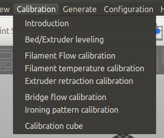

<link rel=”manifest” href=”docs/manifest.webmanifest”>

# Calibration
***Note: This is WIP, so maybe come back another time as well! ;)***  
  
For getting high quality prints, you need to calibrate your printer.  
As there are many things being worth mentioned and I can't cover and explain all of them, I'll just talk about a few which seem to be the most crucial ones beginners might not be aware of, especially with these printers.  

I'll divide this section into two parts: the section "Printer Calibration" and "Other Calibration".  

- The section "Printer Calibration" will cover the calibration of the hardware itself. It's absolutely necessary that everything is set up correctly and that you take care about some specific topics to get a reliable machine. Please refer to the belonging sections of the chapter ["Hardware"](hardware/hw_index.md) as well for further information.  
- The section "Other Calibration" will cover calibration procedures that need to be done for tuning in the printer itself, like dialing in the z-offset.   
Besides those steps being mentioned in the section "Other Calibration" (yet), you also have to do other calibrations as well for e.g. finding the correct printing temperature for your specific filament and so on. There are many websites and YouTube guides out there to find which are already covering this wide topic of calibrations and give way more detailed instructions for certain calibrations though, so I'd recommend to do a little research by your own.   
However, to make this journey a bit easier for you to begin with, I'll list some pages that I personally found useful in the following section.  

For further sources of information also check out the chapter ["Further Sources"](further_sources.md).  

If you encounter problems, check out the chapter ["Troubleshooting"](troubleshooting.md), you might find your problem and a solution mentioned there.  

---

## Calibration Guides
There are many sites and tutorials to find which are about calibration, so you might want to search for that at your preferred site first. However, I found the following guides useful.  

- A handy reference when it comes down to **judging the quality of your first layer** is the [**poster about bed leveling**](https://i.imgur.com/hIcGr8U.png) made my [Billie Ruben](https://www.billieruben.info/).
- A great resource with many specific calibration tips and instructions is [**Elli's Print Tuning Guide**](https://ellis3dp.com/Print-Tuning-Guide/) made by @[AndrewEllis93](https://github.com/AndrewEllis93).
- A great resource as well is the [calibration page from TeachingTech](https://teachingtechyt.github.io/calibration.html).
- For not only getting an idea what "calibrate your e-steps" means, but to get a useful guide about how to do so, maybe also read [All3DP's article "Extruder Calibration: How to Calibrate E-Steps"](https://all3dp.com/2/extruder-calibration-6-easy-steps-2/).

---

## Calibration Tools
Using certain tools makes it easier to calibrate your printer. It'll allow you to generate your own specific models which are necessary for certain calibrations, like e.g. temperature or retraction distance towers. I'll list some options in the following.   

- **SuperSlicer**  
  I personally prefer SuperSlicer (after I used Cura in the first place), especially when it comes down to calibration.   
  One of the great functions is, that SuperSlicer already comes with an *inbuilt set of calibration tools*.  
    
  You'll follow the proposed order and generate the specific 3d models for your specific needs with just one click, like temperature towers, retraction towers and so on.  
  After that, you just print them and don't have to take care about additional code sections (e.g. like applying temperature or retraction distance changes at layer xy) which is necessary when using Cura and the Calibration Shapes plugin.  

- **OrcaSlicer**  
  OrcaSlicer also comes with a set of inbuilt calibration tools. As I don't use OrcaSlicer (yet), I can't show you a screenshot right now, but it might be worth having a look at it.  

- **Cura**  
  If you're using Cura, you might want to check out the plugin ["Calibration Shapes"](https://marketplace.ultimaker.com/app/cura/plugins/5axes/CalibrationShapes) which gives you access to different STL models you can use for calibration.  
  Before slicing and printing, make sure you're reading the specific notes about the models at the [wiki page of the creator](https://github.com/5axes/Calibration-Shapes/wiki) and to add the additional code to the generated STL files when necessary.  
  Another plugin is ["AutoTowers Generator"](https://marketplace.ultimaker.com/app/cura/plugins/Kartchnb/AutoTowersGenerator).  

---

## Printer Calibration 
The following steps should be done first to ensure that you set up your printer correctly and that you took care of printer specific pecullarities.  

---

### Correct Assembly
Make sure that you built and set up the printer correctly and that it's trammed as best as you can.  
**This is the most important and crucial thing, as you'll only be able to get good prints if the hardware itself is set up correctly.**   
The printer does come preassembled, but it's really advisable to check the preassembled parts as well! 

So, please read through the hardware chapters if you didn't do it yet.  
  
In the following I'll list the most crucial points.  

- Set up the frame correctly!  
  Means, check if the baseframe is mounted being square, if the the z-axis aluminum parts are really mounted perpendicular onto the baseframe and so on. **As everything else relies on this, the proper alignment of the frame is the most important step!**  
  So, once again: **Set up your frame and your axes. Everything should be square, perpendicular and equidistant.**  
- Check the axes!  
  Means, check the whole z-axis lead screw system for being assembled correctly and vertically aligned and that the timing belt is properly tensioned.
  Make sure the lead screws are lubed, that the anti-backlash nuts are installed correctly, that the coupler between the motorshaft and the lead screw is tight, that the pulleys are mounted tightly and so on.  
  At the x- and y-axes, make sure that you have all wheels positioned correctly (neither too tight nor too loose), that you don't have bad bearings which cause hiccups and irregular movements and that the belts aren't sloppy or too tight.
  So the best would be to go through the chapter ["Axes"](hardware/axes.md) and check all mentioned parts step by step.  
- Check if everything moves smoothly while the printer is switched off!  
  Means, *slowly* move the bed and the printhead manually across the whole range of motion and turn the lead screw by hand (across the whole range of motion as well) and check if you feel any unusual resistance in certain areas. Alter the movement speeds then and see if everything still feels well.   
  Parts being attached to the axes and running along them like the printhead and the bed shouldn't wiggle as well.  
  When everything looks and feels good, you can move the bed, the printhead and the position of the x-axis gantry to about the middle of the range of motion, then turn on the printer and home all axes using the control unit to see if the endstops are working.

---

### Tram The Bed
Even though tramming the bed (aka 'leveling' the bed) isn't really possible when using the rigid stock spacers of the bedplate these printers come with, there is something one can and should do though: check if those spacers are all of the same height.  

See the section ["Tramming The Bed"](hardware/bed.md#tramming-the-bed) for further information and instructions about how to do so.  

---

### Check The Z-Axis And The Timing Belt
Checking and tramming the whole z-axis lead screw system for being vertically aligned is crucial. Especially since a timing belt is being used which will be sloppy if the screws are misaligned.  

See the section [Timing Belt](hardware/axes.md#timing-belt) for further information.

---

### Tram The X-Axis Gantry
Tramming the x-axis gantry (aka 'leveling' the gantry) is a really important step as well as it will ensure that the x-axis gantry either is parallel to the bed (when using the rigid stock spacers) or to the baseframe (when using adjustable spacers).  

See the section [Tramming The X-Axis Gantry](hardware/axes.md#tramming-the-x-axis-gantry) in the belonging hardware chapter for further information and instructions about how to do so.  

---

### Level The ABL Sensor 
You also should level the ABL sensor in relation to the nozzle, so that you have a defined distance between the tip of the sensor and the tip of the nozzle. Every time you change the hotend or parts of it, you should check that distance again to make sure it's the same like before.  

See the belonging section for your specific model in the section ["ABL Sensor"](hardware/printhead.md#abl-sensor) for further information and instructions about how to do so.  

---

### Check The Z-Offset Sensor

There are two things you want to do before starting the calibration procedure and determining the z-offset using the control unit:  

- check if the sensor comes back up again when being pushed down and
- check if the sensor's height is correct.  

---

#### Check If The Sensor Comes Up
The button of the z-offset sensor/switch is spring loaded. Check if the metal button can move freely and comes back up when you push it down with your finger and release it.  

See the section ["Adjusting The Sensor's Spring Tension"](hardware/bed.md#adjusting-the-sensors-spring-tension) for further information.  

---

#### Check The Height Of The Sensor
The upper side of the button of the z-offset sensor/switch must align with the upper side of the PEI plate. If the metal button is either too high or too low, you need to adjust the height accordingly.  

See the section ["Adjusting The Sensor's Height"](hardware/bed.md#adjusting-the-sensors-height) for further information.

---

## Other Calibration  

In the following I'll list some of the calibrations which are necessary. The list isn't completed yet, mostly I'll list calibrations where certain things come into account for this specific printer model. If you don't find a specific calibration mentioned here, please refer to other sources like the abovementioned calibration guides I linked to.  
  
Keep in mind that it may take some time until you found the best suitable settings. And even then it might occur that you'll have to adjust certain settings later when finally printing 'real' models. So maybe try to see it more like a process instead of the struggle of a search for the 'perfect' settings which must be out there somewhere..  

Also keep in mind that you'll have to do certain calibrations again when using different kinds of filament. This doesn't only comes into account when printing a differenty type like ABS or PETG instead of PLA, but it also most likely will be the case when using the same type of filament but made from another manufaturer. Even the same type and brand of filament from the same manufacturer might need some slightly different settings like the temperature for example, when you're using a new spool or a different colour.  

---    

### Z-Offset  
The z-offset is the distance between the nozzle and the bed/plate you're printing on. It comes into account when printing the first layer of a model and therefore it's crucial and absolutely important that you dial in your z-offset to get your first layer as perfect as possible.  
If the nozzle is too far up above the plate, you'll experience that the print doesn't stay onto the bed or (if it's way too far up) that it'll just produce 'spaghetti' while printing up in the air.  
If it's too close to the plate and therefore the filament will be squished into the plate too much, then it'll either be difficult to remove the object or (if the nozzle is way too close) it'll provoke clogging as the filament won't be able to come out of the nozzle. Worst case would be that the nozzle scrapes across the plate and that you damage the hardware itself.  

Even though the z-offset will be somewhat calculated by the printer itself by probing the z-offset switch, you might need to finetune the setting on the fly while printing an inital layer of a model.  
The perfect z-offset can also change when using different types of filament, means, you might have to adjust it when using e.g. PETG instead of PLA.  
  
*To determine the perfect first layer, I'd recommend to have a look at [this handy guide](https://i.imgur.com/hIcGr8U.png) from [Billie Ruben](https://www.billieruben.info/) first to get an impression how you can judge if the first layer (and therefore the z-offset) is good or not and how it should look like.*  
    
<!--
    
When it comes down to describe the actual process of how to determine and set the z-offset correctly, I have to mention that right now the following step-by-step instruction here about how to proceed is written from my memory how I did it when using the stock firmware. I'm using Klipper now and probably don't remember 100% how I proceeded when using the stock firmware, so please keep that in mind.   
However, from what I do remember right now you (roughly) do it this way:  
 
- Preheat the system for PLA temperatures by using the control unit.  
- With the printer homed, enter the menu in the control unit where you can move the axes manually, choose "Move Z" and set the value to zero.  
- Then move the printhead to the middle of the bed (x and y axes) - I'd recommend to do so by using the control unit as well instead of moving it manually to avoid any movement on the z-axis.  
- Take a 0.1mm feeler gauge (or a piece of paper if you don't have a feeler gauge) and place it under the nozzle.  
- Then enter "Leveling" -> "Z-Offset" in the control unit and lower the printhead *carefully step by step* until the nozzle touches the gauge/paper. *You want to be able to still move the gauge/paper without any force, but you should feel a tiny bit of resistance to make sure the nozzle touches the gauge/paper.*   
- Once you found the sweet spot, save the value.  
-->  

After initiating the probing and calibration sequence using the control unit, start a print job and verify that the first layer came out perfect. Compare the look of it with the abovementioned poster from Billie Ruben to check if it really is perfect or if you need a bit of adjustment.  
If you need to adjust the height, you don't need to execute an ABL sequence again, just correct the z-offset setting. You can also adjust it 'on the fly' using the control unit while printing a (larger) first layer and look at the outcome - this is often even better as you'll see the effect right away.    

??? info "Don't Rely On The "Paper Method""

    Using the abovementioned feeler gauge or a sheet of paper (which people usually recommend - using a feeler gauge is more precise though) for dialing in your z-offset is only an *approach* to get in the right area of your z-offset. The *optimal* z-offset for printing a perfect first layer depends on various factors like e.g. layer height and type of filament being used. So *always* check the first layer while printing it and dial in your z-offset on the fly while printing it.   

??? info "Print A Skirt"  

    I personally recommend adding a skirt to the models you're printing. You activate that setting in your slicer, there you can also determine the width of the skirt and the distance to the model. When printing a skirt you print a few lines outside the area the model will be printed. This serves as a purge line (I personally don't use a purge line because I use a skirt) and you can check if the z-offset is set correctly. If not, you can adjust in on the fly.  
    You could also add a brim in addition to a skirt or even instead of a skirt - a brim is connected to the model though (which helps keeping the model stuck on the bed) which isn't always wanted.   
  
---

### Printing Temperature (Filament)
You determie the best printing temperature for your specific type of filament by printing temperature towers. These models change the printing temperature at certain layer heights in certain steps (e.g. in 5°C increments, starting with the highest temperature first), so that you'll print the same structure with different temperatures. For generating a temperature tower with your own specific settings, I recommend using the abovementioned SuperSlicer with the inbuilt calibration toolset. You can take the recommendations of the manufacturer of your filament as a rough guide for the temperature range you should print at.   

Then you inspect the printed model: in which temperature zones does it look best? Where are the layers of the filament solidified and melted together best? Where do overhangs look best and where does (massive) oozing and stringing occur? 
Don't pay *too much* attention on stringing and oozing yet though, as you'll take care of that later by printing retraction towers. Same goes for bridges (and overhangs): if you notice that bridges didn't come out perfect and that you can see strings of filament 'hanging' down, don't get too irritated by that as well. You can and should take care of bridging specific settings in your slicer later anyway, like a different printing speed, different extrusion rate, different fan speed and so on.    

What's actually more important at this time right now is the *bonding* of the layers!  
You can encounter an already pretty much great looking print with lower temperatures, but the model will break apart between layers easily. Vice versa you can observe that some stringing, oozing and/or maybe some poorer bridging quality will occur at higher temperatures, but the bonding is much better!  
As you'll take care of settings that affect stringing and bridging later anyway, *I'd recommend to always go with the higher temperature when in doubt!*   
Besides only *looking* at the outcome, I personally use to tear apart the printed temperature towers. By doing so, you can find the best printing temperature - not only in terms of the 'look', but also in terms of mechanical stress and resistance.  
So try to break each temperature section apart by using your hands first. You'll most likely already encounter some floors which are easy to break apart.  
Once you're done with that, take two pliers and repeat the process for each floor. You'll most likely be able to break every floor at a certain point, but you'll notice some obvious differences like how much force you have to use and *how* the floors break apart.  
So after you teared the model apart, inspect those areas: did it clearly break right between two layers? Or did it break *across* different layers?  
When it clearly broke between two layers, inspect the next floor with the higher temperature being used. Try to find the floor where it seems that the layers sticked together very well and the break most likely occured across different layers.    

Once you're done and decided to go with a specific temperature, continue with other calibrations like printing retraction towers, calibrating the e-steps and so on. At the end I'd recommend to print another temperature tower once again for being able to compare the output to the first one you printed. You don't have to print such a 'large' and wide ranged temperature tower though, maybe just print a tower with the 'final' settings and temperature you decided to use and add a floor with 5° higher and 5° lower temperature.   
  
  
---
  
### Retraction Settings
As a crucial element for great printing results you need to find the optimum settings for retraction *distance* and retraction *speed*.  
Both settings have to be evaluated for each filament you're using. You'll note that the settings may differ not only within the same type of material, but especially within different types of material (when printing PLA for example you'll end up with pretty different settings than you'll use when printing flexible TPU).  
In general you'll determine the correct settings (after determining the correct print temperature) by printing retraction distance and retraction speed towers. Slight adjustments might be necessary later on though, so pay attention to not only the stringing, but also to e.g. starts and ends of layers where over-/underextrusion might be occur due to imperfect retraction settings.   

The correct settings will mostly avoid stringing. There are various aspects which affect stringing though, so if you struggle with stringing, you might want to have a look at the section ["Stringing"](troubleshooting.md#stringing) where I list some factors that affect it. 

!!! warning "Feeder Gear Pressure Is Crucial!"

    It should be noted that the correct pressure of the feeder gear is very crucial (not only) when it comes down to retracting.  
    If the feeder gear pressure is too low, the gear won't 'grab' the filament sufficiently and therefore starts slipping and grinding instead of pulling it back. If the pressure is too high though, it'll deform the filament which may result in e.g. visible artefacts of your printed model. So make sure you adjusted the correct pressure.   
    You can check if the filament gets properly fed and retracted by looking at the filament while printing. Adding some marks with a water resistant pen might be helpful. Observe the filament if it gets retracted (= pushed back) and fed reliably when the printer should do so.   
    
---

#### Retraction Distance
The retraction *distance* is a crucial setting one has to take care about. The retraction *distance* is the setting how *far* the feeder gear will pull back the filament when retracting.      

Finding the correct retraction distance setting can be difficult and might take a few iterations, as it depends on various other settings and variables, so there isn't a general one-fits-all setting one could use.  

As this is a direct drive system, you need to go with small retraction distance settings. Due to the Volcano-like nozzle and the longer melting zone, you can try up to 2mm and still should be safe (imho). Start with the smallest settings though!
  
For finding out the correct retraction distance setting, you can print retraction distance towers, where different retraction distance values are applied at certain heights (kinda the same like when printing temperature towers). Before doing so, you should have figured out the correct printing temperature though.   

    
---

#### Retraction Speed
Retraction *speed* is the setting how *fast* the feeder gear will pull back the filament when retracting. It plays together with the setting of the retraction distance, and both settings affect each other.  
In general it seems that you can say that the higher the *speed*, the lower the *distance* can be - but like with every 'rule of thumb', this is just a 'rough' guide and you'll need to find out the optimum setting for your specific setup by your own. You might also find out that things work out much better and that you get better results when using a lower retraction speed.    
  
It has to be mentioned though that a high(er) retraction speed isn't always the key - it can also be the case that using a lower speed is necessary for getting the best results. This also depends on the type and quality of the filament as well.  
  
  

---

### Calibrating E-Steps
You've probably already came along the sentence "calibrate your e-steps" and maybe you wonder what it is, what you'd have to do and why you should do so. It's actually pretty simple: the "e-steps" are the steps of the motor of your extruder (so "e-steps" stands for "extruder-steps") and therefore they determine how much filament will be extruded with a certain amount of motor steps.  
Depending on how accurate this setting is (means, how well you calibrated the e-steps), you'll either have some pretty perfect prints (in the meaning of the amount of filament of each layer) or you'll see signs of more or less severe under- or overextrusion.  
Now some people try to adjust or get rid of this problem by setting different extrusion multipliers in the slicer without touching this setting, but that's not the best/correct way (imho), as you always should have the hardware tuned in as much as possible before trying to tweak software settings for better results.   
However, due to the fact that KobraOS is based on Klipper where you'd have to change the e-steps (which are called rotation distance in Klipper) in the file `printer.cfg` and that we don't have access to this file as KobraOS is closed-source, we can't actually adjust the setting. So one has to go with adjusting the flowrate in the slicer.

---
  
### PID Tuning
Without going into too much details here, PID stands for Proportion, Integral and Derivate. These are three variables of an algorith which is supposed to keep the temperature stable.  
By executing a PID tuning, the printer heats up the desired heating element (extruder or bed) to a given temperature, cools down again a few degrees and heats up again for a given amount of circles and measures the fluctuation. After the process is done, you'll then get an output of three values P, I and D and save them to the firmware.  

It's advisable to execute a PID tuning for both the extruder and the bed before you want to use your printer for the first time.  
Also after you changed something at the hotend (like installed a new nozzle or heatbreak) and especially if you changed the cartridge heater or a thermistor (or even the position of it when removing and reinserting it) or installed a new bed, you should execute a PID tuning.  

Again, as this KobraOS is based on Klipper, one would usually do that with two specific commands for the hotend and the heated bed - but as there's no way to connect to the machine locally through a webinterface like Mainsail or Fluidd (as there's no Moonraker API implementation given here), we can't execute PID tunings this way.   

As I didn't check yet if the control unit offers this function, I can't give you further information right now if this calibration process can actually be initialized. I'll update this section as soon as I investigated this.  

---  
  
### Layer Height
This isn't really a calibration you need to do, but it's something you should be aware of and take into account when choosing the layer height for your print settings and therefore I'd like to mention it at this point. So when deciding for a layer height, you probably think "well, I can just choose whatever I want" - and yes, of course you can do so. But there's a "magic number" you should actually take into account when making your decision: **0.04mm**.  
This is the distance the head travels up and down along the z-axis for each *full step* of the z-axis motor and therefore it's advisable to always choose layer heights which can be fully divided by / which are multiples of *0.04mm*.  

You can find a bit more information about the 'maths' behind it in the expandable info textbox "Choosing A Layer Height: The "Magic Number"" [here](hardware/axes.md#z-axis).  

    
---

  

