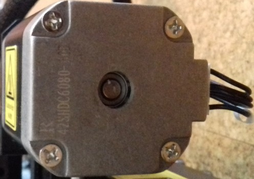

<link rel=”manifest” href=”docs/manifest.webmanifest”>
  

# Axes

| Specifications |
|:---------------|
| **X-Axis Belt**: GT-2, 6mm width, ~790mm total length |
| **X-Axis Belt Tensioner Pulley**: 3mm(??) ID / 20(??) teeth (for 6mm wide belt) (--> need to check specs again!) | 
| **Y-Axis Belt**: GT-2, 8mm width, ~770mm total length |
| **Y-Axis Belt Tensioner Pulley**: 3mm(??) ID / 16(??) teeth (for 8mm wide belt) (--> need to check specs again!) |
| **X- & Y-Axis Linear Rail System**: SG15 bearings, chrome-plated stainless steel rods, ??mm OD (--> need to check specs again!) |
| **X-Axis Motor**: 42x34 Nema17, 1.8°, 200 steps, 5mm shaft with 20(??) teeth pulley (5mm bore) attached (for 6mm wide belt) (--> need to check specs again!) |
| **Y-Axis Motor**: 42x48 Nema17, 1.8°, 200 steps, 5mm shaft with 16 teeth pulley (5mm bore, 11mm teeth length) attached (for 8mm wide belt) (--> need to check specs again!) |
| **Z-Axis Lead Screws**: T8x8 (8mm diameter, 8mm lead, 2mm pitch, 4 starts), 350mm length, 10mm and ~23mm unthreaded 5mm OD shaft, belt-driven dual z  |
| **Z-Axis Timing Belt**: GT-2, 6mm width, closed loop, length 600mm |
| **Z-Axis Lead Screw Pulleys**: 20(??) teeth (5mm bore) (for 6mm wide belt) (--> need to check specs again!) |
| **Z-Axis Anti-Backlash Nut**: POM, spring loaded, 8mm inner diameter, 20mm distance between mounting screws (18mm will fit as well due to elongated holes at the bracket!) |
| **Z-Axis V-Slot Wheels**: POM, ~24x10.2mm with 6mm width at the tip of the "V", 625 type ball bearing with 5mm inner diameter |
| **Z-Axis Motor**: 42x34 Nema17, 1.8°, 200 steps, 5mm shaft |
| **Z-Axis Motor Coupler**: rigid coupler, 5mm bore at both sides |
| **Limit Switches**: x- & y-axis = mechanical, NO ; z-axis = no physical switch given, probe acts as virtual endstop |

---

This printer is a so called 'bed slinger'.  
Means, the bed moves along the y-axis (back and forth).  
The printhead moves along the x-axis (left and right) and is attached to the x-axis gantry.  
The x-axis gantry moves along the z-axis (up and down).  

The endstop/limit switches of the axes are located at the *minimum* endposition of each axis and are triggered when either axis reaches its limit. The switches of the x- and y-axes are mechanical switches. At the z-axis there's no physical switch, here the probe acts as a virtual endstop.    
So if you notice that e.g. the motor of the y-axis doesn't stop when the bed reaches the end then you should check if the belonging switch is being triggered and/or if it's faulty. 

---

## X-Axis
The x-axis is represented by the printhead moving along the x-axis gantry.  

  

The metal plate where the printhead is mounted onto is belt driven, the motor which drives the belt (8mm wide, GT-2 type) is located at the left side.   

You can adjust the tension of the belt by using the knob at the right side of the aluminum profile where the printhead is guided onto.  

See the belonging sections for further pictures and descriptions of the parts.  
  
---

### Belt Tensioner

The following picture shows the belt tensioner located at the right hand side of the x-axis gantry.  

You adjust the tension of the belt by turning it clockwise for increasing the tension and turning it counter-clockwise for decreasing it.  

??? example "Disassembling The Belt Tensioner"  

    **Note: The following pictures are taken from the belt tensioner of the Kobra Neo as I didn't diassemble the tensioners at my Kobra 2 Pro yet. I'd assume that they look pretty much the same in the inside though, so at least you'll get an idea of how a belt tensioner is (most likely) built.**  

    It might happen that you have to disassemble the tensioner in order to replace a broken belt or a broken (part of the) tensioner.  
    In that case turn the knob counter-clockwise until the belt completely sags. Then unhook one end of the belt from the bedgantry (I suggest to unhook it in the front of the bed gantry). Unscrew the two screws you can see at the blue plastic cap of the belt tensioner and carefully pull it off the frame. You might have to turn the knob even more counter-clockwise if it doesn't come off right away.  
    Once you've pulled it off, you'll see the parts as shown in the picture below (right now the picture shows the disassembled y-axis tensioner, but besides a slightly different shaped plastic cap, the interior looks the same - I'll add a belonging picture of the x-axis tensioner soo though).  

    

    If you have to replace certain parts, you can easily disassemble the pulley by pushing out that little shaft to one side, so that you'll have all the parts laying in front of you each by their own.  

      

    The following picture shows the 20 teeth pulley which is used in this assembly.  

        

??? example "Reassembling The Belt Tensioner"

    For reassembling, just put the pulley back into place and stick that little shaft back to where it belongs.  
    Then route the belt through that bracket - make sure the belt isn't somehow twisted and that the teeth are gripping onto the pulley - the smooth side of the belt needs to face you when you look at it from above.  
    Stick the setup back into the blue plastic cap and stick the screw of that knob into the belonging hole at the front. Turn the knob a few times clockwise to make the thread grip the bracket.  
    Then slide the whole setup back into place where it belongs and screw in the two screws which hold the blue plastic cap into place.  
    finally hook up the ends of the belt to those notches at the metal mounting plate of the printhead again.     
    Once everything is done, adjust the belt tension again by turning the knob clockwise.  

---

#### Belt Tension
It's kinda difficult to explain the correct belt tension, so you'd have to experiment a bit with that.  
Generally speaking, the belt shouldn't be too tightened up and shouldn't be too loose either. If it's too tight, too much pressure will be put onto the motor shaft which will do harm, the belt can snap etc. - if it's too loose though, the belt might even slip. Either state (too tensioned and too loose) can cause artifacts.   

My 'rule of thumb' here is: if you can bend the belt down a bit by applying some pressure with your finger onto it but you still feel a good amount of resistance, then it's a good sign that you're in the right area of tension. So start from there and if you feel or need to do so, play around with different belt tensions while printing the same bject over and over again for finding the best tension for your setup.   

??? info "Some Notes On Belt Tension"  

    People often recommend "Tighten your belts!", but that's actually not always the solution if artifacts like layer shifts occur.  
    As a matter of fact, I made many different tests with my Neos and evaluated the different influences of factors like belt tension, wheel position, quality of ball bearings of the wheels, a trammed vs. untrammed frame/printer setup and so on. And to be honest: a belt being too loose in terms of being the cause for severe problems only occured when it was really *that* loose that even someone who has no experience at all with this would notice it. If a belt is sagging, I'd assume that a user would notice that and realizes that this can't be good.   

    Don't get me wrong - *of course* different tensions of the belts *do* have a certain influence of the quality of the print, and it might be worth to finetune the tension for getting the last little amount of perfection out of your print.  
    And yes, of course, if a belt is too loose, then it can slip or it can cause layer shifts due to a slight 'lag' which occurs when the motors start to drive the belt or when a sudden change of the direction occurs.  
    But: a belt being too tight can cause artifacts as well. Not only that - it can and actually will harm the hardware. Users reported not only snapped belts or harmed motors, one even reported a bent bracket where the motor of the Y-axis was mount to. So, believe me or not: even though there are people in forums and on YouTube who claim that a belt can't be too tight - it definitely can.  

    Using the abovementioned 'method' of roughly setting your belt tension to a 'medium' value, I found that other factors have a much bigger impact on the print quality and the reliability and well-functioning of the whole printer.  
    Let me give you two short examples to show you what I mean:  
    
    - If your wheels are too tight, of course you also need to increase the belt tension - but in that case it's not the belt tension what's causing the issue in the first place, it's the wrong position of the wheels.  
    - If you have bad ball bearings at the wheels (which is actually most likely the case due to the cheap parts being used), then those may cause an irregular/inconsistent movement of the wheels and you can feel regular 'hiccups' while moving the belonging part (like the bedgantry or the printhead). You can *feel* how you have to apply more force at certain spots when moving the part manually by hand, as it feels like it's getting stuck at certain spots. So a belt being too loose isn't the cause of the problem here and therefore tightening up your belt isn't the solution - replacing the bad bearings with some quality ones is.  

    So, use your brain and don't always follow the typical answers like "Tighten you belts!" when you're experiencing issues like layer shifts for example. Instead, look at your printer more 'holistic' and see the different parts which are working together in the end. Pay attention to each of them, once again starting by inspecting the frame and making sure everything is still trammed and set up well here. Due to vibrations and repetitive motions screws can come loose, parts can and will wear out and therefore a frame or other parts you set up a while ago can and will come out of alignment by time.

---

#### Maintenance

You should inspect the belts and the belonging parts like pulleys etc from time to time to make sure everything is in a good condition and nothing will suddenly break.  

**Belt**

- Check the belt tension from time to time as it might wear out and lengthen a bit. 
- Check the teeth of the belt if they are still good looking or if they're worn out or if even some teethe are missing.
- Check if you can see any cracks or other damage at the belt.

**Pulleys**  

- Check the pulleys of the motors which are driving the belts. Are they also looking ok? Did they become loose on the motor shaft somehow?  

??? example "Broken/Snapped Belt"

    When you experience a broken/snapped/ripped belt, it's most likely caused by too much belt tension. Of course the belt itself can be physically harmed as well when grinding across sharp edges or when it gets old, but you should notice that when examining the belt every now and then when doing the regular maintenace of your printer.  
    
    If you encounter a snapped belt, get yourself a good quality one as a replacement - don't go with the cheapest no-name product you can get.  
    I'd suggest to look out for an original "Gates Powergrip®" belt. You can get them in different lengths, like one or five meters.  
    Then get yourself some of those metal clamps you have to crimp at the ends of the belts as well. If you feel insecure about how to properly add those clamps to the belt and how to actually crimp them properly, practice crimping a few to your old broken belt.  
    
    Crimp one of those clamps to one end of the belt, measure the belonging length of the belt and apply the other one, then cut off the rest of it.  
    Install the belt by disassembling the belonging parts like the belt tensioners (see the notes on how to do so in the belonging sections).  
    Pay attention to route the belt in the correct way and not being twisted and adjust the tension of the belt once everything is reassembled.  
    

---

### X-Axis Motor
The motor of the x-axis is a 42-34 Nema 17 stepper motor with a 20 teeth pulley being attached to the 5mm motor shaft.  
It seems to be a regular 1.8° stepper, which means the shaft turns 1.8° at each steps, and therefore it's doing 200 steps for one full 360° rotation.  
The motor is located at the left hand side of the x-axis gantry.  

  

??? info "Spare Part Motor"  

    As there aren't any specifications and replacement motors from Anycubic being available, you can either use a motor with the beforementioned specs or get yourself a motor from a Creality Ender 3 (or one that's advertised to fit that printer).  

??? warning "Attention When Connecting A 'Generic' Motor!"  

    As the connections of the stock vs a generic or a 'Creality'-type motor are/might be different due to different pinouts of the coils, you need to make sure you connect it correctly!  
    *So, before connecting it to the mainboard though, take your multimeter and identify the coils by probing the pins of the motor's connector!*  
    Compare your findings with the ones from the stock motor - you might have to switch the position of certain wires inside of the plug.
    
  

??? example "Identifying The Coils And Connections"  

    When you want to use a different motor than the stock ones, it's most likely the case that the coils are connected to different pins of the 6 pin connector of the motor.  
    The best would be if you take a multimeter and probe the pins to see which ones belong to a coil. So let me go over this procedure really quick - don't worry, you can't harm the motor by doing the following.  
    
    Take your multimeter and set it either to continuity measurement or to resistance measurement. Either one will work - if you have the option for continuity measurements, choose that one though as they often offer a little buzzer which makes a sound when continuity is given.  
    
    Unplug the motor (of course) and hold one of the two probes of the multimeter to one of the pins of the 6 pin connector of the motor. I personally like to start at the left side, so hold one probe onto the very left pin.  
    Then use the other probe and touch the other pins - one after another.  
    Make sure that both tips of your probes really make contact to the desired pins. Once you found the corresponding pin for the very left sided pin you placed your first probe onto, mark that.  
    Then move the probe to the next pin and repeat the process.  
    In the end you'll come up with having two 'paired' pins identified - each pair belongs to one coil.  
    
    For illustration purposes, the following picture shows the coils of a motor from a Kobra Neo and a Creality motor.    

      
    
    If the pairing of your probed pins is the same - fine, you can connect the motor right away.  
    
    If the pairing is different, like at the Creality motor shown in the picture, you need to pull out two wires of the connector of the motor cable (one wire of one coil each!), switch them accordingly and insert them back in the connector housing.  
    At the shown example with the stock vs. the Creality motor, you'd just switch the position of the two inner wires here.  
    
    You can pull out the wires (inclduing the attached metal contacts) by pressing down a tiny metal latch of that contact.  
    Take something like a needle or a tiny screwdriver for that. Gently press that latch down and slightly pull on the wire - the wire with the contact being attached will come out.  
    Once you put it into the correct position, just push it back into the belonging hole - but mind the orientation! You might hear a little "click" sound, but check if the wire really got into position by looking after that latch and by pulling at the wire - it shouldn't come out.  
    
    After a final check if everything is still ok, connect the motor - it should work now.  
    
    If it happens that the polarity of the coils/wiring is wrong, you'll experience a stuttering and probably noise-making motor. In that case proceed as above and switch the wiring accordingly.  
    

---

### Linear Rail System

The X axis has a linear rail motion system instead of POM wheels like many other machines.  
It's not a 'real' linear rail like a MGN12 system for example though - instead, Acnycubic is using U-shaped metal SG15 bearings running along round-shaped metal rails which are being mounted in the v-slots of the x-axis gantry's aluminum rail.  
The following picture shows this rail system (without the printhead being mounted to the plate).  

  

---

#### SG15 Bearings Position
The metal wheels of the printhead's mounting plate, the SG15 bearings, are leading the printhead along the aluminum profile of the x-axis (the so-called "x-axis gantry").  
These bearings run along a round-shaped metal rail and therefore they should sit in an optimal position.   
The following picture shows the back side of the meatl plate the printhead is mounted to. You can see two SG15 bearings at the top and one at the bottom.  

*You can adjust the position and therefore the overall pressure of the bearings against the metal rail of only ***one*** bearing by turning the eccentric nut which moves the bearing either towards or away from the metal rail.*   

*The bearing whose position can be adjusted is the one located at the ***bottom*** - the two wheels at the top which are running across the upper side of the x-axis gantry can't be adjusted as there aren't any eccentric nuts mounted!*  

  

??? info "What Is An Eccentric Nut?"  

    The following picture shows an eccentric nut (in this case mounted to a POM wheel) which I painted to make the special shape of it more visible.  

       

    As you hopefully can see, the bolt isn't centered - so if you turn that eccentric nut while being mounted, the position of the bolt and therefore the whole bearing will be changed, either towards or away from the rail it's sitting at.  

The bearings shouldn't sit too tight at the rail but also not too loose.  
They should touch the rail and should sit in place well without any sort of wobbling and they should be able to move smoothly.  
On the other hand, they also shouldn't be too loose or far away from the rail which would lead to instability.  
The printhead shouldn't wiggle but it has to be able to move freely.   
    
Make sure they're assembled correctly and line up with the rail as well - if they're out of alignment and don't run correctly along the rail, you'll experience a massive wear and tear. Same goes for the bearings being too tight.  

---
  
#### Maintenance  

As the bearings as well as the rods will suffer from metal running on metal and debris can build up, clean the rails and the bearings from time to time.  
Inspect all parts for any visible damage, check if the SG15 wheels are still in the correct position and if they turn well or if maybe a bearing became bad.   
After that, add a slight coating of lubrification to reduce the wear and tear due to the fact that metal is running on metal - I personally use "Super Lube" for that.     

!!! warning "Wear And Tear"  

    Wear and tear does occur at this kind of linear rail system as well, as metal bearings are running along a metal rod.  
    In the beginning you'll probably notice some black dust coming off the rail and the shiny coating isn't that shiny anymore as shown in the following picture.     

    

    When things get worse, you'll see the chrome coating coming off completely as shown in the following picture.  

      

    There are (imho) three main reasons which cause this issue and which highly affect how fast this damage occurs:  
    
    1. First to mention would be an insufficient lubrification.  
       So make sure to clean off old grease and apply fresh grease regularly. The more you're using the machine, the more often you have to do this maintenance!  
    2. Second to mention is improper alignment and running the bearings too tight onto the rail.  
       So make sure you position the SG15 bearings correctly.  
    3. Third is the common behaviour of placing and printing smaller parts in the center of the build plate.  
       So place smaller parts in different areas of the bed instead of always locating them right in the center. The more the bearings are running across a specific section of the rails, the more the abrasion will occur in that area.  
       
??? example "Replacing The Linear Rods"  

    If it happens that the rods of this linear rail system got harmed, you can actually push them out of the aluminum rail's v.slot, turn them a bit and push them back in.  
    This might take some effort, but it's possible to do so.  
    If you have to do this procedure, make sure you can access both ends of the aluminum rail freely. Means, dismount any caps, belt tensioner, motors or whatever is in the way.  
    Then take a hammer and something like a wide flathead screwdriver or (even better) a bolt or so. Place the bolt onto the end of the rod you want to push out and *carefully* use the hammer on the bolt. By doing so you can push out the rod.  
    
    *Make sure to not deform the end of the rod! Don't hit the bolt too hard as well, you want to hit it light and careful - just enough to make the rod move out of the v-slot!*  

    After rotating the rod a bit, push it back in.     
    
        
---

### Limit Switch 

The limit switch is located inside of the blue plastic cover at the left hand side (where the motor is mounted at as well).   

The following pictures show the limit switch from two different point of views.  

| Limit switch front side view | Limit switch bottom view |  
|:----------------------------:|:------------------------:|
|  |  |   

??? example "Checking The Switches (And Wires)"

    You can check if the switch really isn't working by triggering it manually while the belonging axis is moving. If the movement doesn't stop, turn off your printer. Check the connectors at the switch and the mainboard if they're still in place.  
    If everything looks fine here, then it's most likey that either a wire is broken or the switch itself is faulty. If you have a multimeter, you could measure if the switch itself is working as well as check the wires. When measuring the wires, move them around as it may be the case that a wire is slightly broken inside of the insulation and that it loses contact in a certain position of the wire itself.   
    If the wire is broken, fix it or install a new one. If the limit switch itself is broken, disassemble the switch from the frame and put in a new one. Wire everything up again and try again triggering it manually to see if it works now.  
  
??? example "Limit Switch Problem"

    If you encounter the problem that the limit switch won't be hit sufficiently for being triggered sucessfully, move the printhead manually against it (with the blue plastic cover of the printhead removed) and observe what might cause the problem. Most of the cases the whole blue plastic cap isn't in the correct position, so check that and try to adjust the position, so that it can be triggered sucessfully.  
    When using a **Neo**, pay attention to the metal lever of the switch itself as well as to the nut of the left wheel of the gantry. See both areas marked in the following picture.      It might be the case that the nut hits the y-shaped metal bracket of the x-axis gantry before the edge of the metal bracket triggers the limit switch.    
  
---

## X-Axis Gantry
The x-axis gantry is the aluminum profile (plus the corresponding parts) where the printhead is actually running onto.  

  

You already read the information about the belonging parts of the x-axis in the chapter above, in the following you'll find the information about the parts of the x-axis gantry which are moving along the z-axis frame.  
Plus, you'll find information about *how to tram the x-axis gantry, which is crucial for a good and reliable outcome*.  
 
---

### V-Slot Wheels Position
The x-axis gantry is moving along the z-axis aluminum profile driven by the z-axis lead screws, guided by v-slot wheels. They run in the v-slot of the z-axis profiles and therefore they should sit in a good position. Means, they shouldn't sit too tight in the V-slot but also not too loose - they should be able to roll and move freely, but they shouldn't be too far away from the profile which would lead to instability.  

*You can adjust the roller tension by turning the eccentric nut of the inner wheels which moves the wheels either towards or away from the aluminum profile.*    

??? info "What Is An Eccentric Nut?"  

    The following picture shows an eccentric nut (in this case mounted to a POM wheel) which I painted to make the special shape of it more visible.  

       

    As you hopefully can see, the bolt isn't centered - so if you turn that eccentric nut while being mounted, the position of the bolt and therefore the whole bearing will be changed, either towards or away from the rail it's sitting at.   

*Not all of the wheels have eccentric nuts though as the following pictures show, only the two wheels (one at each side) which are facing the inner side of the frame (towards the bed) do have an eccentric nut.*  
    

  
Here you can see clearly that only the inner wheel on the left side in the following picture has an eccentric nut, the red circle at the outer wheel on the right side marks the round spacer.  

  
However, you might face the problem that you just can't get all of the three wheels at each side to touch the aluminum frame as they should.  
So if you need to adjust the position of the wheels using the eccentric nuts, you might encouter the problem that e.g. the inner wheel and the lower wheel on the outside may sit in the v-slot really nice, but that the third wheel (the upper one on the outside in this example) isn't even touching the aluminum and can be spinned in the air. This also leads to a wobbly and sagging/lagging x-axis gantry at the unsupported right side, as you'll most likely be able to move the right part (the side without the lead screw) up and down a bit.   
Whatever you'll try with the eccentric nut of the wheel of the inside (because there's only this one), you won't be able to achieve that all of the three wheels touch the aluminum and sit in the slot like they should, as the eccentric nut only changes the position of the inner wheel towards the frame.  
So - what to do?  
Well, there's a 'trick': you need to align those Y-shaped metal brackets where the wheels are mounted to - which directly leads us to the process of [tramming the x-axis gantry](#tramming-the-x-axis-gantry).   

The following picture shows one of those Y-shaped brackets I'm referring to - in this case it's the one from the Kobra Neo (as I didn't disassemble the x-gantry at my Kobra 2 Neo yet), but the principle is the same.  
They're mounted to each end of the x-axis gantry.  

  

---
  
### Maintenance  

As the wheels will suffer from running on the aluminum and debris can build up, clean the aluminum and the wheels itself from time to time. 

If you see debris building up pretty quick, it's most likely because the wheels are running too tight in the v-slot of the aluminum and therefore it's too much friction which leads to a quick wearout.  
Another factor is a possible misalignment here, so that they aren't running well along in the slot, so check the position of the wheels as well.  

See the following picture where you can clearly see a heavy wear and tear.  
The picture is taken from the mounting plate of the printhead of a Kobra Neo, but the wear and tear will be the same at POM wheels located at different spots.  
According to the user who took this picture, this is the state after three days of usage - which is absolutely *not* "normal".   

  

So if your wheels look like this, check the position of the wheels!  
          
---

### Tramming The X-Axis Gantry

??? warning "'Tramming' vs. 'Leveling' The Gantry"  

    Because I got attacked, harrassed, insulted and called names for using the correct term "tramming" instead of the misleading and technically wrong term "leveling", let me make something clear at this point.  
    
    What we do here is a procedure called "tramming". 
    We (try) to get the machine and certain parts of it aligned perfectly, like axes and parts being square, parallel, perpendicular and equidistant *towards each other*.  
    For example, we try to set up the frame being mounted perfectly square, the z-axis frame being perpendicular to the base frame, the x-axis gantry being perpendicular to the z-axis frame and the bed being parallel and equidistant to the x-axis gantry and the printhead/nozzle.  
    It's a technical term which is also used at CNC machines for example and this is the correct nomenclature. And as a matter of fact, this is also the case with 3d printers. Point.  
    
    "Leveling" though is the process of bringing something like a shelf, a table or a framed picture hanging at the wall into the position that it's *perpendicular to gravity* so to say. Most of the time you do so by taking a bubble level or a self-leveling laser. *But this is NOT how you 'level' the bed of your 3d printer for example!*  
    
    Yes, I'm highly aware of the fact that the majority of the 3d printing community uses the term 'leveling', that people say "Level your bed!" and that the marketing guys and gals of the companies use the (even more misleading!) term "Automatic Bed Leveling" (which is even worse as it suggests that the process will actually 'level' the bed itself - which it obviously doesn't). But that doesn't mean that I have to follow that misleading road.   
    So besides the fact that this isn't the correct nomenclature (seriously, I'm not the grammar police - I'm a German guy who speaks a little bit of English..), my 'problem' with this term is that it's just really misleading!  
    
    How many beginners are pulling out their bubble level, put it on the bed or the x-axis gantry to check if it's leveled and maybe even shim out the table the printer stands on - just to come to the conclusion that their bed or gantry is leveled?  
    Believe it or not: many - whether you came across those users while trying to help them or not. You can use a 3d printer on a tilted table - if the printer is trammed, it'll still print fine.   

    *So to all those haters out there: yes, I will continue to use the correct term "tramming", no matter how much you'll attack and try to insult me.*  
    And no, I don't do it because I want to show the world that I know the correct term, I do it because I want to avoid that beginners become frustrated because they just get it wrong.  
    And if you haters would start to actually do the same, then maybe one day there might occur a shift in the 'consciousness' of the community and the correct term would be used on a regular basis. Seriously, try to *help* people out by just using the correct term for making them realize that it's *not* about how perpendicular the bed or gantry is towards gravity - and stop harrassing people who already do so.  
    

It's advisable to tram the x-axis gantry to either the bed itself or the frame, depending on the type of spacers of the bedmount. By doing so, you make sure that the bed and the gantry are parallel to each other and therefore the distance of the nozzle to the plate is pretty much the same all along the x-axis.  
  
As the printer comes with rigid spacers (the cylindric metal pieces between the bedplate and the bed gantry), you aren't really able to "tram" the bed unless you replace the stock spacers with [adjustable ones](bed.md#different-spacers) - which I personally *won't* suggest to do at this machine, regarding the high speed and accelerations this machine is running.    
The problem with those rigid stock spacers is, that they might not be all of the same length/height - so I'd recommend to at least dismount them, check if they're all of the same height and if they aren't, sand them down to an equal height. By doing so you can at least make sure that you won't have a tilted or warped bed caused by spacers of different legth. See the section ["Tramming The Bed"](bed.md#tramming-the-bed) for further information and instructions.   
*Make sure to take care of this before actually starting to tram the x-axis gantry, as you'll tram it in relation to the bed.*  
   
After taking care of the spacers (either the stock ones or after getting yourself new adjustable ones), reassemble everything. Now you can proceed tramming the x-axis gantry:  

- If you're using the *rigid stock spacers*, tram the gantry in relation to the *bed* itself.  
- If you're using *adjustable spacers*, tram the gantry in relation to the *frame* itself and then tram the bed in relation to the nozzle at different positions (see the section ["Tramming The Bed"](bed.md#tramming-the-bed) for further information and instructions about it).     

Please see the expandable textbox below for further instructions about how to tram the x-axis gantry.  

??? example "Tramming The X-Axis Gantry And Adjusting The Wheels"  

    When it comes down to tramming the x-axis gantry, up to me one should differ between tramming it in relation to the frame of the printer and in relation to the bed. Depending on which spacers are being used, you should either do the one or the other:  
    
    1. Tram **in relation to the bed**, if you're using the stock spacers, because you can't really "tram" the bed itself.  
       *Make sure you checked the rigid stock spacers of the bedmount for an equal height before tramming the gantry though!* If they're not all of the same height, I'd recommend to sand them down to the height of the shortest spacer.  
    
    2. If you've swapped the stock spacers and are using *adjustable* ones, like silicone spacers or springs, then you should tram in **relation to the frame** itself to make sure everything is square and perpendicular like it should be. *Of course the whole frame has to be assembled correctly first, so make sure the base frame really is mounted square and the aluminum parts of the z-axis frame really are perpendicular to the base frame!*    
      In this case follow the steps being mentioned in the following, **but instead of placing two identical objects onto the bed, place them onto the base frame** and rest the aluminum part of the x-axis gantry onto them. After bringing those y-shaped metal brackets into the correct position, make sure to retighten the screws while the aluminum frame of the x-axis is perpendicular to the aluminum frame of the z-axis at both sides.  
      After that, tram the bed itself to the x-axis gantry by adjusting the height of the bed by using the screws and adjust it at the four corners to the same distance of the nozzle (e.g. 0.1mm by using a feeler gauge or a sheet of paper).  
    
    *Note: the following description is for tramming the x-axis gantry in ***relation to the bed*** itself when using the rigid stock spacers!*  
    *If you're using adjustable spacers, the procedure is pretty much the same, you just have to put two pieces of equal height onto the frame of the printer (where the z-axis aluminum frame is mounted onto) and rest the x-axis gantry onto them instead of placing those pieces on the bed itself!*  

    **For being able to access the belonging parts and screws for the following tramming process, you need to turn the printer around so that you face the backside of it.**  
    I personally prefer to also take off the printhead for this procedure, just to not have it in the way, but you don't have to do it. 

    *The following description is about the process without taking out the lead screws completely. However, if you didn't take care of cleaning and lubing the lead screws yet as well as checking the whole z-axis lead screw system for perfect vertical alignment and the anti-backlash nuts for a correct installation, this is the perfect time to do so!*  

    ***Take your time for this!  
    Read attentively, best would be to read this whole description before even attempting the actual tramming process.  
    Follow the steps and be as precise as you can be!***  
    
    - In order to **tram the x-axis gantry in relation to the bed**, so that both are as parallel as possible, take two parts of equal height like cans for example and place them onto the left and right side of the bed.  
    
    - Lower the x-axis gantry until the aluminum frame is slightly lower than the cans (only like 5mm or so).  
    - Now put something underneath the gantry or (imho better) tie it up to the top part of the frame to make sure it can't fall down when proceeding the next steps. 
    - Take out the screws which attach the anti-backlash nuts to their respective mounting brackets.  
    - Loosen the grub/set screws of the pulleys at the top of the screws where the timing belt runs across.  
      By doing these two steps you achieve that there isn't any kind of force being added to any side of the gantry which will lead to a false result.  
      You want the gantry to rest on the cans *only* by it's own weight!  
    - Now lift the gantry just a little bit manually with your hand - just enough to be able slide the two cans underneath it.  
      Don't turn the lead screws to raise the gantry.  
    - Place the cans to the very left and right side of the bedplate.  
      Make sure to have the cans positioned as far to the sides of the bed as possible. Also make sure to push them backwards so that *only the rod of the linear rail of the gantry touches them!*     
      This is crucial - you *don't* want those y-shaped metal brackets touch the cans at all!  
    - Now lower the gantry carefully until it rests on the cans *with the rod of that linear rail* at the underside of that aluminum rail of the gantry.  
    - Check if the 'noses' of the anti-backlash nuts still sit in that notch of those y-shaped metal brackets how it should be while there's still a little gap between the upper side of them and the corresponding mounting brackets. See the following picture for a better understanding what I'm talking about.  
        
      If it's *not* the case and the nuts are either too low (so that those 'noses' aren't sitting in that notch) or too high (so that there isn't a gap between them and the mounting bracket), slowly turn the lead of that side accordingly until it looks like in the picture shown above.   
    - Once you're done with that, pay close attention to the position of the gantry on those cans.  
      The following picture shows the slightly crooked gantry resting on one can (the left one), where there's a noticeable gap between it and the can on the right side.  
        
    - Now loosen the two hexagon socket screws at each side of the aluminum frame of the gantry which are holding each of the Y-shaped metal plates (where the wheels are mounted onto, at the backside so to say) against it. Don't take them out (!), just loosen them a bit.  
      The following pictures show the locations of those screws.  
       |   

    - The goal now is to bring these brackets into position so that the rail of this x-gantry completely rests on those cans like the following picture shows.  
         
      For achieving this, you now might have to wiggle and trun the brackets a bit to get everything aligned up well.  
    
    - The following picture illustrates the following steps for achieving the perfect position of those Y-shaped brackets (yes, it's the Y-shaped metal bracket of the Kobra Neo, but the principle is absolutely the same).   
        
      *Important note: with adjusting the position of the inner wheels by turning the eccentric nut (now and later as well), you only adjust the pressure and how tight the wheels sit and run along the z-axis frame. The position of the outer wheels only can be achieved by positioning them manually as described.*  
      
    - With those brackets being loose, adjust their position by slightly wiggling and turning them until the outer wheels of them touch the aluminum frame of the z-axis. Do one bracket at each time.  
      Don't pay (too much) attention to the inner wheel yet though, as you'll adjust the position of it in the following step.  
      *Remember: right now you want to achieve that the bracket is in the position that both of the two outer wheels touch the aluminum frame!*    
      Once you found that perfect position of that bracket, hold it in place with one hand, press down the rail of that x-gantry onto the cans once again for making sure it rests on both of them and then tighten the two bolts again to secure the brackets in it's position while still holding the bracket into position.  
      Do this for both sides.  
      Once done with this, make sure the x-gantry still rests on the cans equally.    
      
    - Now adjust the position of the inner wheels by turning the eccentric nuts in the correct position. You want to achieve that all three wheels touch the frame.  
    Make sure to not position those inner wheels too tight against that rail - it should sit good in that v-slot, but you don't want to tighten them up too much which would cause too much resistance and unnecessary wear and tear.  
      Do this for both sides.  
      The following picture shows an eccentric nut which I painted to make the special shape of it more visible.  
         
      As you hopefully can see, the bolt isn't centered - so if you turn that eccentric nut while being mounted, the position of the bolt and therefore the whole wheel will be changed, either towards or away from the v-slot of the rail it's sitting at. 
        
    - After you did this, pay attention to the rod of that linear rail of the x-axis gantry once again - you want it to rest completely equal on both cans as shown again in the following picture.  
       
      
    - Now all of the wheels should touch the aluminum frame of the z-axis and the x-axis gantry should be as parallel to the bed as possible. The y-shaped brackets should be at pretty much the same position as well.  
    
    - Now that the brackets, wheels and the whole gantry is trammed perfectly, *carefully* turn each lead screw so that the anti-backlash nut is coming upwards again.  
      *Pay close attention as you only want to drive it up until the point that it just touches the bracket - you DON'T want to drive it any further which would lift up that specific side of the gantry!*    
      Once they are in place, put the screws back in and mount the anti-backlash nuts back to their brackets.  
    - Once done with that, check the position of the gantry once again. If everythings still looks fine and the rod of the linear rail still touches both cans equally, tighten up the grub/set screws of those pulleys at the top.  
    
    - When everything is set up again, move the z-axis up and down by using the control unit. Again, everything should move smooth. Home the z-axis and you should be good to go!   
    
    *Congratulations, you just trammed the x-axis gantry!*   
    

---

## Y-Axis
The following picture shows the baseframe of the machine where you can see the y-axis very well.  

  

The y-axis is the long rail in the middle which reaches from the front to the back and where the gantry of the bed (the gantry is the construction where the bed is mounted onto) is running along.  

The gantry of the bed is belt driven (GT-2 type, 8mm wide), the motor which drives the belt is positioned at the back of the printer.  

You can adjust the tension of the belt by using the knob at the front side of the aluminum profile where the bed is guided onto.   
The gantry for the bed itself has U-shaped SG15 rollers which are running along round-shaped rails at the side of the y-axis' aluminum profile.  

Please see the belonging sections for further pictures and descriptions of the parts.  

---

### Belt Tensioner

The following picture shows the belt tensioner located at the front of the y-axis aluminum rail.  

You can adjust the tension of the belt by turning it clockwise for increasing the tension and turning it counter-clockwise for decreasing it.  

??? example "Disassembling The Belt Tensioner"

    **Note: The following pictures are taken from the belt tensioner of the Kobra Neo as I didn't diassemble the tensioners at my Kobra 2 Pro yet. I'd assume that they look pretty much the same in the inside though, so at least you'll get an idea of how a belt tensioner is (most likely) built.**  
    
    It might happen that you have to disassemble the tensioner in order to replace a broken belt or a broken (part of the) tensioner.  
    In that case turn the knob counter-clockwise until the belt completely sags. Then unhook one end of the belt from the bedgantry (I suggest to unhook it in the front of the bed gantry). Unscrew the two screws you can see at the blue plastic cap of the belt tensioner and carefully pull it off the frame. You might have to turn the knob even more counter-clockwise if it doesn't come off right away.  
    Once you've pulled it off, you'll see the parts as shown in the picture below.  

    

    If you have to replace certain parts, you can easily disassemble the pulley by pushing out that little shaft to one side, so that you'll have all the parts laying in front of you each by their own.  

    

    The following picture shows the 20 teeth pulley which is used in this assembly.  

       

??? example "Reassembling The Belt Tensioner"

    For reassembling, just put the pulley back into place and stick that little shaft back to where it belongs.  
    Then route the belt through that bracket - make sure the belt isn't somehow twisted and that the teeth are gripping onto the pulley - the smooth side of the belt needs to face you when you look at it from above.  
    Stick the setup back into the blue plastic cap and stick the screw of that knob into the belonging hole at the front. Turn the knob a few times clockwise to make the thread grip the bracket.  
    Then slide the whole setup back into place where it belongs and screw in the two screws which hold the blue plastic cap into place.  
    Finally hook up the end of the belt to that notch at the bedgantry again.   
    Once everything is done, adjust the belt tension again by turning the knob clockwise.  
 

  
---

#### Belt Tension
It's kinda difficult to explain the correct belt tension, so you'd have to experiment a bit with that.  
Generally speaking, the belt shouldn't be too tightened up and shouldn't be too loose either. If it's too tight, too much pressure will be put onto the motor shaft which will do physical harm, the belt can snap etc. - if it's too loose though, the belt might even slip. Either state (too tensioned and too loose) can cause artifacts.   

My 'rule of thumb' here is: if you can bend the belt down a bit by applying some pressure with your finger onto it but you still feel a good amount of resistance, then it's a good sign that you're in the right area of tension. So start from there and if you feel or need to do so, play around with different belt tensions while printing the same bject over and over again for finding the best tension for your setup.   

??? info "Some Notes On Belt Tension"  

    People often recommend "Tighten your belts!", but that's actually not always the solution if artifacts like layer shifts occur.  
    As a matter of fact, I made many different tests with my Kobra Neos and evaluated the different influences of factors like belt tension, wheel position, quality of ball bearings of the wheels, a trammed vs. untrammed frame/printer setup and so on. And to be honest: a belt being too loose in terms of being the cause for severe problems only occured when it was really *that* loose that even someone who has no experience at all with this would notice it. If a belt is sagging, I'd assume that a user would notice that and realizes that this can't be good.   

    Don't get me wrong - *of course* different tensions of the belts *do* have a certain influence of the quality of the print, and it might be worth to finetune the tension for getting the last little amount of perfection out of your print.  
    And yes, of course, if a belt is too loose, then it can slip or it can cause layer shifts due to a slight 'lag' which occurs when the motors start to drive the belt or when a sudden change of the direction occurs.  
    But: a belt being too tight can cause artifacts as well. Not only that - it can and actually will harm the hardware. Users reported not only snapped belts or harmed motors, one even reported a bent bracket where the motor of the Y-axis was mount to. So, believe me or not: even though there are people in forums and on YouTube who claim that a belt can't be too tight - it definitely can.  

    Using the abovementioned 'method' of roughly setting your belt tension to a 'medium' value, I found that other factors have a much bigger impact on the print quality and the reliability and well-functioning of the whole printer.  
    Let me give you two short examples to show you what I mean:  
    
    - If your v-slot wheels or SG15 bearings are too tight, of course you also need to increase the belt tension - but in that case it's not the belt tension what's causing the issue in the first place, it's the wrong position of the wheels.  
    - If you have bad ball bearings at the wheels (which is actually most likely the case due to the cheap parts being used) or SG15 rollers, then those may cause an irregular/inconsistent movement of the wheels and you can feel regular 'hiccups' while moving the belonging part (like the bedgantry or the printhead). You can *feel* how you have to apply more force at certain spots when moving the part manually by hand, as it feels like it's getting stuck at certain spots. So a belt being too loose isn't the cause of the problem here and therefore tightening up your belt isn't the solution - replacing the bad bearings with some quality ones is.  

    So, use your brain and don't always follow the typical answers like "Tighten you belts!" when you're experiencing issues like layer shifts for example. Instead, look at your printer more 'holistic' and see the different parts which are working together in the end. Pay attention to each of them, once again starting by inspecting the frame and making sure everything is still trammed and set up well here. Due to vibrations and repetitive motions screws can come loose, parts can and will wear out and therefore a frame or other parts you set up a while ago can and will come out of alignment by time.

---

#### Maintenance

You should inspect the belts and the belonging parts like pulleys etc from time to time to make sure everything is in a good condition and nothing will suddenly break.  

**Belt**  

- Check the belt tension from time to time as it might wear out and lengthen a bit. 
- Check the teeth of the belt if they are still good looking or if they're worn out or if even some teethe are missing.
- Check if you can see any cracks or other damage at the belt.

**Pulleys**

- Check the pulleys of the motors which are driving the belts. Are they also looking ok? Did they become loose on the motor shaft somehow?  

??? example "Broken/Snapped Belt"

    When you experience a broken/snapped/ripped belt, it's most likely caused by too much belt tension. Of course the belt itself can be physically harmed as well when grinding across sharp edges or when it gets old, but you should notice that when examining the belt every now and then when doing the regular maintenace of your printer.  
    
    If you encounter a snapped belt, get yourself a good quality one as a replacement - don't go with the cheapest no-name product you can get.  
    I'd suggest to look out for an original "Gates Powergrip®" belt. You can get them in different lengths, like one or five meters.  
    Then get yourself some of those metal clamps you have to crimp at the ends of the belts as well. If you feel insecure about how to properly add those clamps to the belt and how to actually crimp them properly, practice crimping a few to your old broken belt.  
    
    Crimp one of those clamps to one end of the belt, measure the belonging length of the belt and apply the other one, then cut off the rest of it.  
    Install the belt by disassembling the belonging parts like the belt tensioners (see the notes on how to do so in the belonging sections).  
    Pay attention to route the belt in the correct way and not being twisted and adjust the tension of the belt once everything is reassembled.  
    

---

### Y-Axis Motor
The motor of the y-axis is a 42-48 Nema 17 stepper motor with a 20 teeth pulley being attached to the 5mm motor shaft.  
It seems to be a regular 1.8° stepper, which means the shaft turns 1.8° at each steps, and therefore it's doing 200 steps per one full 360° rotation.  

  

  

  
  

!!! warning "Attention When Connecting A 'Generic' Motor!"  

    As there aren't any specifications and replacement motors from Anycubic being available, you should be able to use any 'generic' motor with the beforementioned specs.  
    *Before connecting it to the mainboard though, take your multimeter and identify the coils by probing the pins of the motor's connector!*  
    Compare your findings with the ones from the stock motor - you might have to switch the position of certain wires inside of the plug.  
    
  

??? example "Identifying The Coils And Connections"  

    When you want to use a different motor than the stock ones, it's most likely the case that the coils are connected to different pins of the 6 pin connector of the motor.  
    The best would be if you take a multimeter and probe the pins to see which ones belong to a coil. So let me go over this procedure really quick - don't worry, you can't harm the motor by doing the following.  
    
    Take your multimeter and set it either to continuity measurement or to resistance measurement. Either one will work - if you have the option for continuity measurements, choose that one though as they often offer a little buzzer which makes a sound when continuity is given.  
    
    Unplug the motor (of course) and hold one of the two probes of the multimeter to one of the pins of the 6 pin connector of the motor. I personally like to start at the left side, so hold one probe onto the very left pin.  
    Then use the other probe and touch the other pins - one after another.  
    Make sure that both tips of your probes really make contact to the desired pins. Once you found the corresponding pin for the very left sided pin you placed your first probe onto, mark that.  
    Then move the probe to the next pin and repeat the process.  
    In the end you'll come up with having two 'paired' pins identified - each pair belongs to one coil.  
    
    For illustration purposes, the following picture shows the coils of a motor from a Kobra Neo and a Creality motor.    

      
    
    If the pairing of your probed pins is the same - fine, you can connect the motor right away.  
    
    If the pairing is different, like at the Creality motor shown in the picture, you need to pull out two wires of the connector of the motor cable (one wire of one coil each!), switch them accordingly and insert them back in the connector housing.  
    At the shown example with the stock vs. the Creality motor, you'd just switch the position of the two inner wires here.  
    
    You can pull out the wires (inclduing the attached metal contacts) by pressing down a tiny metal latch of that contact.  
    Take something like a needle or a tiny screwdriver for that. Gently press that latch down and slightly pull on the wire - the wire with the contact being attached will come out.  
    Once you put it into the correct position, just push it back into the belonging hole - but mind the orientation! You might hear a little "click" sound, but check if the wire really got into position by looking after that latch and by pulling at the wire - it shouldn't come out.  
    
    After a final check if everything is still ok, connect the motor - it should work now.  
    
    If it happens that the polarity of the coils/wiring is wrong, you'll experience a stuttering and probably noise-making motor. In that case proceed as above and switch the wiring accordingly.  
    
---

### Linear Rail System

The Y-axis has a linear rail motion system instead of POM wheels like many other machines.  
It's not a 'real' linear rail like a MGN12 system for example though - instead, Acnycubic is using U-shaped metal SG15 bearings running along round-shaped metal rails which are being mounted in the v-slots of the Y-axis gantry's aluminum rail.  

The following picture shows this rail system.  

  

---
    
#### SG15 Bearings Position
The metal wheels of the bed's gantry, the SG15 bearings, are leading the bed along the aluminum profile of the y-axis.  
These bearings run along a round-shaped metal rail and therefore they should sit in an optimal position.    

You can adjust the position and therefore the overall pressure of the bearings against the metal rail of only *two* bearings by turning the eccentric nut which moves the bearing either towards or away from the metal rail.   

*The bearings whose position can be adjusted are located at the ***right hand side*** of the gantry when looking at it from the front - the two wheels at the left side of the aluminum frame can't be adjusted as there aren't any eccentric nuts mounted!*  

  

You can actually see them better when looking at it from the right side.  

  

??? info "What Is An Eccentric Nut?"  

    The following picture shows an eccentric nut (in this case mounted to a POM wheel) which I painted to make the special shape of it more visible.  

       

    As you hopefully can see, the bolt isn't centered - so if you turn that eccentric nut while being mounted, the position of the bolt and therefore the whole bearing will be changed, either towards or away from the rail it's sitting at.  

The bearings shouldn't sit too tight onto the rail but also not too loose.  
On the other hand, they also shouldn't be too loose or far away from the rail which would lead to instability - the gantry shouldn't wiggle but it has to be able to move freely and without much of a force being applied.   
So, in a summary: the SG15 bearings should touch the rail and sit on it well without any noticeable amount of play which would cause a wiggeling, but they should still be able to move smoothly.  
    
Make sure they're assembled correctly and line up with the rail as well - if they're out of alignment and don't run correctly along the rail, you'll experience a massive wear and tear. Same goes for the bearings being too tight.  
             
    
---  

#### Maintenance  

As the bearings as well as the rods will suffer from metal running on metal and debris can build up, clean the rails and the bearings from time to time.  
Inspect all parts for any visible damage, check if the SG15 wheels are still in the correct position and if they turn well or if maybe a bearing became bad.   
After that, add a slight coating of lubrification to reduce the wear and tear due to the fact that metal is running on metal - I personally use "Super Lube" for that.  

!!! warning "Wear And Tear"  

    Wear and tear does occur at this kind of linear rail system as well, as metal bearings are running along a metal rod.  
    In the beginning you'll probably notice some black dust coming off the rail and the shiny coating isn't that shiny anymore as shown in the following picture.     

    

    When things get worse, you'll see the chrome coating coming off completely as shown in the following picture.  

      

    There are (imho) three main reasons which cause this issue and which highly affect how fast this damage occurs:  
    
    1. First to mention would be an insufficient lubrification.  
       So make sure to clean off old grease and apply fresh grease regularly. The more you're using the machine, the more often you have to do this maintenance!  
    2. Second to mention is improper alignment and running the bearings too tight onto the rail.  
       So make sure you position the SG15 bearings correctly.  
    3. Third is the common behaviour of placing and printing smaller parts in the center of the build plate.  
       So place smaller parts in different areas of the bed instead of always locating them right in the center. The more the bearings are running across a specific section of the rails, the more the abrasion will occur in that area.  
       
??? example "Replacing The Linear Rods"  

    If it happens that the rods of this linear rail system got harmed, you can actually push them out of the aluminum rail's v.slot, turn them a bit and push them back in.  
    This might take some effort, but it's possible to do so.  
    If you have to do this procedure, make sure you can access both ends of the aluminum rail freely. Means, dismount any caps, belt tensioner, motors or whatever is in the way.  
    Then take a hammer and something like a wide flathead screwdriver or (even better) a bolt or so. Place the bolt onto the end of the rod you want to push out and *carefully* use the hammer on the bolt. By doing so you can push out the rod.  
    
    *Make sure to not deform the end of the rod! Don't hit the bolt too hard as well, you want to hit it light and careful - just enough to make the rod move out of the v-slot!*  

    After rotating the rod a bit, push it back in.  
        
??? tip "Check The Screws Of The Bedplate And The Gantry Of The Bed"

    Check if the bedplate itself is somehow wobbling. Not only sideways/horizontally, but also up and down/vertically.  
    If so, not only check the SG15 bearings and maybe adjust their fitting using the eccentric nuts, also check if the screws of the gantry of the bed where the wheels are mounted to are tightened up.  
    Same goes for the screws which are being used for mounting the bedplate to the gantry itself.

---

### Limit Switch

The limit switch for the y-axis is mounted to the metal bracket of the Y-axis motor at the back.  

  

The rear wheel on the left side of the bed gantry triggers the switch when moved completely to the back.  

| Y-limit switch open | Y-limit switch closed |
|:-------------------:|:---------------------:|
|  |  | 

??? example "Checking The Switches (And Wires)"

    You can check if the switch really isn't working by triggering it manually while the belonging axis is moving. If the movement doesn't stop, turn off your printer. Check the connectors at the switch and the mainboard if they're still in place.  
    If everything looks fine here, then it's most likey that either a wire is broken or the switch itself is faulty. If you have a multimeter, you could measure if the switch itself is working as well as check the wires. When measuring the wires, move them around as it may be the case that a wire is slightly broken inside of the insulation and that it loses contact in a certain position of the wire itself.   
    If the wire is broken, fix it or install a new one. If the limit switch itself is broken, disassemble the switch from the frame and put in a new one. Wire everything up again and try again triggering it manually to see if it works now.  
    
---

## Z-Axis
The z-axis is driven by two lead screws which are connected to each other with a timingbelt at the very top.  
One lead screw is attached and driven by the z-axis motor, the other one is then driven by the timingbelt.  
Therefore this system is called a dual z-axis, timingbelt driven system.   
The following picture shows the upper part where you can see the the top bearing blocks both lead screws rest in, the pulleys and the timing belt which connects both lead screws.  

The lead screws have 8mm in diameter with 8mm lead ('distance' of one complete rotation), 2mm pitch and 4 starts and has a length of 350mm.  
At the bottom part of the lead screw there's a 10mm long unthreaded part and at the top this part is 20mm long, the outer diameter of these shafts is 5mm.  

The rod which is directly driven by the motor is mounted to the 5mm shaft of the motor by a rigid coupler at the bottom.  
The rod which is driven by the belt then is mounted to a bearing block at the bottom which holds it in place.  
Both top ends of the rods are held in place by a bearing block at the top. At this end, right underneath the bearing block, a pulley is attached to both screws, which are then connected by a closed loop belt.  
All these bearings where the lead screws sit in, the pulleys as well as the coupler to the motor are 5mm in diameter to take up the unthreaded part of the rods.

In between the lead screws are guided by a spring loaded POM anti-backlash nut which is mounted to the x-axis gantry. When the lead screws turn, it the drives the x-axis gantry up and down accordingly.    

In the following picture you can see the bottom part of the lead screw which is driven directly by the motor. From the bottom to the top you can see the motor being mounted to the rail of the z-axis frame, the coupler which connects the shaft of the motor and the lead screw, a part of the lead screw and the anti-backlash nut which is mounted to the x-axis gantry.  
  
  

!!! warning "Z-Axis Drives X-Axis Gantry"  

    **The lead screws drive the x-axis gantry up and down along the z-axis aluminum frame parts, so check the section [x-axis gantry](#x-axis-gantry) as well for adjusting the position of the brackets the v-slot wheels are mounted to as well as for adjusting the position of the wheels!**  

??? info "Choosing A Layer Height: The "Magic Number""  

    I'd like to mention the so called "magic number" for choosing layer heights at this time already, even though you probably didn't reach the sections about the individual parts of the z-axis lead screw system yet: it's **0.04mm**.  
    
    Let me explain it a bit: when the head at the x-gantry is being moved up and down along the z-axis which is done by the lead screws, it's smart to choose your layer heights in a way that for each layer *full motor steps* are taken. *One* step is 0.04mm, so it's better to set e.g. 0.2mm or 0.16mm layer heights instead of e.g. 0.18mm or 0.15mm.  

    To understand it better, I'll try to give a simple explanation of what a *full step* of a motor is and what *microstepping* of a motor is, before I'll explain the 'math' behind the magic number. If you're interested in a more precise and proper technical description of how exactly a stepper motor works, please search the web for an adequate source.  
    For a better understanding of the following description, see the following picture which shows the inside of a stepper motor.  
      
 
    We have motors which execute 200 *full steps* to rotate the shaft of the motor for a full 360° rotation, where each step is a movement of 1.8° (there are also 'high resolution' stepper motors which do 400 steps with 0.9° movement per full step, but we have motors which do the mentioned 200 steps). This is based on how the motor is built in the inside with it's permanent magnet motor and the stator coils which make the shaft of the motor turn in the end.   
    At each of these 200 steps with 1.8° movement, the motor 'rests' in that specific position due to the positions of the permanent magnets in the inside. Means, these positions are 'given', there don't occur any deviations or misalignments.  
    
    Then we have *microstepping*. Microstepping is dividing one full step in a number of smaller steps, the so called microsteps. In our case we have 16 microsteps being used (other setups can use up to 256 microsteps). For making this mircostepping possible, the belonging stepper motor driver (which is a chip on the mainboard, in this case a TMC2209) adjusts the current of the stator coil in a way that the permanent magnet motor will be hold in a position between two full steps. So the motor doesn't 'rest' in a certain position due to the force of the magnets, it's being 'hold' in an intermediate position between two magnets which are next to each other so to say.  
    In our case with a 1.8° rotation per full step and 16 subsequent microsteps, each microstep is a movement of 0.0025mm, because one full step is 0.04mm.  
    But, due to the fact that the motor is being 'hold' in that position between two magnets like it's floating, this movement isn't 100% precise. So in reality it's not *exactly* altering it's position of 0.0025mm when a microstep is executed, it's more like it's moving *approximately* 0.0025mm.  
    And this is already the reason why it's smart to choose a layer height which is a multiple of *full steps*, just because the movement is more 'precise' due to the fact that the motor moves from magnet to magnet instead of being hold in a somewhat-position in between.  
    There are other additional reasons as well like that the torque is heavily reduced when microstepping, but I won't go into further details about that.     

    Now that you know the basic principle of how a stepper motor works and what the difference of a full step and a microstep is, you might wonder why the up and down movement of the z-axis is 0.04mm for a full step now.   
    Here's the 'math' behind it:  

    - The stepper motor of the z-axis does 200 steps per revolution (1.8° per full step for a 360° rotation).
    - The lead screw is 8mm in diameter.  
    - There are 4 starts (= thread paths) at the lead screw.  
    - The lead screw has 2mm pitch.  
    - 4 starts multiplied by 2mm pitch is 8mm lead per one *full* rotation of the lead screw. In other words: for every 360° rotation the motor shaft and therefore the lead screw does, the z-axis moves (either up or down) 8mm.     
    Therefore we have the 8mm lead divided by 200 steps per revolution, which then results in *0.04mm movement per step*.  

    Doing the math, you'll realize that e.g. 0.16mm layer height = 4 full steps, 0.2mm l.h. = 5 full steps and so on.  
    Now we remember that a microstep is ~0.0025mm.  
    So when choosing a layer height like e.g. 0.15mm, the motor has to do 3 full steps (3*0.04mm=0.12mm) and 12 microsteps (12*0.0025mm=0.03mm).  
    But because a microstep is a position which is somewhat 'floating' due to the fact that it's being held between two magnets instead of 'resting' in a position facing one magnet, the chosen 0.15mm layer height is not as precise as the 0.16mm or 0.2mm which is a multiple of 0.04mm full steps. Therefore it's smart to always choose layer heights which can be fully divided by 0.04mm.  

    Now you probably ask yourself if it really affects the outcome of the printed part in the end and if it's worth it paying attention to this, and imho the answer "maybe not that much" and "yes".  
    You *probably* won't be able to tell the difference in terms of quality when looking at two parts with the bare eye.  
    But what's the advantage of using a layer height of 0.15mm (where a somewhat unprecise microstepping has to be used) instead of just choosing 0.16mm layer height (which consists of full steps)? Exactly - there isn't any advantage. So, imho: yes, it's worth paying attention to this, because if we can somewhat improve the quality and accuracy of a print by just making one smart decision - then why shouldn't we do it?   
    

---

### Lead Screws  
The lead screws are T8x8 type of lead screws, means they are 8mm in diameter with 8mm lead ('distance' of one complete rotation), 2mm pitch and 4 starts. The total length is 350mm.  
At the bottom part of the lead screw there's a 10mm long unthreaded part and at the top this part is ~23mm long, the outer diameter of these shafts is 5mm. Means, you can *not* just get one of those typical lead screws which have the thread going all along the whole length of the rod if you need a replacement!   

The following picture shows the unthreaded part at the bottom which is 10mm long - the part at the top is ~23mm long.  

  
  
---

### Timing Belt  
The two lead screws are connected by a closed loop GT-2 timing belt (6mm width, ??mm length).  
This means, that the lead screw which is driven by the motor drives the second lead screw by the timing belt.  

!!! warning "Sloppy Timing Belt"

    My machine came with an absolutely sloppy belt, and actually every other Kobra 2 model which uses this timing belt solution that I've seen seems to have the same problem.  
    The following picture shows that sloppy state of the timing belt - I didn't apply *any* further force with that flimsy cotton swab to it than pushing it slightly to the front!  
      
    Please see the violet expandable textbox in the next section for some instructions how to tension the belt.  

??? example "Sloppy Belt? Check The Position Of The Top Bearing Blocks"

    When you experience a sloppy timing belt, you might be tempted to add an adjustable tensioner/idler pulley for being able to tension it. This is most likely *unnecessary* though!  
    Chances are high that the positions of the top bearing blocks weren't perfectly adjusted during the preassembling process. At least at my machine it was the case, and after adjusting the positions the belt had a sufficient tension - which makes me assume that the length of the belt itself which is being used is actually correct.  
    So before adding a tensioner pulley to the top, I'd suggest to do the following in the first place:  

    - Measure the inner distance between the two lead screws at the bottom, right above the coupler and the bottom bearing block. I measure between the sides of the threaded part which are facing towards the bed. At my Kobra 2 Pro the distance was about 274mm.  
    - Now measure the distance similarly at the very top. In my case the distance was 2mm less.  
    - Now measure the distance of each screw towards the outer (or inner) side of the Z-frame rail, again by starting at the very bottom. I suggest doing this to see if only one screw is out of vertical alignment or both.  
    - Once you got the results, you now loosen the two screws of the belonging top bearing block. While pulling it into position and hold it that way, tighten up the screws again.    
    - After doing so, repeat the measuring mentioned before to check if your adjustments were correct. You want to achieve equal values and make sure that each lead screw is as much vertically aligned as possible.  
      I my case I had to mainly adjust the position of the top bearing block at the side which is driven by the motor. After adjusting it, the distance of each screw towards the side of the rail was the same at the top and the bottom as well as the distance between the screws itself was equal. Well, to be honest: actually the screws are still about 0.2mm too close towards each other at the very top than they are at the bottom, but I wasn't able to apply more force with one hand while tightening up the screws with the other hand due to the belt being tensioned already, so I'll leave it like that. 
    - Check the tension of the belt then, it should be fine now.  

    Btw: I drove the x-gantry all the way up to the top in the first place as I was hoping/assuming that it might push the screws in the somewhat correct position already when doing so and just loosening the screws of the top bearing blocks. That didn't really work out though as the anti-backlash nut do allow a bit of a sidewards movement (which is good!). So I *strongly* recommend to go with the measuring routine as described above.  
    Sure, you could also just loosen the top bearings, pull them apart and tighten them up again, but that might let you end up with one or both lead screws being out of vertical alignment even more, which isn't something we want to achieve.   

    The following pictures show the state of the belt before and after adjusting everything - again I'm just pushing the belt slightly to the front with that flimsy cotton swab.  
    
    | Before tensioning, how the printer came preassembled | 
    |:-----:|
    |  | 
    
    | After tensioning by adjusting the position of the top bearing blocks |
    |:------:|
    |  |
    

---

#### MOD: Adding An Adjustable Tensioner/Idler Pulley For The Timing Belt

!!! warning "Most Likely Unnecessary!"  

    It's actually unlikely that you have to do the mod I'll mention in this section, because **if** the screws are set up and in place perfectly, then the belt does have the correct length!  
    
    So before doing this mod to tension the timing belt, check the distance of the lead screws towards each other at the bottom and the top in the first place!  
    Most likely they aren't perfectly preassembled and are slightly closer towards each other at the top which you can and should adjust by the position(s) of the top bearing block(s).  
    *See the vioelet expandable textbox "Sloppy Belt? Check The Position Of The Top Bearing Blocks" in the section above for further details!*  

If you think the timing belt doesn't have the correct tension *even though the bearing blocks are adjusted and the lead screws do have the exact same distance towards each other*, you can add an adjustable tensioner/idler pulley for the timing belt.    

You can either get yourself one of those aluminum plates or print yourself an according bracket where you then mount a pulley to. The mounting plate itself can then be mounted by screwing two screws into the two threads located at the blue plastic bar at the top.    

(add link to models)

I'd suggest to add a teethed pulley to the inner side of the belt. Of course you can also use a pulley with no teeth and place it on the outer side where the belt doesn't have teeth, but in that case the belt will be bent against it's usual bending direction, which *might* affect the lifespan of it negatively.  

---

#### MOD: Z-Axis Driven By Two Motors
As this machine uses the same mainboard like the Kobra 2 Max/Plus, there is one free connector at the mainboard for connecting a second z-axis motor.  

  

Theoretically speaking, you *should* be able to get rid of the belt system and drive the second lead screw with an own motor instead by simply connecting it.  
Mind that both motors will still be driven by the same stepper driver though, so you won't be able to use the advantages of two independent stepper drivers/motors anyway.  

However, I personally didn't do that and most likely I won't as there aren't any advantages (imho) to the timingbelt driven system.  
As a matter of fact, you'll actually have disadvantages: additional load is put onto the stepper driver and the x-gantry could come out of alignment when accidentally pushing one side down. At a timingbelt driven system this isn't a problem as both screws are connected to each other and therefore both screws will turn if you accidentally push down one side of the x-gantry.  
But this is just my personal opinion, so if you added a second z-motor, please reach out via email (see footer) with a picture so that other users can see your solution.  

---

### Bearing Blocks   
There are two kinds of bearing blocks at the machine: one at the top of each lead screw and one at the bottom of the lead screw which isn't connected to the motor.  

---

#### Top Bearing Blocks

Both lead screws are held in position with a bearing block at the top where the 5mm OD shaft rests in. So the hole in the bearing has 5mm ID as well.   

  

??? tip "Add Screws"  

    As you can see in the picture, it seems like Anycubic forgot to add screws to hold the bearing in place. The holes are threaded, so I'd suggest to grab some M? screws and put them in.  

    | Missing screws | Screws added |
    |:--------------:|:-------------|
    |  |  |  
    

??? warning "Sloppy Timing Belt"

    My machine came with an absolutely sloppy belt, and actually every other Kobra 2 model which uses this timing belt solution that I've seen seems to have the same problem.  
    The following picture shows that sloppy state of the timing belt - I didn't apply *any* further force with that flimsy cotton swab to it than pushing it slightly to the front!  
      
    Please see the violet expandable textbox below for some instructions how to tension the belt.  

??? example "Sloppy Belt? Check The Position Of The Top Bearing Blocks"

    When you experience a sloppy timing belt, you might be tempted to add an adjustable tensioner/idler pulley for being able to tension it. This is most likely *unnecessary* though!  
    Chances are high that the positions of the top bearing blocks weren't perfectly adjusted during the preassembling process. At least at my machine it was the case, and after adjusting the positions the belt had a sufficient tension - which makes me assume that the length of the belt itself which is being used is actually correct.  
    So before adding a tensioner pulley to the top, I'd suggest to do the following in the first place:  

    - Measure the inner distance between the two lead screws at the bottom, right above the coupler and the bottom bearing block. I measure between the sides of the threaded part which are facing towards the bed. At my Kobra 2 Pro the distance was about 274mm.  
    - Now measure the distance similarly at the very top. In my case the distance was 2mm less.  
    - Now measure the distance of each screw towards the outer (or inner) side of the Z-frame rail, again by starting at the very bottom. I suggest doing this to see if only one screw is out of vertical alignment or both.  
    - Once you got the results, you now loosen the two screws of the belonging top bearing block. While pulling it into position and hold it that way, tighten up the screws again.    
    - After doing so, repeat the measuring mentioned before to check if your adjustments were correct. You want to achieve equal values and make sure that each lead screw is as much vertically aligned as possible.  
      I my case I had to mainly adjust the position of the top bearing block at the side which is driven by the motor. After adjusting it, the distance of each screw towards the side of the rail was the same at the top and the bottom as well as the distance between the screws itself was equal. Well, to be honest: actually the screws are still about 0.2mm too close towards each other at the very top than they are at the bottom, but I wasn't able to apply more force with one hand while tightening up the screws with the other hand due to the belt being tensioned already, so I'll leave it like that. 
    - Check the tension of the belt then, it should be fine now.  

    Btw: I drove the x-gantry all the way up to the top in the first place as I was hoping/assuming that it might push the screws in the somewhat correct position already when doing so and just loosening the screws of the top bearing blocks. That didn't really work out though as the anti-backlash nut do allow a bit of a sidewards movement (which is good!). So I *strongly* recommend to go with the measuring routine as described above.  
    Sure, you could also just loosen the top bearings, pull them apart and tighten them up again, but that might let you end up with one or both lead screws being out of vertical alignment even more, which isn't something we want to achieve.   

    The following pictures show the state of the belt before and after adjusting everything - again I'm just pushing the belt slightly to the front with that flimsy cotton swab.  
    
    | Before tensioning, how the printer came preassembled | 
    |:-----:|
    |  | 
    
    | After tensioning by adjusting the position of the top bearing blocks |
    |:------:|
    |  |
    
    
---

#### Bottom Bearing Block

The lead screw which is driven by the timing belt is mounted to the frame by a bearing block at the bottom where the 5mm OD shaft of the lead screw rests in. Therefore the hole of the bearing has 5mm ID as well.    
You can see the bearing block being mounted to the frame in the following picture, it's the plastic part at the very *bottom* (the part above is the anti-backlash nut).  

   

The following pictures show the bottom bearing block from different angles.  

| Frontview | Sideview | Topview |
|:---------:|:--------:|:-------:|
|  |  |  |

---

### Pulleys

Underneath the bearing blocks at the top, each lead screw has a pulley mounted to it where the timing belt runs across.  
The dimensions of the pulleys are 16mm OD / 5mm ID with 20 teeth.   

  

---

### Anti-Backlash Nut
The stock anti-backlash nut is made from plastic with POM in the inside where the lead screw runs along.  
The nut is made out of two parts which are spring loaded and it's mounted to the x-axis gantry as shown in the following picture.  

  

When receiving the machine and when dis-/mounting the lead screw, you need to make sure that the anit-backlash nut is installed being pressed together, so that the spring is loaded. The following pictures show you the unloaded anti-backlash nut and the nut being pressed together.    

| Nut with unloaded spring | Nut being pressed together |
|:------------:|:----------------------:|
|  |  |

So as you can see in the first picture of the mounted nut, it looks like it hasn't been pushed together while being installed. To be safe, it's advisable to take out the lead screw in this case, press the nut together and put the screw back in while holding the nut being pressed together.  

---
    
#### MOD: Different Anti-Backlash Nut  

If the anti-backlash nut that came with the printer is worn out like shown in the picture below, you should look out for a new one.   
    
  
    
The nut shown at the picture above is still useable though as it still sits tight on the rod.  
However, sooner or later the debris will come off again and stick on the rod which may causes jams or stuttering of the z-axis movement.   
These stock anti-backlash nuts used by Anycubic are pretty hard to find as a spare part though - and *if* you find them, they're most likely ridiculously overpriced.  
    
There are spring loaded anti-backlash nuts made of brass and POM for this kind of lead screw available as well, you can also use them. The following picture shows the stock anti-backlash nut at the left side, a spring loaded brass one in the middle and a spring loaded POM one on the right side.    
    
  
    
However, the distance of the threads of the stock anti-backlash nut is 20mm, the ones of the 'regular' ones being available are either 16mm or 18mm - at least I personally didn't find any of them with 20mm distance. The 16mm obviously won't fit, but as the holes of the bracket where you actually mount this nut to are a bit elongated, so nuts with a thread distance of 18mm do actually fit as the following picture shows.  

    
Whichever spring loaded anti-backlash nut you (re-)install, make sure that you press both parts together when putting the lead screw in. There's a little spring between the upper and the lower part of the nut which is there to prevent the backlash. This spring needs to be pushed together during the installation, so that there's tension and both parts of that nut system are being pushed away from each other when installed.  

If you installed a regular nut like in the picture shown below instead of an anti-backlash nut, I suggest to use a anti-backlash nut as the ones shown above instead.  

  

??? note "Upwards Or Downwards?"  

    You might have seen installations where the spring loaded anti-backlash nuts were mounted upwards, so that the nut is mounted to the topside of the bracket and the spring part is facing upwards. (..add explanation..)  (..add picture..)

---

### Coupler
The lead screw is mounted to the shaft of the z-axis motor with a rigid coupler.    
The coupler is 5mm ID for taking the 5mm shaft of the motor and the 5mm shaft/unthreaded part of the lead screw.  

  

---

  
#### MOD: Different Coupler

!!! warning "Important Note"  

    All couplers shown in the following are couplers which have an 8mm ID bore at the top part as the pictures were taken from a different type of printer which uses an 8mm lead screw threaded across the whole length.  
    You can find these couplers with 5mm/5mm diameter bores as well, so the following pictures are just to illustrate the type of coupler!  
    *Make sure to get the correct size of coupler when replacing them!*  

It's a good idea to change the 'rigid' coupler to a somewhat flexible one, as the one which comes with the printer doesn't compensate any misalignement of the motor shaft and the lead screw. So if they aren't in a perfect vertical alignment, it will result in shear forces, increased wear of the anti-backlash nut and even may cause jamming.  

The following picture shows the stock coupler that is mounted.    
    
   

It's adviseable to swap out the rigid stock couplers and use flexible couplers instead. Those allow to compensate a minor misalignment of the z-axis lead screw setup.   

If you want to change the coupler, you'll need to get a coupler which suits 5mm on one side and 8mm on the other side as the motor shaft is 5mm and the rod is 8mm in diameter.  
Make sure you *don't* get a coupler which uses a grub/set screw that holds onto the shaft and rod itself, you need to get a coupler which uses some kind of a clamp mechanism as the stock one. The reason is simple: the motor shaft is round, it doesn't have a flat area where a grub screw needs to be screwn onto, same goes for the lead screw itself - so a clamping mechanism will just work better holding everything in place.  
Besides that, using a clamp mechanism makes sure that the shaft and the lead screw are as centered as possible in the coupler - when using a coupler which uses grub/set screws that tighten against the shaft and the rod, you'll most likely end up with a coupler being mounted slightly off-center. 

---

##### MOD: Spider Coupler  
Spider couplers are made out of two metal parts with an elastic part in between as you can see at the following picture.  

---

##### MOD: Spring(y) Coupler
The next picture shows the type of coupler you probably com earound instantly when searching for "flex coupler" - I call it "spring(y) coupler" as it's shaped like a spring and it actually behaves like one as well.   
        
   
    
When mounting this type of flexible coupler, I put a 7mm ball of a ball bearing between the motorshaft and the lead screw, so that it won't be pushed together by the weight of the z-axis components. At the following picture you can see the 7mm ball of a ball bearing being put into the bigger hole.  

  

The lead screw then rests on top of it while the hole assembly rests on the shaft of the motor.  
The following picture demonstrates that setup.  

  

I also added ball bearings underneath the flexcoupler to keep the main load off of the motorshaft and transfer it to the motorhousing, just to support the whole system a bit and take off as much vertical load from the motor shaft as possible.    
Additionally, I also added a nylon washer of the correct thickness underneath the motor itself as it was hanging in the air, only held by the two screws of the motormount at the z-axis aluminum profile.      

---

##### MOD: Diaphragm Coupler 

There's also another type of coupler available, the so called "Diaphragm Coupling".  This one is bigger and is supposed to compensate misalignments even better.  
However, it seems like that some additional dampening occurs, which usually isn't adviseable for the z-axis (there are motor dampeners available on the market which you mount between the motors and the frame to dampen vibrations - those ones shouldn't be added to the z-axis motor though), but I personally didn't use this type yet, so I can't really say anything further about it.  

The following picture shows this type of coupler - for comparing the size, the spider coupler mentioned above is put next to it.  

  
    
    
---

### Z-Axis Motor
The motor of the y-axis is a 42-34 Nema 17 stepper motor with a 5mm motor shaft.  
It seems to be a regular 1.8° stepper, which means the shaft turns 1.8° at each steps, and therefore it's doing 200 steps for one full 360° rotation.  

The following pictures show the motor with the mounting bracket.  

| Z-motor back side view | Z-motor side view |
|:----------------------:|:-----------------:|
|  |  |   
 

As there aren't any specifications and replacement motors from Anycubic being available, you can either use a motor with the beforementioned specs or get yourself a motor from a Creality Ender 3 (or one that's advertised to fit that printer).  

!!! warning "Attention When Connecting A 'Generic' Motor!"  

    As the connections of the stock vs a generic or (in this case) a 'Creality'-type motor are different due to different pinouts of the coils, you need to make sure you connect it correctly!  
    *So, before connecting it to the mainboard though, take your multimeter and identify the coils by probing the pins of the motor's connector!*  
    Compare your findings with the ones from the stock motor - you might have to switch the position of certain wires inside of the plug.
  

??? example "Identifying The Coils And Connections"  

    When you want to use a different motor than the stock ones, it's most likely the case that the coils are connected to different pins of the 6 pin connector of the motor.  
    The best would be if you take a multimeter and probe the pins to see which ones belong to a coil. So let me go over this procedure really quick - don't worry, you can't harm the motor by doing the following.  
    
    Take your multimeter and set it either to continuity measurement or to resistance measurement. Either one will work - if you have the option for continuity measurements, choose that one though as they often offer a little buzzer which makes a sound when continuity is given.  
    
    Unplug the motor (of course) and hold one of the two probes of the multimeter to one of the pins of the 6 pin connector of the motor. I personally like to start at the left side, so hold one probe onto the very left pin.  
    Then use the other probe and touch the other pins - one after another.  
    Make sure that both tips of your probes really make contact to the desired pins. Once you found the corresponding pin for the very left sided pin you placed your first probe onto, mark that.  
    Then move the probe to the next pin and repeat the process.  
    In the end you'll come up with having two 'paired' pins identified - each pair belongs to one coil.  
    
    For illustration purposes, the following picture shows the coils of a motor from a Kobra Neo and a Creality motor.  

      
    
    If the pairing of your probed pins is the same - fine, you can connect the motor right away.  
    
    If the pairing is different, like at the Creality motor shown in the picture, you need to pull out two wires of the connector of the motor cable (one wire of one coil each!), switch them accordingly and insert them back in the connector housing.  
    At the shown example with the stock vs. the Creality motor, you'd just switch the position of the two inner wires here.  
    
    You can pull out the wires (inclduing the attached metal contacts) by pressing down a tiny metal latch of that contact.  
    Take something like a needle or a tiny screwdriver for that. Gently press that latch down and slightly pull on the wire - the wire with the contact being attached will come out.  
    Once you put it into the correct position, just push it back into the belonging hole - but mind the orientation! You might hear a little "click" sound, but check if the wire really got into position by looking after that latch and by pulling at the wire - it shouldn't come out.  
    
    After a final check if everything is still ok, connect the motor - it should work now.  
    
    If it happens that the polarity of the coils/wiring is wrong, you'll experience a stuttering and probably noise-making motor. In that case proceed as above and switch the wiring accordingly.  
    
    
---

### Limit Switch

There is no physical limit switch at the z-axis.  
The probe acts as a virtual endstop.  
      
---

### Further MODs  
In the following I'll list some further which I find recommendable or other common modifications I might come across. 

---        
    
#### MOD: Add An Oldham Coupler
    
I'd recommend adding a so called "Oldham Coupler". An Oldham Coupler is made out of three individual parts and it allows horizontal movement of the lead screw which avoids jamming, stuttering or banding caused by the z-axis not being perfectly aligned vertically.  

The following picture shows an assembled Oldham Coupler at the left side. The one at the right side isn't completely taken apart, I just moved the parts for illustrating how it looks and works.  

  
    
!!! warning "An Oldham Coupler Is Additional Part"  

    *An Oldham Coupler needs to be mounted between the bracket which holds the anti-backlash nut and the anti-backlash nut itself. So it's ***not replacing*** any part, it's an addition to the whole setup!*  

    (..add pic..)  
    
You can look out for Oldham Couplers with a 18mm mounting hole distance (often they're advertised for being compatible with a Creality Ender 3) - BUT you'd have to swap out the stock anti-backlash nut and use one of the 'regular' spring loaded anti-backlash nuts with 18mm hole distance as the ones mentioned and shown in the expandable textbox "Changing The Anti-Backlash Nut" above (as the stock nut has 20mm distance between the holes which obviously doesn't match the 18mm of the Oldham Coupler).  

??? note "Lubricate The Oldham Coupler"  

    As the Oldham Coupler is made out of three individual brass parts which glide along each other, you should add a bit of lubrification on the parts surfaces. You can use PTFE grease like "Super Lube" to do so.  

??? info "Upwards Or Downwards?"  

    You might have seen installations where the Oldham Coupler together with the loaded anti-backlash nuts were mounted upwards, so that the parts are mounted to the topside of the bracket. (..add explanation..)  (..add picture..)

??? info "Additional Backlash?!"

    An Oldham Coupler does add a little bit of backlash to the system, due to the fact that there needs to be a litte bit of clearance between the individual parts of the Oldham Coupler to make it work. This usually isn't a problem though and the benefits of an Oldham Coupler surely make this unwanted effect up.  

---

### Maintenance   

Maintenance of the whole z-axis system (means, the whole lead screw setup *and* the belonging parts of the x-axis gantry) is crucial for a well operating printer.  
Especially the initial cleaning (getting rid of the old and sticky 'oil') and lubrification plus the necessary vertical alignment of the lead screw system is *really* important!  

In the following expandable textboxes you'll find some notes and instructions about how to care of the lead screw system.  

!!! warning "Z-Axis Drives X-Axis Gantry"  

    **The lead screw drives the x-axis gantry up and down along the z-axis aluminum frame parts, so check the section [x-axis gantry](#x-axis-gantry) as well for adjusting the position of the brackets the v-slot wheels are mounted to as well as for adjusting the position of the wheels!**  

??? example "Lead Screw System Maintenance"

    - Make sure the coupler is mounted correctly.    
      Check from time to time that the coupler didn't come loose somehow. 
    - Make sure the rod is clean, there shouldn't stick debris or dirt on it as it could/would block the movement. The following picture shows a partially clogged thread due to debris of the anti-backlash nut.      In this case the motor was still able to move the rod across it, but you could notice a tiny jerk at that point.  
    - If you need to clean it, it's advisable to disassamble the whole rod system including the coupler and the anti-backlash nut. The following picture shows the **Neo** where the coupler, rod and nut are dismounted.      See the other expandable box for some guidances about dis- and reassembling the z-axis lead screw system.  
    - Spray e.g. WD-40 on the rod to loosen old sticky oil and debris. Then take a toothbrush or something like that for being able to reach the bottom of the thread also and clean it up. Make sure to not leave any particles from the anti-backlash nut like shown in the picture below or any dirt stuck on it.   
    - After this procedure, clean the WD-40 off of the rod by using e.g. car break cleaner or silicone remover spray. It'll wash off everything, you can also use an old cloth to wipe it (but make sure that no textile fibres will stick in the thread somehow). 
    - After you cleaned and dried it, inspect the rod and the anti-backlash nut.  
      Are there any dents in the thread or any kind of deformation that shouldn't be there? Is it really straight or is it somehow bent (roll it across a flat surface)? If so, it would be best to get a new lead screw and replace it.   
      Is the anti-backlash nut worn out like in the picture shown below? If so, replace it, maybe use a brass one instead (note: until now I didn't find a brass one that fits the distance of the holes though).      When you mount the anti-backlash nut to the belonging part of the frame, I personally like to not tighten up the screws completely to allow a bit of a movement on the horizontal plane.  
    - If everything is fine though and you want to mount the lead screw to the printer again, add a little lube to the rod. Don't be excessive here and drown it with oil - just use a tiny bit to make it glide better.  
    *Don't use WD-40 or grease which contains graphite or MoS2!*   
    I personally like to use PTFE spray first, let it dry and then put some synthetic lube on which is made for mountainbike chains as it uses to stick a bit better onto the metal. If you have, you can also use synthetic grease like PTFE or silicone grease ("Super Lube"), it should work even better.  
    You can draw a line of oil all along one side of the rod from the bottom to the top and then put the rod between your fingers and turn it. By doing so, the excessive oil will build up at your fingers and will also reach the bottom of the rod. Wipe off any excessive amount of oil afterwards again - you don't want to have oil dripping down on your motor later!  
    Tip: to avoid dripping oil down to the motor, I personally wrap a pipe cleaner around the rod right above the coupler. If by time a drop or two will move down, the pipe cleaner will absorb it.     
    - Before installing the rod into the coupler of the motor again, clean the last inch of the bottom again by using the car break cleaner and the cloth. Try to get it as much degreased as possible, so that it doesn't start to slip inside of the coupler later. 
    - When you're done reassembling everything and you home the printhead, you only should hear the low noise of the turning motor now - so now grinding noise from the anti-backlash nut or something like that.  
    
    !!! warning "Don't Use WD-40 for Lubrication"
    
        Do yourself a favour and *never* use WD-40 for *lubrication* as it's *not* a lubricant!  
        It's perfectly fine for washing off old oil from the threaded rod, but it's *not* a sufficient lubrification!  
        People use to think WD-40 is the perfect solution for pretty much everything, but they aren't aware of the fact that -due to the chemical recipe it's made of- it's absolutely not sufficient for getting parts lubed mid- to longterm. Fact is, that the chemicals inside of it will even wash off any grease or oil, it can harm POM and rubber and so on.  
        As an example: So let's say you want to lubricate your bike chain and use WD-40 to do so, you'll basically *wash away* the existent lubrification  which is inside the chain - therefore the chain will be worn out pretty quick. You'll also harm the sealings. If you don't believe me, make a little test by yourself: take an air baloon, pump it up, spray WD-40 onto it and wait..  

??? example "Timing Belt Maintenace"

    You should inspect the timing belt and the belonging parts like pulleys and bearing blocks etc from time to time to make sure everything is in a good condition and nothing will suddenly break.  

    - Belt:
      - Check the belt tension from time to time as it might wear out and lengthen a bit. 
      - Check the teeth of the belt if they are still good looking or if they're worn out or if even some teethe are missing.
      - Check if you can see any cracks or other damage at the belt.

    - Pulleys:  
      - Check the pulleys at the top which are driving the timing belt. Are they also looking ok? Did the grub/set screws become loose?  
   
??? example "Disassembling The Lead Screw System"   

    If you need to disassemble the z-axis lead screw system, there are a few things that one should be aware of. Besides that, the necessary steps are pretty easy and self-explaing, so I'll go over them just really quick.  
    
    - First, you should somehow fixate the gantry of the x-axis to get the load off of the lead screw. You can do so by e.g. putting two soupcans onto the bed, each on one side (left/right) and then lower the gantry until it rests onto them. Or you can move the gantry up and fixate it with some velcro straps or cable ties as shown in the picture below.     
    - Now unplug the wire from the stepper motor, just to be on the safe side. The printer itself is also switched off of course.  
    - Loosen the two screws at the coupler which conects the motor shaft and the lead screw. 
    - Now you can turn the lead screw by hand to screw it out of the anti-backlash nut. After you completely took it out, dismount the anti-backlash nut from the holder at the frame as well.  
      If you fixated the x-axis gantry at the top like shown in the picture above, you can also just screw the lead screw a bit higher into the anti-backlash nut so that it comes out of the coupler and then you just dismount the anti-backlash nut from the holder at the frame. After that you can take out the lead screw with the nut still on and take off the nut then.  
    - Take off the coupler from the motor shaft as well for being able to inspect everything.  

??? example "Reassembling The Lead Screw System"   

    If you need to resassemble the z-axis lead screw system, there are a few things that one should be aware of. Besides that, the necessary steps are pretty easy and self-explaing, so I'll go over them just really quick.  
    
    - To reassemble everything, just follow your steps backwards.   
    However, there are a few things you should pay attention to now:  
    - Make sure the motor shaft and the bottom tip of the lead screw are free of oil or grease to avoid slipping of the coupler.  
    - Mount the coupler to the bottom of the lead screw first and tighten the screw. Then put it onto the motor shaft and tighten the screw. The coupler should not move or wiggle on either part.    
    - When installing the *anti-backlash nut*, make sure you *press it together* firmly while inserting the lead screw, so that the spring inside these two parts of the anti-backlash nut is completely compressed and loaded. 
    - Before finally installing the lead screw, loosen up the screws of the motor holder a bit so that the motor itself can move a bit on the horizontal plane.  
    Then install the lead screw, *align everything*, screw the anti-backlash nut (attention: don't forget to really press it together!) to the belonging holder and align the motor once again.  
    Then finally tighten up the screws of the motor mount.  
    By doing so you do the best you can to get the parts vertically aligned as much as possible.  

---  

  

