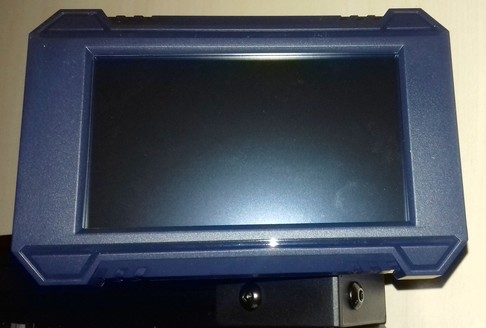
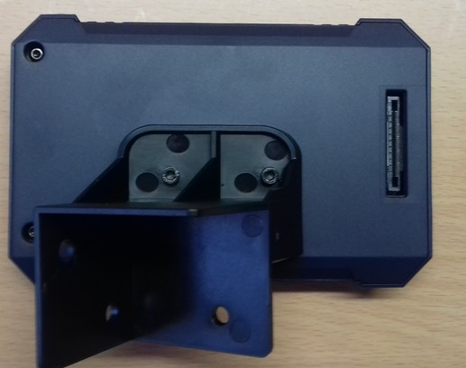
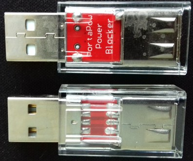
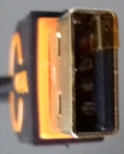

<link rel=”manifest” href=”docs/manifest.webmanifest”>

# Control Panel  
The printer comes with a 4.3" touch display.  
It's mounted to the front right edge of the baseframe.  
There's no additional microSD card slot located at this panel.  

  

At the backside of the control unit is a connector where the flat ribbon cable must be plugged in accordingly.  

  

The following picture shows the display's home screen, right after you turned on the printer.  

  

The control panel allows you to control the printer manually.    
You can e.g. initiate the bed leveling process, heat up the extruder, load and unload filament, adjust your z-offset, home one or all axes, chosse the file you want to print and so on.  
The usage is pretty easy and self-explaining, so at this point I won't add pictures of the menu or so.  
See your manual for further information of the possible actions you can take.  
  
It also displays status information like the current temperatures and the temperatures that should be reached due to a certain function or during the printing process as well as error messages if they occur.  

   
  
The display also displays error messages if any severe errors occur. See the section ["Error Messages"](../problems.md#error-messages) for further information.  
  
---

## Uploading And Choosing A File To Print  
At this time, as it's not possible to connect the printer itself to your computer nor access it locally through WiFi without using the APP and cloud, you have to use a USB drive where you save the file you want to print onto and then plug it into the printer.  
After doing so, when you want to select the file you want to print, you can then choose between three different sources where the files are/can be stored at: the internal storage of tha mainboard, the USB drive and the Anycubic cloud.  

..add pic..  

--- 

### MOD: RPi Zero(2)W As WiFi USB Drive
[mrfenyx](https://github.com/mrfenyx/) came up with an imho brilliant solution to avoid using a USB drive which you'd have to swap back and forth between your computer and your printer: he uses a Raspberry Pi Zero(2)W as a USB drive and which can then be accessed through your local network using WiFi. By doing so, you can just send (= copy/save) the sliced file to the RPi and then select it at the printer using the control unit.  
I personally didn't test it yet, but I'll definitely do so.  

This is the repo where you can find all the necessary information: [RPi-Zero-W-WiFi-USB](https://github.com/mrfenyx/RPi-Zero-W-WiFi-USB/)  

??? warning "Use A USB Power Blocker"

    When connecting the Raspberry Pi to the printer, make sure to use an additional USB power blocker.  
    By doing so, you make sure that neither the RPi nor the mainboard will draw power through the USB-C connector from the other device. If you don't do so, it can harm your mainboard as well as your computer.  
    
    As it's an fast and easy solution, you can get a device called "USB power blocker" for a few bucks. Attention: make sure to *not* get a "USB *data* blocker" though, it *has* to be a *power* blocker!  
    This device will then be plugged between the USB connector of the computer and the actual USB-C cable. It still allows data to be transferred, but the 5V line isn't existent. The following picture shows such a device - it's just plugged in between the printer's USB and the USB cable.  

      

    However, you don't *have* to spend money on this item, as there are other ways to interrupt the 5V power line.  
    For example, you can cut the 5V wire of your USB cable, you can solder a male and a female USB connector onto a little PCB and avoid making the 5V line connection.  
    You can also simply use some electric or Kapton tape and cover the belonging pin at the USB connector of the cable like shown in the following picture.  

      

    Keep in mind though that you have to pay attention that you *only* cover the 5V pin and that you have to make sure that the tape is still in place every time you plug in the cable after you unplugged it.  

---

  

