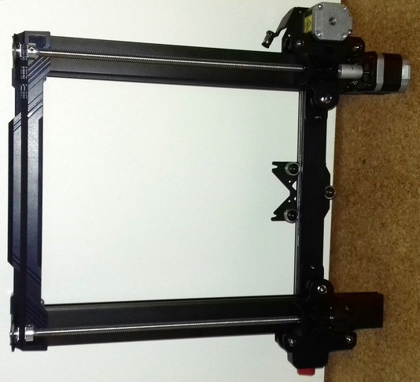

# Frame 

??? tip "Tram The Frame"  

    As already mentioned in the introduction of this hardware section, **I strongly recommend to check and tram the whole construction of the printer's frame first. Check the base frame as well as the z-axis frame even before mounting them together.**  

    *Check the whole frame if everything is square, rectangular and perpendicular, check all screws, bolts, belts, wheels, electrical connectors - literally everything.* This will save you a lot of hassle, frustration and headaches later..  

    *Seriously, I can't encourage you enough to do a complete check-up and maintenance of your printer before you even try to print the first time.*    
    Not only will you get to know your printer better, it'll most likely save you headaches and many hours of fiddling around trying to find the perfect print settings - just to despair of weird artifacts showing up on prints just when you thought you found the perfect settings because they were caused by a sticky and partially clogged lead screw thread or so.   

    Get yourself a good carpenter's square in a 90° rectangular angle. Make sure the tool itself actually really *is* square - especially the cheap ones being offered often lack of precision and aren't really square themself.  
    When attempting to measure the parts of the frame and bring them into the correct position, always measure at both sides of the construction. By doing so you can mostly avoid any misalignments which might occur if only checking at one side and maybe not really paying attention to the parts of the rails which are further away.  
    You can also strengthen the construction itself by adding certain coponents which make sure the construction is and stays in a rectangular position.  
    It's also advisable to use some screw glue like Loctite, just to make sure screws won't come loose over time due to the vibrations of the machine.  

    Take your time setting up the frame of the printer (and the axes and wheels etc. after doing so as well), be as precise as you can be. Every misalignment here will most likely cause some weird issues later which might be hard to find or even solve if you're not remembering that maybe the construction itself might be the cause.   

The machine comes preassembled with basically two major frame parts (which consist of individual parts) which I'd call the base frame and the z-axis frame.  

The following picture shows what I'd call the base frame.  

   

On there you mount the z-axis frame which is shown in the following pictures (frontside view / backside view).  

   

   

!!! warning "Don't Put It On The Side For Mounting"

    I always see people putting the whole construction on the side, with the printer resting on the side of the baseframe and the according site of the z-frame (or, to be more precise, only certain parts of it touching the desk!). Then they insert the screws and tighten them up, turn the printer around on the other side and do the same there. But by doing so, you'll risk that the z-fame won't be mounted perpendicular to the baseframe.  
    
    So what I'd recommend is to put the printer to the edge of a table, letting one side stick out a bit where you want to put in the screws.  
    Now put the z-fame on top of the base frame and make sure that the z-frame really is perpendicular to the base frame using a carpenter's square while tightening up the screws as shown in the following picture.  

      
    
After mounting both parts together, you'll already have the printer standing in front of you.  

| Kobra 2 Pro frontview | Kobra 2 Pro backview |  
|:---------------------:|:--------------------:| 
|  |   | 

---

  
