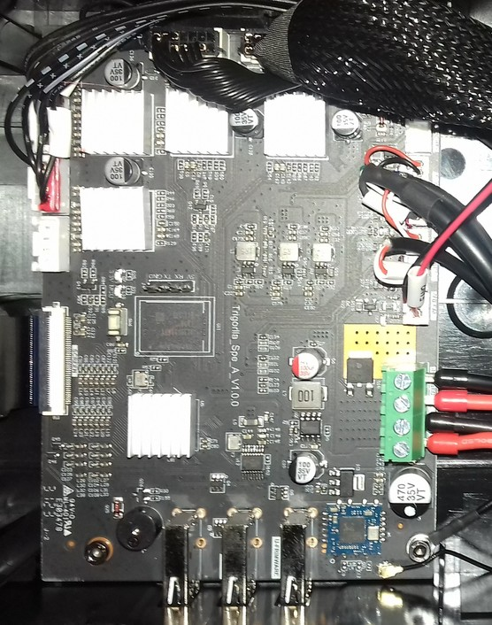
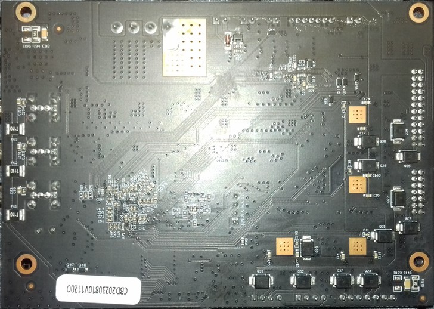
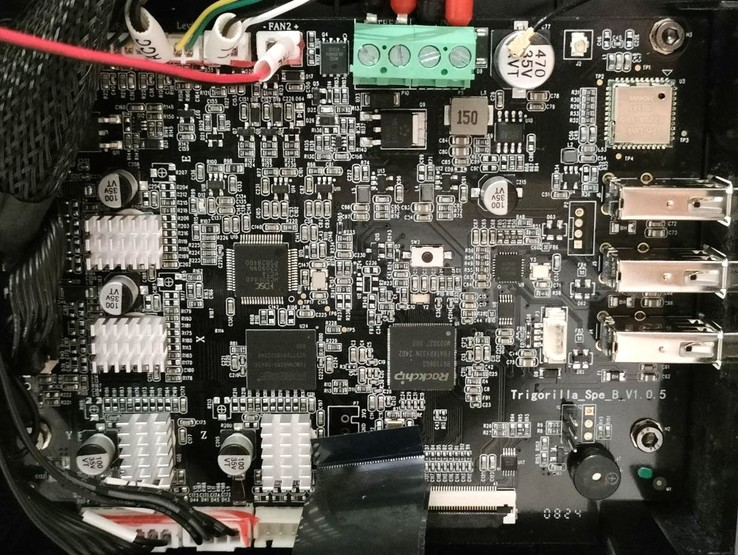
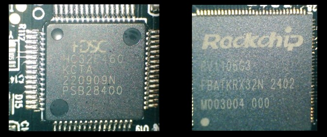
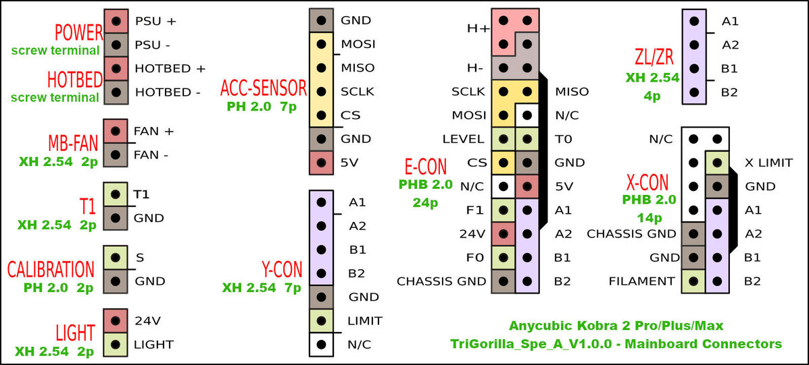
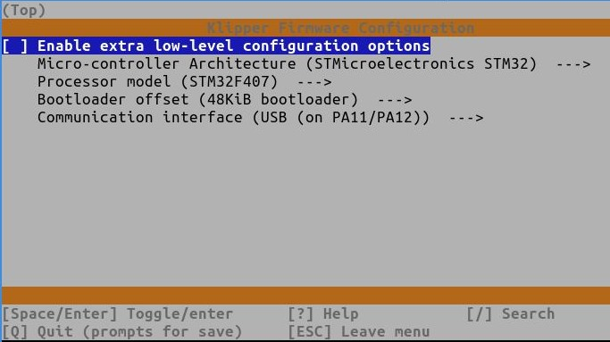
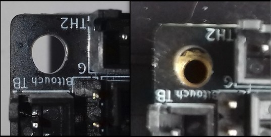
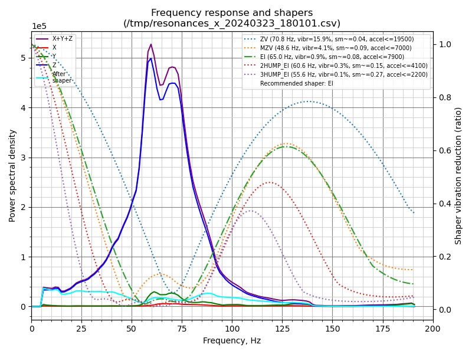

<link rel=”manifest” href=”docs/manifest.webmanifest”>

  

---  

# Mainboard

It has to be noticed that Anycubic apparently changed the mainboard revisions at a certain point after the Kobra 2 Pro/Plus/Max (which all used to have the same type of mainboard built in) hit the market.  
In the 'beginning', these printers were equipped with the "Trigorilla **Spe A**_v1.0.0". This mainboard was designed to run the newly developed [KobraOS]() firmware (which isn't Marlin anymore, but Anycubic's own firmware based on Klipper; see the chapter "Firmware" for further information).     
Probably around summer 2024, printers with "Trigorilla **Spe B**_v1.0.x" mainboards were sold - it's unclear if this only happened with a few smaller batches or if this change was permanent since then. These mainboards are equipped with a HC32F460 chip, just like other Trigorilla mainboards before that were running Marlin firmware and which could have been flashed with Klipper.  
Also, afaik, the Kobra 3 uses the "Trigorilla **Spe B**_v1.1.x., which might be a later revision of the Spe_B-revision used in the Kobra 2 Pro/Plus/Max at a certain point. The Kobra 3 also runs KobraOS, but a different version than the one that has been used at the Kobra 2 Pro/Plus/Max printers before.  
The important thing now is that there is a modded KobraOS of the Kobra 3 available, which not only seems to work fine with the B-revision of the mentioned mainboard, but it also offers access and enhanced functionality.  
Unfortunately, I personally don't have such a mainboard and therefore I can't test it, but imho it might even be possible now to install a native Klipper on this B-revision mainboards.  
So if you're looking for a solution to run a different type of firmware (either a modded KobraOS or a native Klipper), please mind the following infobox.  

!!! warning "Mind the Board Type"  

    If you're not satisfied with the stock KobraOS and seek for other options, check which mainboard revision you have built in:  
    - If it's the "Spe **A**" type, then you'd have to build in a different mainboard and go with a native Klipper (see the according chapter further down below).  
    - If it's the "Spe **B**" type, then you might want to try the modded KobraOS (see the chapter "Firmware" for further information) before attempting a hardware mod.  

---

## Trigorilla_Spe_A_V1.0.0 (Stock) 
  
The "Trigorilla_Spe_**A**_V1.0.0" is a 32bit 24V mainboard with an ARM Cortex-A7 which runs at 1.2GHz and offers 8GB of internal storage capacity.  

The mainboard comes with four TMC2209 silent stepper drivers (at least that's what Anycubic states - I didn't take off the heatsinks to check if these really are genuine TMC2209 chips) which are *soldered* onto the board (they can't be swapped out!).  

It offers three USB-A connectors labeled at the PCB as "U-EXT1", "U-EXT2" and "U-FRIMWARE" (yes, typo included ;) ).  

It also offers a built in Realtek WiFi chip ([RTL8723DU](https://www.realtek.com/en/products/communications-network-ics/item/rtl8723du)) with an external antenna which is glued to the left front side of the black plastic aperture from the inside of the housing (the position is about where the label "Kobra 2 Pro" is located).   

  
  
  

At the following picture I added labels of the connectors.  

The pinout of the 7 pin connector of the acceleration sensor is printed onto the PCB itself (same with some other pinouts of connectors in that row), but I'll list it here again, just in case you can't read it on your mainboard and when zooming in the picture shown above.  
So when you're looking at the connector in the direction of the picture above, the pinout (from left to right) is:  
| 5V | GND | CS | SCK | MISO | MOSI | GND |  

The USB-A connectors can be accessed from the front of the printer, you find them at the right hand side of that black plastic aperture of the frame as shown in the picture below.  

  

---

## Trigorilla_Spe_B_V1.0.x (Stock, new revision) 
  
The "Trigorilla_Spe_**B**_V1.0.x" is a 32bit 24V mainboard with a Huada HC32F460 chip.  
Two revisions of this mainboard have been spotted in a Kobra 2 Pro, the "Spe_B_v1.0.4" and the "Spe_B_v1.0.5".  
The following picture shows the "Trigorilla Spe_B_v1.0.5".  

  

  
   

The mainboard comes with four TMC2209 silent stepper drivers (at least that's what Anycubic states - I didn't take off the heatsinks to check if these really are genuine TMC2209 chips) which are *soldered* onto the board (they can't be swapped out!).  
It offers three USB-A connectors and WiFi.     

!!! info "Modified KobraOS Available"  

    For *this* type of mainboard there's a modded KobraOS version available - please see the according section in the chapter "Firmware" -> "KobraOS"

--- 

## Accessing The Mainboard  
If you need to access the mainboard, you need to open the housing where the mainboard is located. For doing so, you need to access the underside of the printer.  
The housing where the mainboard is located in is about 238x142mm and it's inserted in between the side rails of the base frame (see the expandable textbox below for further pictures).

Once you opened the lid, you can see that there's quite a lot of space left inside of the enclosure. If one re-routes the wires, it should be possible to add an [external MOSFET](powersupply.md#add-an-external-mosfet-mod) for the bed here.  

  

Please see the expandable textbox below for further instructions and illustrations about how to actually open the housing and access the PCB.  
<!--
As this might be interesting for someone who might try to access the mainboard for reverse engineering, I'd like to mention that there's a four pin SPI/UART connector on the mainboard as shown in the following picture.  

  
-->

??? example "How To Open The Mainboard's Housing"  

    - When looking at the underside of the machine, you can see the housing of the mainboard being located it the front, between the outer rails of the baseframe.  
        
    - In the middle you can see two hex screws. These are holding the whole housing in place as they're screwed into the Y-rail in the middle, but they also hold down the lid. So take them out first.  
    - After you took out the screws, you then have to 'unclip' the lid of the housing. As you can see in the following picture, there are plastic 'noses' which rest in the belonging nothes of the housing's base part. Use a thin tool like a screwdriver or a plectrum and insert it in the slot between the housing's lid and the base part.  
      You then need to *carefully* bend the base part slightly away to make the lid come out. I'd suggest to start at one edge like show in the picture below - once you have lifted that up, it's much easier to go around the rest.  
       
    - Once you have released all clips, I'd recommend to unplug the flat ribbon cable of the control unit and lead it through the belonging cutout of the lid for being able to flip the lid over.  
    - Once you have done that, you can flip the lid over as shown in the following picture.  
        
    - Be careful and don't rip off the wire of the fan!    

    **That's it - you successfully opened the housing of the mainboard!**  

    - If you need to take out the whole mainboard now, take out the four screws located in the corners of the mainboard.  
      Then lift up the PCB in the back first, as the USB connectors are positioned in those cutouts in the front of the housing. 
    
    For **reassembling** everything, just follow the steps in reverse.  
    In addition to that, mind the following:  
    
    - Pay attention to the wires though, so that they aren't positioned between the posts where the screws will be screwed through later.    
    - Also mind the black ribbon cable of the control unit - don't forget to lead it through the belonging cutout of the lid and reconnect it to the control unit.  
    - Also make sure to reconnect the black grounding wire at the lower right corner in case you took out the PCB.  

    If you want to **take away the whole housing** to e.g. place it outside an enclosure you put the printer in, mind the following:  
    
    - You have to take off the mount which holds the control unit.  
    - You have to pull out the black plastic cap of the face of the other side's rail. That one is just stuck in the aluminum frame, so you can pull it out. Be careful to not break those little plastic posts though which are shoved into the threads of the middle parts of the 4040 rail.  
        
    - See the following picture for getting an idea of how it should look like when all parts are dismounted for taking away the housing.  
         
    - You now have to disconnect all wires.  
    - Once you have completed this step, you can then just pull out the enclosure. It's shoved in between those two outer rails of the base frame, some plastic noses are guiding it in one of the v-slots.  
      
    

??? danger "Add Ferrules To The 24V Wires!" 

    The 24V wires already come with ferrules being added. If it happens that your specific machine doesn't come with ferrules but with tinned wires instead, **it's highly advisable to cut off the tinned tips of the wires without a plug (power supply and heated bed) and add ferrules to them.**  
    Same goes for the case that a ferrule comes off - in that case, **add a new one** instead of just inserting the wire or tinning the end of it.     
    
    The reason why not using tinned ends is simple: when you are screwing down the soldered tip inside the clamp, the solder will get cracked a bit and may get deformed a bit as well.  
    When the wire gets warm due to the current and the solder gets softer, the contact may become loose which could lead to malfunction or even cause fire in the last consequence.  
    So it's always highly recommendable to just use proper ferrules!  
      
  

??? info "Red Glue Across All Connectors"

    When you look at the mainboard, you'll see some red glue spread across all connectors.  
      
    That's just for securing the connnection. You can get that stuff off by carefully pulling it off. It works better if you warm up that stuff *a little bit* for making it more flexible, a hair dryer is good for that. It then becomes a bit softer and easier to be pulled off. Don't heat it up too much though as it'll become too soft then!  
    You can also use a thin screwdriver to lift up a part of that stuff and then use some tweezers to grab it.    
    
    However, be *very careful* to  
    
    - not harm the mainboard by slipping off with the screwdriver or tweezer!  
    - not overheat the mainboards of parts of it when heating up that red glue!  
    - not rip off the heatsinks of the stepper drivers!  
      This can happen really quick as they're just glued onto the stepper drivers with some thermal paste and the red glue is usually spread across the fins of the heatsinks as well!  
      So *if* you have to pull off that stuff from those connectors of the motor wiring, then *make sure that you press down the heatsink with your finger when trying to pull that stuff off!*  
      
---

## Connecting To The Printer / Mainboard

Anycubic doesn't allow any local access to the machine, neither via USB or via the inbuilt WiFi. So if you want to get access, you need to use their cloud service and APP.  

However, there are some approaches and/or solutions being worth mentioned at this point which I'll list as MODs in the following. As soon as I come across further ones, I'll add them here as well.  

---

### MOD: RPi Zero(2)W As WiFi USB Drive
[mrfenyx](https://github.com/mrfenyx/) came up with an imho brilliant solution to avoid using a USB drive which you'd have to swap back and forth between your computer and your printer: he uses a Raspberry Pi Zero(2)W as a USB drive and which can then be accessed through your local network using WiFi. By doing so, you can just send (= copy/save) the sliced file to the RPi and then select it at the printer using the control unit.  
I personally didn't test it yet, but I'll definitely do so.  

This is the repo where you can find all the necessary information: [RPi-Zero-W-WiFi-USB](https://github.com/mrfenyx/RPi-Zero-W-WiFi-USB/)  

??? warning "Use A USB Power Blocker"

    When connecting the Raspberry Pi to the printer, make sure to use an additional USB power blocker.  
    By doing so, you make sure that neither the RPi nor the mainboard will draw power through the USB-C connector from the other device. If you don't do so, it can harm your mainboard as well as your computer.  
    
    As it's an fast and easy solution, you can get a device called "USB power blocker" for a few bucks. Attention: make sure to *not* get a "USB *data* blocker" though, it *has* to be a *power* blocker!  
    This device will then be plugged between the USB connector of the computer and the actual USB-C cable. It still allows data to be transferred, but the 5V line isn't existent. The following picture shows such a device - it's just plugged in between the printer's USB and the USB cable.  

      

    However, you don't *have* to spend money on this item, as there are other ways to interrupt the 5V power line.  
    For example, you can cut the 5V wire of your USB cable, you can solder a male and a female USB connector onto a little PCB and avoid making the 5V line connection.  
    You can also simply use some electric or Kapton tape and cover the belonging pin at the USB connector of the cable like shown in the following picture.  

      

    Keep in mind though that you have to pay attention that you *only* cover the 5V pin and that you have to make sure that the tape is still in place every time you plug in the cable after you unplugged it.  

---

### MOD: Own Server And Webinterface  

User [anjomro](https://github.com/anjomro) did some reverse engineering and created a solution where you basically set up your own server where the machine then connects to via WiFi. You then use a webinterface anjomro created, which uses the interface of the printer's firmware.  
By doing so you can then access the machine locally to a certain degree.  

This neat solution is called ["Kobra Unleashed"](https://github.com/anjomro/kobra-unleashed).  
    

---

## Mainboard Cooling Fan
  
The following picture shows the fan of the mainboard. It's a 80x80x15mm, 24V, 0.06A type ("HSC BCY8015S24L").  

 

As you can see, the fan is covered with a metal grille to avoid that any wires might get caught.  
The following picture shows the mounting direction of the fan.  

  

---
  

## MOD: Different Mainboard

Since we can't run a native Klipper on the stock mainboard, we have to use a different mainboard if we want to do so.  
Generally speaking, you can use pretty much any generic mainboard, like from BTT or MKS, you just need to make sure that it can use 24V DC.   

In the following, I'll list which kind of connectors you most likely will need - of course you have to check the according connectors at the specific maninboard you want to use.  

Since the stock wiring for both the main cable which connects to the printhead ("E-CON") as well as for the cable which connects to the X-axis setup ("X-CON") come with specific connectors, you can either get yourself the corresponding connectors or just cut the given ones and retrofit the specific connectors which are needed for the mainboard you have chosen.  
You need a **14pin** and a **24pin PHB 2.0 male** connector. These connectors for the two main ribbon cables might be hard to find - I didn't find them at all in any store in Germany, but luckily *one seller* at AliExpress ("YANDONG store", store/912016358) had them (the 24pin connector was the one which was hard to find). The mentioned seller offers an already wired up connector with a male and a female plug, so you can just cut off the female connector and add the specific connectors.  
The following picture shows the wired 24pin version as well as a 14pin version you'd have to crimp yourself.  
   
 
Further on, you need a  
- **7pin XH 2.54 male** connector for the Y-axis setup cable,  
- **7pin PH 2.0 male** connector for the acceleration sensor of the bed,  
- **2pin PH 2.0 male** connector for the z-offset switch.  

You most likely will need **2pin, 3pin and 4pin XH 2.54 female** connectors  and a decent crimping tool for setting up most of the wiring.  
You also might need some **DuPont** connectors and a **10pin IDC female** connector (the latter one only if you want to use the ESP2 connector for connecting the acceleration sensors to SPI1 how I did it).  
In addition to that, you might need some wires, a soldering iron, heat shrink tubes, button connectors, ferrules and a crimping tool, M3 screws and nuts and last but not least a *multimeter*. See the chapter ["Tools"](../tools.md) for further information and pictures.     
  

**You can find schematics of the stock connector's pinouts at the follwing GitHub repository:** [Reverse engineering the Kobra 2 Pro](https://github.com/codexnovus/reverse-engineering-the-kobra2-pro)  
I took the following pinout scheme from there and added the names of the according connectors - thanks to [codexnovus](https://github.com/codexnovus/) for allowing me to use his picture!  
  

!!! warning "Double-check The Wiring!"  

    It can't be pointed out strongly enough:  
    - **Make sure you make the correct connections** and  
    - **double-check the wiring before connecting anything to the mainboard**!  
    - **Probe the pins and according wires** with a multimeter to make sure you picked the correct ones.  
    - When done with setting up the wiring, **check the quality of the connection with your multimeter** as well - make sure there are no loose connections (especially when crimping any connector and when using those button connectors) and no cold solder joints (when soldering). If you soldered the wires, make sure to add heatshrink tubes!   
    
---      

### MOD: MKS Robin Nano v3.1

Since I already had MKS TMC2208 v2.0 stepper drivers in my spare parts drawer, I chose the MKS Robin Nano v3.1 which I found for 25€ at AliEx.  

The following picture shows the stock mainboard on the left and the MKS board on the right.  
  

I won't go over the specs of the board here - you can find all necessary documentations for this particular board at MKS' GitHub repositories and their Wiki:  
- Main GitHub repository: ["MKS-Robin-Nano-V3.X"](https://github.com/makerbase-mks/MKS-Robin-Nano-V3.X).  
- [Hardware section for the v3.1](https://github.com/makerbase-mks/MKS-Robin-Nano-V3.X/tree/main/hardware/MKS%20Robin%20Nano%20V3.1_001) with all the schematics.  
- [Wiki for the v3.x](https://github.com/makerbase-mks/MKS-Robin-Nano-V3.X/wiki)  

They also offer an outdated `klipper.bin` file for flashing the mainboard as well as an generic `printer.cfg` example in their repo ["Klipper-for-MKS-Boards/MKS Robin Nano V3.x/"](https://github.com/makerbase-mks/Klipper-for-MKS-Boards/tree/main/MKS%20Robin%20Nano%20V3.x).   

In the following, I'll add some notes about some specific steps.  
The wiring and according pin assignments can be looked up at the mentioned documentations of the MKS board and the GitHub repo with the pinouts of the stock hardware, I'll just add some notes about my specific setup. You can also look up the pin assignments at my `printer.cfg` (see link above).  

---

#### Klipper.bin And Printer.cfg  

**Compiling The Klipper.bin File**  
Referring to the notes in the example printer.cfg file MKS offers, you have to choose the following settings for compiling the `klipper.bin` file:   

  

After you compiled the `klipper.bin` file, you need to rename the file to `Robin_nano_v3.bin`, copy it onto a microSD card (FAT32 formatted, completely empty) and insert it into the microSD cardreader while board is *not* powered on. Then power on the board and wait about 5-10min to complete the flashing procedure. Turn off the power again, take out the card and connect the board to your Klipper host via USB cable.  

**Obtaining The Printer.cfg File**  
If you like, you can find the specific `printer.cfg` I set up in the according subfolder of my GitHub repository "Klipper4Kobra2series" **[here](https://github.com/1coderookie/Klipper4Kobra2series/blob/main/Kobra2Pro/MKS/Robin_Nano_v3.1/MKS-Nano-v31_K2Pro_printer.cfg).**  

---

#### Housing
  
I decided to use the stock housing and designed an adapter plate for a comfortable mounting which you can find here: [Kobra 2 Pro/Plus/Max: MKS Robin Nano v3.1 Adapter Plate For Stock Housing](https://www.printables.com/model/817843-kobra-2-proplusmax-mks-robin-nano-v31-adapter-plat)  

You have two options of mounting the MKS board:  
- 'horizontally' where the longer side of the mainboard is parallel to the longer side of the housing, and  
- 'vertically', where the longer side of the maiboard is parallel to the shorter side of the housing.  

If you mount the board 'horizontally', you mount the mainboard to the adapterplate only, and then you mount the adapter plate to the four stock mounting, then you should be able to use a regular USB-A to USB-B cable. Then you can carefully lead the USB-A plug through one of the cutouts.  
In this case mount the mainboard to the adapter plate using all four mounting holes of the adapter plate, and then mount the plate itself to the housing using the four mounting holes of the stock mainboard.   

If you mount the KMS board 'vertically', the arrangement is a bit 'tight' and you'd need a 90° angled USB-B adapter due to the fact that the mainboard is quite close to the housing's wall.  
You can also *not* access the USB port or the microSD card reader once everything is built in. When using this mounting solution, you'll have a bit more space for stowing away the cables though.  
  

When mounting the board this way, you screw the mainboard onto the adapter plate with two screws only and then finally mount the plate and the mainboard using the four mounting points of the stock mainboard. You have to slightly elongate one specific hole though to make it fit the stock mounting points as shown in the following pictures.  
  

Since I mounted the MKS board 'vertically' and pretty close to the housing's wall, I had to use an angled USB adaptercable as mentioned. I had a USB-B male to USB-B female cable already, so I used that.  
Since I couldn't lead any of the connectors through the cutouts of the USB connectors at the front of the housing, I simply drilled a 4mm hole into a corner of the lid, cut away the plastic to make it a slot and lead the cable through there. The following picture shows the assembled setup.  

---

#### Mainboard Cooling Fan
  
Due to the stepper drivers having sockets at the MKS mainboard instead of being soldered onto the board, the clearance between the heatsinks of the stepper drivers and the lid of the stock housing is pretty limited.  
When using my adapterplate (which is 3mm thick) for mounting the MKS board into the stock housing, then it most likely won't fit (I actually didn't test it, I just eyeballed it).  
So I decided to mount the stock fan for the mainboard on the outside of the housing/lid.  
For doing so, just take a 2mm drill first of all and lead it through the existing holes of the lid's fan mounts. Make sure to not touch and harm the threads! Carefully drill through the lid.  
Once done, take a 3mm drill, flip the lid around and *carefully* enlargen the 2mm holes you just drilled (from the 'outside' so to say). Pay attention to just drill through the material, which is about 2-3mm thick - you don *not* want to drill all the way down and harm the threads!  
Now mount the fan to the outside. You can use the stock screws for that. Make sure the fan is *pushing* the air into the housing (the scoops should face the lid/inner side of the housing). Also mount the metal grill. Once done, you can lead the fan's wire through the slot of the lid where usually the ribbon cable of the control unit runs through.   
The following picture shows the fan being mounted as described.   

  

**Attention:**  
**When doing so, you have to use risers for the feet though, to elevate up the whole machine!**  

---

#### Wiring And Pin Assignment  

Since I prefer to keep the stock connectors (just in case I have to test anything with the stock mainboard later), I decided to make adapter cables, so I got myself the according connectors listed in the section above.  
  

For wiring everything up, just look up the pinout schemes at [Reverse engineering the Kobra 2 Pro](https://github.com/codexnovus/reverse-engineering-the-kobra2-pro) for the K2 Pro/Plus/Max (they're all the same).  
I took the following pinout scheme from there and added the names of the according connectors - thanks to [codexnovus](https://github.com/codexnovus/) for allowing me to use his picture!  
  

If you want to see which specific components I connected to which specific connectors at the MKS board (besides the ones I'll mentioned down below), just have a look at the `printer.cfg` I'm offering **[here](https://github.com/1coderookie/Klipper4Kobra2series/blob/main/Kobra2Pro/MKS/Robin_Nano_v3.1/MKS-Nano-v31_K2Pro_printer.cfg)**.  
To make it easier for you, I made a table where you can see the according wiring/connections I made.  
Before showing that table here, let me point out a few things first though:   

1. **Connections Of 24V, H+/H-, GND, CHASSIS_GND**  
    When you look at the pinouts of the stock wiring, you'll notice that at the main ribbon cable that connects to the printhead (called "E-CON") there are the pins GND, CHASSIS GND, 24V and H+/H- given.  
    
    Basically the *24V* and the *GND* are lead to the breakout board PCB of the printhead, from there the belonging components get the according connection. So you can can connect those ones to one of the two connectors of the MKS board which deliver the 24V continously - I personally used connector "J5" for that.  
    *Make sure to NOT connect CHASSIS GND as well here (see further down below)!*   
    When you then make the connections for the individual parts like the printhead's fans, the thermistor and so on, look at the pinout and check the according pin assignment. Since you already connected 24V and GND, you then only have to connect the according signal pin to the MKS board.  
    As an example: fan F0 (part cooling fan) needs 24V and 'F0', which is the signal (to be more precise: it's the individual PWM driven GND connection). Since it already gets the 24V from the head's breakout board where it's connected to and you already connected 24V to J5, you only need to connect 'F0' to the according connection at the MKS board - I used 'FAN1' = PC14 for that.  
    The thermistor T0 of the hotend on the other hand connects to 'T0' and GND. Since you already connected GND to J5 and the thermistor gets that connection from the head's breakout board, you only have to connect 'T0' to the according pin at the MKS board - I used 'TH1' = PC1 for that.
   
    Then we have the *CHASSIS GND* at both the E-CON and X-CON ribbon cable connectors - basically this is protective earth.  
    At the stock mainboard, we have copper plated mounting holes, where one wire is being connected to which then connects to the protective earth of the power supply. Since we don't have these copper plated mounting holes at the MKS board, you can just connect all CHASSIS GND wirings together with the wire that's running to the protective erath of the PSU.

    Then we have three *H+* and *H-* connectors at the E-CON ribbon cable. These are the 24V connections for the heater cartridge.  
    *DON'T connect them together with the 24V and GND connections mentioned above!*    
    Due to the higher current that will flow when heating up the cartridge heater for the hotend and the thin wires being used at the E-CON ribbon cable, we have three wires/connections for each *H+* and *H-* here.  
    You now have to bundle the *H+* wires and connect them to an individual *thicker* wire.
    Same with the *H-* wires - bundle them up and connect an individual *thicker* wire to them.  
    These two thicker wires now have to be connected to the according connector at the MKS board - I used 'HE0' = PE5 for that. Connect *H+* to *HE0+* and *H-* to *HE0-*.  
   
2. **Wiring Up The Motors**  
    At the mentioned pinout scheme for the K2 Pro/Plus/Max, the four motor pins are called A1, A2, B1, B2.  
    At the scheme of the MKS board though, they're called 1A, 1B, 2A, 2B.  
    So when assembling the connectors of the motor wiring, you have to make sure to connect it as shown in the following table.  

    | Anycubic Pinout | MKS Pinout |
    |:-------:|:----------:|
    | A1 | 1A | 
    | A2 | 1B | 
    | B1 | 2A |
    | B2 | 2B |

    *Don't connect A1 to 1A and then A2 to 2A - that won't work and will result in a non-functional motor setup and an error message at Klipper later.*  

3. **Z-Offset Sensor**  
    I also connectected the z-offset sensor, even though I probably won't use it. Since I plan on adding an optical minimum limit switch for the z-axis (which I'll connect to "Z-" = PC8), I connected the z-offset sensor to "Z +" = ^PC4 (I *think* you need to have the `^` in front since that activates the pullup for that pin). I'll probably not use it, but I like to have it connected - just in case..

4. **Inductive Proximity Sensor / ABL Probe**  
    The inductive proximity sensor is conencted to 24V, GND and the according signal pin labeled as 'LEVEL' at the pinout scheme at the printhead's breakout board. Since you already connected 24V and GND, you only have to connect the signal pin 'LEVEL' to the MKS board - I used the BLTOUCH connector = PA8 for that.  
    Don't worry about the 24V and the signal - due to the electronic circuit of the head's breakout board, the signal level will be just fine and won't harm the according connection of the MKS board.

5. **Fans**  
    The MKS board has two fan connectors which can be PWM controlled: FAN1 (= PC14) and FAN2 (=PB1). I connected the *part cooling fan F0* to FAN 1 and the *heatsink cooling fan of the hotend F1* to FAN2.  
    I then connected the *mainboard cooling fan* to the 24V connector "J4" - that one provides 24V continously, so the mainboard cooling fan will run as soon as you switch on the printer.  
    *Attention: always mind the polarity!*  

6. **Acceleration Sensors**  
    I decided to connect both of the acceleration sensors (printhead & bed) to the same SPI bus.  
    Since I don't use an additional screen for the MKS board, I used the EXP2 connector (you either need a 10pin female IDC connector or just some female DuPont connectors) which is SPI1.  

    If you want to use an additional screen, you can't use this connector though, so you'd have to use a different SPI bus instead.  
    In my opinion it should be possible to use the connector for the optional WiFi module which would be SPI2.  
    If that doesn't work and you don't use the 5th stepper driver E1 for driving a second z-axis motor independently, you can also use that one - make sure to set the jumper for SPI mode accordingly.  

    Whichever SPI bus you'll use in the end, just connect the MISO, MOSI, SCLK, GND and 5V VCC of both sensors parallel to the according pins.  
    *Every CS pin of each sensor has to be connected to it's own pin then though.* This is crucial - you can *not* connect the CS pins of the y- and the x-axis acceleration sensor to the same pin!  
    I decided to connect the CS pin of the x-axis' acceleration sensor (printhead) to the SPI1's "CS" pin = PA8; for the CS pin of the y-axis' sensor (bed) I used the pin PA11.
    GND can be connected to the LOGIC GND as well, or just connect it to GND at the corresponding connection you end up using for the SPI connection.  
    You then have to connect the 5V pin of the acceleration sensors to an according 5V pin at the MKS board - I used the 5V pin of the BLTOUCH connector for that.   

    The following screenshots show the results of the resonance measurements of my K2 Pro.  
      
        

The following table shows the wiring/connections according to *my* `printer.cfg` - if you want to use e.g. a different SPI port for the acceleration sensors or an additional stepper driver for a 2nd z-motor, make sure to adjust the wiring/connections accordingly!  

| Part | Pinout Label | MKS Connector | Pin / Pin Assignment |
|:-----|:----------|:--------------|:---------------|
| Probe / ABL Sensor | E-CON: LEVEL | BLTOUCH PA8 | PA8 |
| Acceleration Sensor   Printhead = X   E-CON | E-CON: MOSI   E-CON: MISO   E-CON: SCLK   E-CON: CS   E-CON: 5V | EXP2: SPI1_MOSI   EXP2: SPI1_MISO   EXP2: SPI1_SCK   EXP2: SPI1_CS   BLTOUCH: 5V | PA7   PA6   PA5   PE10   (BLTOUCH: 5V) |            
| Acceleration Sensor   Bed = Y   ACC-SENSOR | ACC-SENSOR: MOSI   ACC-SENSOR: MISO   ACC-SENSOR: SCLK   ACC-SENSOR: CS   ACC-SENSOR: 5V   ACC-SENSOR: GND | EXP2: SPI1_MOSI   EXP2: SPI1_MISO   EXP2: SPI1_SCK   EXP2: BTN_EN2   BLTOUCH: 5V   J5 --> 24V **-** | PA7   PA6   PA5   PE11   (BLTOUCH: 5V)   (J5 --> 24V **-**) | 
| Printhead's 24V main | E-CON: 24V | J5 --> 24V **+** | (J5 --> 24V **+**) |
| Printhead's GND main | E-CON: GND | J5 --> 24V **-** | (J5 --> 24V **-**) |
| Part Cooling Fan | E-CON: F0 | FAN1 | PC14 | 
| Heatsink Cooling Fan | E-CON: F1 | FAN2 | PB1 |
| Thermistor Hotend | E-CON: T0 | TH1 | PC1 |
| Cartridge Heater | E-CON: H+ / H- (3x) | HE0+ / HE0- | PE5 |
| Thermistor Bed | T1/GND | TB1 | PC0 | 
| Heater Bed | HOTBED + / - | H-BED + / - | PA0 |
| PE / Chassis GND | E-/X-CON: CHASSIS GND | PE-Wire PSU | (PE-Wire PSU) | 
| Filament Runout Sensor | X-CON: FILAMENT/GND | MT_DET1 PA4/GND | !PA4 |  
| X Limit Switch | X-CON: X LIMIT/GND | X PA15/GND | !PA15 |
| Y Limit Switch | Y-CON: LIMIT/GND | Y PD2/GND | !PD2 |    
| Mainboard Cooling Fan | MB-FAN + / - | J4 --> 24V + / - | (J4 --> 24V + / -) |
| Z-Offset Sensor | CALIBRATION S/GND | Z+ PC4/GND | ^PC4 |
| Extruder Motor | E-CON: A1/A2/B1/B2 | E0-MOTOR: 1A/1B/2A/2B | step: PD6 / dir: PD3 / enable: !PB3 / uart: PD9 |
| X-Axis Motor | X-CON: A1/A2/B1/B2 | X-MOTOR: 1A/1B/2A/2B | step: PE3 / dir: PE2 / enable: !PE4 / uart: PD5 |
| Y-Axis Motor | Y-CON: A1/A2/B1/B2 | Y-MOTOR: 1A/1B/2A/2B | step: PE0 / dir: PB9 / enable: !PE1 / uart: PD7 |
| Z-Axis Motor | ZL/ZR: A1/A2/B1/B2 | Z1-MOTOR: 1A/1B/2A/2B | step: PB5 / dir: PB4 / enable: !PB8 / uart: PD4 |  
| PSU 24V Main Power | POWER PSU + / - | POWER 12/24V + / - | (POWER 12/24V + / -) |

 
---

#### Assembly  

For assembling the whole setup, I'd suggest to first flash the `klipper.bin` onto the mainboard.  
For doing so, you need to rename the `klipper.bin` to `Robin_nano_v3.bin`, copy it to a FAT32 formatted microSD card and put it in the cardreader and connect the mainboard to your 24V DC power supply. Then switch on the power supply and wait about 5-10min for the flashing procedure to be done.   
Once done, turn off the power again and disconnect the mainboard from the power supply. Take out the microSD card as well.  

Now mount the MKS board to the adapterplate. I'd suggest to *not* mount the adapterplate into the housing yet.  
Make all the connections - *pay close attention to connect the wiring correctly*!  
When done, double-check the wiring and make sure every connector sits tight and won't come off. When using DuPont connectors, I'd suggest to add a bit of hot glue to secure the connector.  
Now carefully put everything inside the housing and mount the adapterplate to the stock mounting points. Place the lid next to the housing and connect the fan accordingly.  
Try to organize the wiring as best as you can and make sure no wires will be harmed when finally installing the lid.  

The following picture shows the MKS being assembled and mounted vertically (mind the 90° angled USB-B cable at the left side).  
The 'creative mess' with the pretty much unorganized wirings is due to the fact that I chose the length of the adapter cable's wiring slightly too short - if those would've been a bit longer, I would have been able to organize everything much better - so maybe keep that in mind if you're going for the same solution.  

Lead the USB cable out of the housing and be careful when closing the lid - you don't want to pinch any wires, neither with the mounting posts of the lid nor the edges of the lid.  
Finally put the risers underneath the feet and connect the USB cable to the one which is connected with your Klipper host.  

  

**Congratulations, you just replaced the stock mainboard** - now have fun enjoying the beauty of a native Klipper! :)  

!!! warning "Don't Start A Print Right Away!"  

    Since it can't be mentioned often enough - please *don't* try to start a print right away!  
    You need to check if everything is working as expected first of all.  
    So please follow [Klipper's "Configuration Checks"](https://www.klipper3d.org/Config_checks.html) before even trying to e.g. set the z-offset, home the machine or execute a bedmesh probing!     

---  

### MOD: BTT Manta M5P  
User [olivergregorius](https://github.com/olivergregorius) installed a BTT Manta M5P in his Kobra 2 Max. You can find his GitHub repository with the according description and files [here](https://github.com/olivergregorius/kobra-2-max-with-manta-m5p).

---

### MOD: BTT Manta M8P v2
User [crazybanane](https://github.com/crazybanane) installed a BTT Manta M8P v2 in his Kobra 2 Plus. You can find his GitHub repository with the according description and files [here](https://github.com/crazybanane/Manta-M8P-V2-for-Kobra-2-Plus).

---

### MOD: Trigorilla Pro B_v1.0.2 (Kobra 2 mainboard)
The Trigorilla Pro B_v1.0.2 is being used in the Kobra 2 (see the according chapter of the Kobra2Insights' page [here](https://1coderookie.github.io/Kobra2Insights/hardware/mainboard/#trigorilla-pro-b-v_102-stock)). With just a few modifications to the stock connectors and the wiring, [OldNKrusty](https://github.com/OldNKrusty) installed this mainboard at his Kobra 2 Max. You can find his GitHub repository with the according description and files [here](https://github.com/OldNKrusty/K2MAXKlipper).  

---

## MOD: Add An External MOSFET  

It's advisable to add an external MOSFET for driving the heated bed (if you like, you can also add one for the heater cartridge as well of course). Even though the MOSFET on the mainboard is sufficient, it's an upgrade worth doing as it not only leads to the fact that the bed will be heated up slightly faster, but it also increases the security of the hole printer.  
The MOSFET of the mainboard doesn't have a heatsink and it *may* caused by overheating due to an excessive amount of current being drawn, especially when using higher bed temperatures. Due to the low clearance between the fan of the moainboard and the ground the printer stands on, the cooling isn't the best as well. When using an enclosure which then heats up as well, cooling gets even worse.  
If the board's MOSTFET dies, you most likely have to get a whole new mainboard then. Even though it's possible to solder a new one onto the board (if you're skilled to do that), additional components might have been harmed.  
To avoid that, it's therefore adviseable to add an external MOSFET which then takes the load - the one on the mainboard only acts as a signal for the external one to switch.  

The 24V DC of the PSU will be connected to the belonging connector of the external MOSFET. The 24V DC line from the heated bed screw terminals will be connected with the belonging connector of the external MOSFET and the 24V DC wires of the heated bed will then be connected to the outlet of the external MOSFET. When the mainboard switches the onboard MOSFET, it will then trigger the external one to switch and lead the current to the heated bed.  
There are a few external MOSFETs on the market, most of them only have a "signal" connector. When using a mainboard with a dedicated 'signal' connector for this, it's then connected to that one. When using a mainboard that doesn't have this 'signal' connector like the one being used at these printers, then it's said to connect the 24V from the bed's connector of the mainboard to that.  

I personally prefer a certain type of MOSFET which also offers a dedicated connector for the 24V line besides the 'signal' connector as shown in the following picture.  

  

The PSU and the wiring of the bedplate are connected to the belonging connectors shown in the following picture: 24V from the PSU belongs to the connector labeled as "Power", the 24V for the wiring of the bedplate belongs to the connector "Hotbed".  

  

The 24V of the bed's connector of the mainboard will then be connected to the belonging connector "Bed" at the MOSFET (positioned next to the connector labeled as "Sig").  

  

If you're using this kind (or a different kind) of MOSFET, you should check if the manufacturer actually added some thermal paste between the MOSFET and the heatsink - it wasn't the case at the ones I got as shown in the picture below, so that actually completely counteracts the whole installation and makes it obsolete.  

!!! warning "Mind The Polarity"  

    Pay attention to the polarity when connecting the components!  

!!! warning "Add An Additional Fuse"

    It is highly recommended to add a suitable fuse to the 24V line, right after the connector of the PSU. If your additional parts like the converter will fail, the fuse will melt - which can save you from burning down your house.  
    
The following picture shows the MOSFET being mounted to the rear left-hand side of the frame. I made an extension wire for the thermistor wires as well. 
  
As an additional benefit, now that it's mounted back there, the problem with the bed's wires being too short isn't given anymore.  

  

---

## MOD: How To Add A Step-Down Converter For Using 12V Fans 

When you want to add components which need a different voltage than the 24VDC the PSU offers, you can do so by using a step-down converter (or a step-up converter if you need a higher voltage than 24VDC). Simply connect the IN of the converter to one of the free 24VDC connectors of the PSU, dial in the voltage you need and then connect the belonging part to the OUT of the converter.  
The following picture shows a typical "LM2596S" type step-down converter which can be used.  

 

However, when you want to use e.g. 12V fans which speeds are usually controlled by PWM of the mainboard, you have to connect them differently. The following drawing shows how to proceed in that case, so that the PWM will still work.  

!!! warning 

    The following circuit diagram about how to connect a step-down converter wasn't tested by me yet. It's assumed that the mainboard controls the PWM of the fans by switching the belonging GND of the connector.  

  

!!! warning "Add An Additional Fuse"

    It is highly recommended to add a suitable fuse to the 24V line, right after the connector of the PSU. If your additional parts like the converter will fail, the fuse will melt - which can save you from burning down your house. 

---

## MOD: Add Additional Fuses To The 24V DC Wiring 

It is highly recommended to add a fuse or a fusebox to each of the 24V lines. Pay attention to choose the correct 'size' of the fuse for the belonging part (ampere rating).  
Doing so can save you from burning down your house if components fail or if the wires somehow overheat and start to burn due to broken strands (which causes a higher resistance) or a shortcut.  

(..need to add pic..)

---

   
