<link rel=”manifest” href=”docs/manifest.webmanifest”>

# Other

Here you can find whatever didn't seem to fit in one of the other chapters.  

---
  
## USB Drive
The printer is shipped with a ??GB USB stick.  
I didn't test another stick yet, but you should be able to use sticks up to 32GB which are formatted as FAT32.  

---
  
## Spool Holder
The spool holder is mounted to the left side of the base frame.  

Some people change the position and mount the spool holder to the top of the frame (you can find models for doing so at e.g. Printables.com and Thingiverse.com).  
However, due to the construction of the frame itself, the additional weight being put on top of it, the resulting impact of the (changing) weight on vibrations while printing (especially at this high-speed type of printer) and because of the poor roll-off behavior of the spool itself, I personally wouldn't do so.  
If you want to get rid of the stock spool holder mounted to the side due to the additional width of the hole printer setip, I'd suppose to use a spool holder solution which isn't attached to the printer itself and which uses ball bearings as well.  

??? tip "Boxed Spool Holder"

    If you'd use a box with a lid which closes really well (best would be this kind of plastic box with the silicone sealing in the lid) and put a bag of desiccant in the box as well, you could also can keep the filament dry and dust-free.  
    Just print yourself one of those ball bearing spool holders where you place the spool onto, drill a hole in the side of the box and feed the filament through. Then place it next to the printer or onto a shelf above it and you're good.  
    Putting one of these cheap digital hygrometers in the box as well helps keeping an eye on the actual humidity inside of the box.  

    I personally used a cakebox with a lid which I mounted to an adjustable construction to the wall (because I couldn't get my hands on a decent box and ran across that cheap cakebox, so I couldn't resist). The spool itself is held by a bolt with some ball bearing spool holder.  
    Of course I put a bag of desiccant and a cheap hygrometer in there as well.  
    This solution isn't as air-tight as a box with a silicone sealed lid, but it does the job in my room fine. Plus, it keeps dust and my cats away from the filament as well.  

    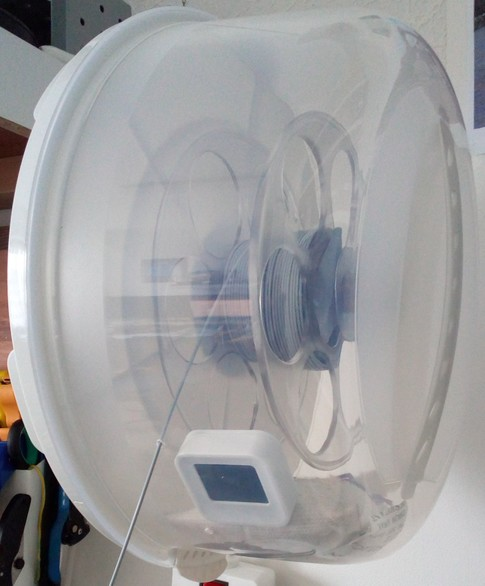

    

    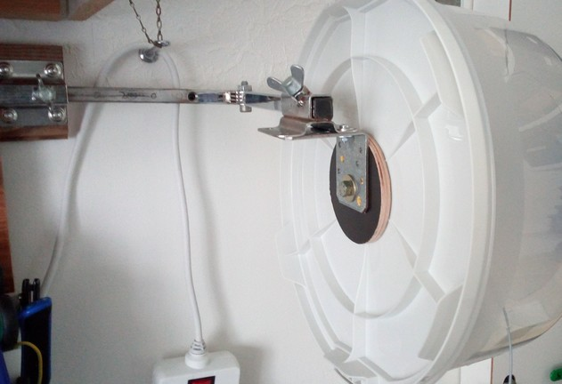  

    At the printers which are located in an enclosure, I use one of those 4l cereal containers (see the section "Filament Storage" below) with a custom lid and a spool holder mechanism to feed the filament.   

??? info "Influence Of The Spool Weight On Vibrations"  

    I personally don't like the spool being attached to the top of the frame. Even though I do see the 'value' of it in saving space around the printer, I personally think that adding 1kg (or even 2kg as some people mount a second one on top as well) to this kind of construction isn't the best idea. Especially not at these high-speed style bedslingers.    
    
    The construction itself isn't the most rigid one anyway, and the higher the x-axis gantry rises along the z-axis, the stronger the vibrations become which are caused by the moving parts. Adding another kilogram or even more to the top now will enhance this effect, which will become even bigger when printing with higher speeds. Plus, the changing weight of the spool (due to the filament being used) causes a changing pattern of these vibrations.  
    
    By using Klipper and the Input Shaper functionality, we can measure the vibrations and apply certain algorithms to compensate them (which is somehow implemented -up to a certain degree- in the stock firmware as well). But due to the fact that the patterns of these vibrations alter with the changing weight of the spool(s), it's kinda counterproductive to mount the spool(s) on top.  
    As I didn't had an empty and a full spool to test the vibrations for investigating this problem, a friend of mine was so kind to run these tests. Even though he uses a Creality Ender3 V2 Neo, the results are pretty impressive and allow to assume that the behaviour will be somewhat similar due to the pretty much same constructions of the printers.  
    
    I don't know *how much* this affects the outcome of the printed model in real life at the end, but as we try to eliminate factors that might have a negative effect anyway, I just wanted to show you this for making you aware of it.  
    
    So the following images show the outcomes of the Input Shaper measurements with an ADXL345 sensor being used. The first two images show the vibrations of the x-axis test with a full 1kg spool and an empty spool, the next two images show the belonging results for the y-axis.  
    
    | X-Axis, Full Spool (1kg) |
    |---|
    |  |  
    
    | X-Axis, Empty Spool |
    |---|
    |  |
    
    | Y-Axis, Full Spool (1kg) |
    |---|
    |  |
    
    | Y-Axis, Empty Spool |
    |---|
    |  |

---

## Filament Dryer
(will come soon)

??? info "Types Of Filament"  

    The following article gives you a nice overview of the different types of filament available and what they're being used for: [Best 3D Printer Filament: The Main Types in 2023](https://all3dp.com/1/3d-printer-filament-types-3d-printing-3d-filament/)

---
    
## Filament Storage  

Storing your filament in a way that it's not only protected from dust and UV light, but also from moisture is the way to go. As always, you have plenty of options. You could put the used spool back in a bag and vaccum and seal it, use re-usable plastic bags with a zipper and a hole for using a pump to create a vaccum, put all of your spools in a big box which is as much sealed as possible or use individual sealed containers for each spool - just to name a few.  
After doing some tests with different storage solutions and measuring the humidity over time, I personally decided to go with the last option I just mentioned - and after observing the stability of the humidity and the filament, I really can recommend it. So let me go a bit into details about it.  

I got myself some of those sealed cereal containers in the size of 4l (size is about ). The 1kg spools fit in there perfectly (at least the ones I tested - I didn't test the brands with those spools made from cardbox though and therefore I don't know if those may vary in the size), 2kg spools don't fit. These containers come with a sealed lid you can clip on the container.  
I printed a little mount for those cheap rectangular hygrometers and printed a mini spool holder as well, just to keep the spool in place a bit better (this isn't necessary though). I then also bought a big amount of silica gel (desiccant) and put 200g of it into some thin lady socks (I also tested those small packages which come with the spools, but those ones just don't take enough moisture imho). I got the orange version of the silica gel which turns to a dark green when being moist (don't get the stuff that turns blue as that's toxic) as it makes it easier to judge by a quick glance if the desiccant is still good to use.  
Adding some labels to the box helps identifying the different types of filament without the need to open the box and thake out the spool. I didn't type the colour, as I'm able to identify that through the box.  

So, adding that 200g bag into an empty container got the humidity down to 10%. That was stable across time. After adding a fresh spool right out of the sealed bag, the humidity usually raised up to something between ~40-50%, which then dropped down to 10% again over time. This value was stable then over time. In my opinion this method doesn't only keep the humidity inside of the container low but it also dries the filament over time.   

The following picture shows a setup like that.  

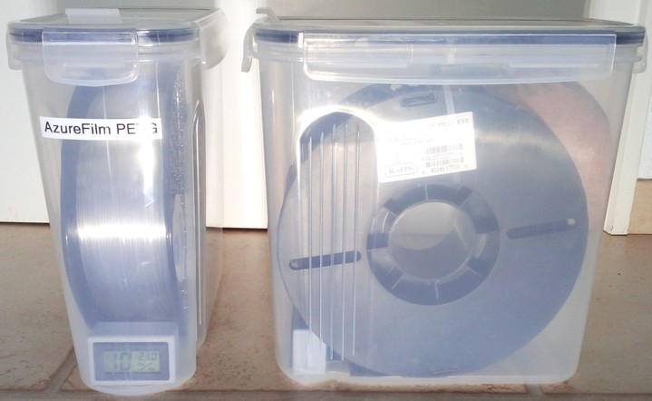

I designed a cap/insert for the lid's opening as I couldn't find any model that fit the specific triangle-like shaped opening. I made it in different variants, like with and without a hole to feed the filament through and with and without a cutout for the typical cheap hygrometer/thermometer units. The following picture shows one of those caps which I personally am using to feed filament right out of the container, it's the version with the hygrometer/thermometer unit and the 4mm hole.  

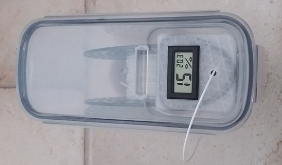  

You can find the models here: [Caps/inserts for the lids of 4l cereal containers (filament storage & feeding filament), 'triangle' shaped type ](https://www.printables.com/de/model/619339-capsinserts-for-the-lids-of-4l-cereal-containers-f)  
If you want to feed the filament right out of the box, I'd suggest to add a ball bearing mount for holding the spool. If you don't have any other feeding system, then I'd suggest to modify one of those containers for this purpose. You can also find guides about this solution and find models for printing different mounting solutions.  
   

??? info "Types Of Filament"  

    The following article gives you a nice overview of the different types of filament available and what they're being used for: [Best 3D Printer Filament: The Main Types in 2023](https://all3dp.com/1/3d-printer-filament-types-3d-printing-3d-filament/)

---

## Printer Enclosure

Using an enclosure has clear advantages and is even necessary for succesfully print certain types of filament.  
However, it might cause some problems as well.  
So here are a few things I'd like to mention about enclosures in general.   

Let's talk about the downsides first, as there are only a few:   

- When you're only printing PLA, an enclosure which traps the heat might be counterproductive. PLA needs a proper cooling, therefore a heated chamber can cause some thermal issues like insufficient cooling of the printed parts. So when you're printing PLA and using an enclosure, it's best if you leave the enclosure as open as possible.  
- An enclosure usually takes more space than the printer itself just standing somewhere. You need additional space in the enclosure for being able to reach certain parts of the hardware comfortably.  
- The trapped heat in an enclosure puts some additional thermal stress on the printer itself. The active cooling of parts like the mainboard, the PSU, the heatsink and the printed part itself won't be as sufficient as if the the printer won't be trapped in a heated chamber. Besides that, motors might get hotter and parts like the POM wheels and the belts might be negatively affected by the heat as well. Depending on the design and size of the enclosure and the temperatures of the bed and the hotend being used for printing, the temperature inside of an enclosure can easily reach 40°C.  
- The risk of a fire hazard might be higher. Especially when using flammable material for building the enclosure.  

The upsides though can clearly make up the beforementioned issues:  

- Your machine is protected from dust, pet hair and so on.  
- Depending on the design of the enclosure, you'll achieve a reduction of the noises and the fumes.  
- Printing certain types of filament will not only become easier (like PETG for example which is already pretty sensitive to a cool airstream hitting the bed), some even require the usage of an enclosure, like ABS for example.  
- You can integrate certain security functions like a smoke detector and even a fire distinguisher, which can reduce the risk of a fire hazard massively.  
  This is highly dependant on the material the enclosure is built from though - if you're using highly flammable material for insulating the inner parts of the enclosure or if you're building the enclosure from wood, then of course the whole enclosure itself will increase the risk as mentioned above. So make sure you're using proper material.  

When thinking about using an enclosure, you'd have to think about the design itself, the size and the materials.  
If you have no idea to start from, you can find countless solutions as an inspiration across the web (a pretty popular and easy to build solution is the "IKEA Lack enclosure").  
There are also prebuilt enclosures available as well as enclosures which I personally call "tent style enclosures" (or just "tents").  

I personally ended up with getting myself two of those tent style enclosures, just because I like the idea of being able to fold it together and put it in the closet if I don't need it anymore.  
There are quite a few of these tents available, but when taking a closer look at the various offers you'll see that most of them are actually the same, just being branded differently. I call them "generic" ones.  
Only some of the tents available on the market seem to really differ from those "generic" ones, here the ones from Creality and SainSmart have to be mentioned as you'll most likely come across them when you're searching for these tent style enclosures.  
I got myself one of those "generic" ones which was branded by Sunlu and one from SainSmart which I'll show in the following and mention some pros and cons I personally consider worth mentioning.  
I didn't get the one fromm Creality as it was the narrowest among those offers (width ~47.5cm) - even though it would be sufficient and the printer would fit in there (without the spool holder being mounted to the side), I personally like a bit of additional space as I often get my hands on the hardware anyway and therefore won't need to always take the printer out of the enclosure when choosing a slightly wider tent.  

***Sunlu (imho "generic" type of tent)***  
The size of this generic tent style enclosure one is about 55x64x74cm.  
Due to it's height, the enclosure allows the usage of a filament spool holder mounted to the top of the frame.    

| Sunlu closed | Sunlu open |  
|:------------:|:----------:|
| 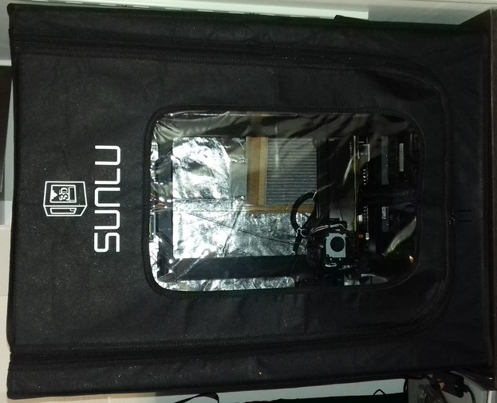 | 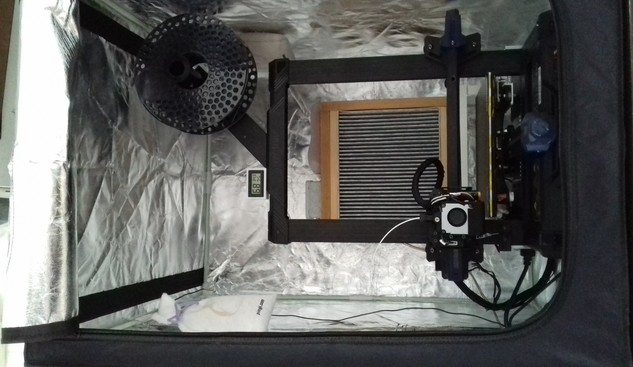 |

When looking at the generic tent which in my case was branded by Sunlu, it hits the eye right away how thin the material actually is.  
The 'aluminum' is applied as some sort of sprayed on layer, there is no insulation between the outer material and the aluminum foil at the inside as there's just one layer of material.   
If you place a lamp inside the enclosure, you can see the light shining through the material (in the picture of the closed tent above you can see some bright spots within the black material at the outside - this is the aluminum coating shining through the outer material!) - I think this already speaks for itself.  
As expected, the insulating effect on noise, temperatures and fumes therefore is only small.  
The zipper isn't covered in any way and it doesn't appear to be made of a high quality anyway.  
The rods are made from fibreglas, the parts where the rods are being stuck into are made from plastic.  
The following pictures show some close-up views of the material and the zipper.  

| Zipper | Material | 
|:------:|:--------:|
| 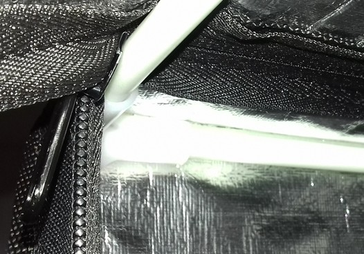 | 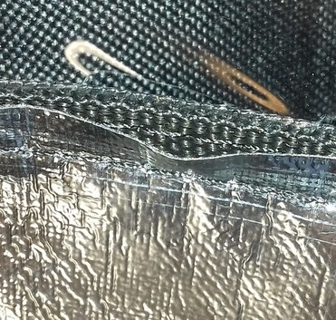 |  

You can open that front door completely all across the top.  
There's an additional opening at the left side which allows accessing the machine or feeding filament from outside - keep in mind though that this will lead to the fact that the heat won't be trapped inside anymore and airstreams could hit the bedplate.  
On the right side some pocketss for storing smaller parts are applied.   
The following picture shows the left side of the enclosure with the part which can be opened.   

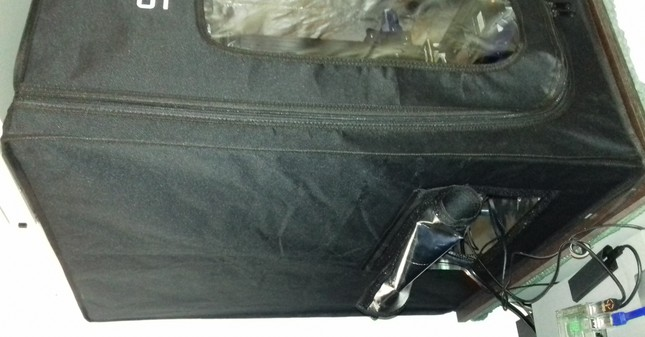

I personally used this enclosure for one of my Kobra Neos which I use for only printing PLA.  
When printing, I completely opened it. When not printing, this enclosure acted as a protection against dust and hairs of my cats.  
However, due to the fact that the following enclosure from SainSmart is just so much better, I ended up getting more of those and stowed away this thin generic one in my closet.

If you're planning on using this type of tent in a really dusty environment though, like in a workshop where you also work with wood or so, I'd strongly recommend to get yourself the tent from SainSmart (see below) instead as the zipper and the whole material is made of a much better quality.   

***SainSmart "Upgraded Large Volume 3D Printer Enclosure"***   
The size of this tent style enclosure from SainSmart one is about 54x62x72cm.  
Due to it's height, the enclosure allows the usage of a filament spool holder mounted to the top of the frame.  

| SainSmart closed | SainSmart open |
|:----------------:|:--------------:|
| 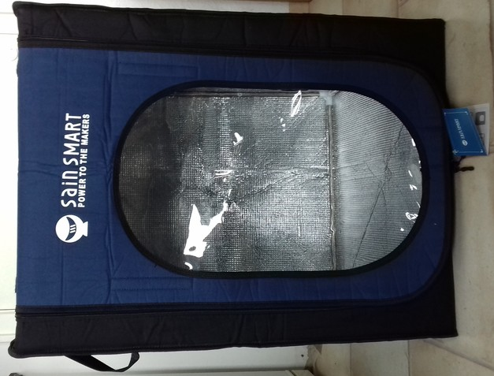 |  |

When looking at the tent, you can tell the much better quality right away.  
The material itself isn't only thicker and more dense, it also consists different layers.  
There is the outer material, then you have some sort of foam insulation and an aluminum foil covering the inside. This results in a *much better* reduction of the noise and fumes and traps the heat inside the enclosure better as well. The risk of a fire hazard should be reduced much more significantly than at the generic tent, as we have a 'real' aluminum layer here instead of just some sort of sprayed-on aluminum-looking substance.   
The zippers seem to be made of a better quality as well and they're somewhat covered.  
The rods of the frame are made from metal, the pieces where the rods get stuck in are plastic as well though.   
The following pictures show some close-up views of the zipper and the material where you can clearly see the foam padding.   

| Zipper | Material | 
|:------:|:--------:|
|  | 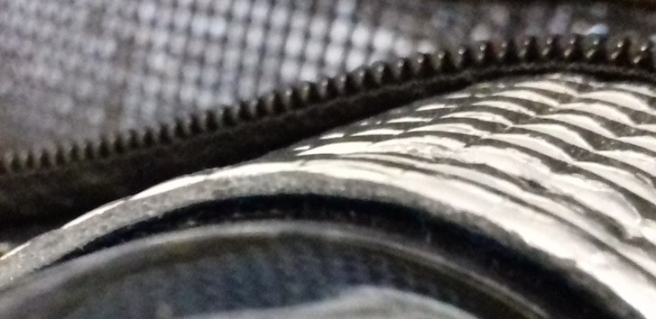 |  

The front door can be opened all across the top as well and there is an additional opening at the top which can be used while the tent is closed.  
On the left side some pocekts for storing smaller parts are applied as well as some belts for e.g. hanging up filament spools.  
On the right side there's an additional oopening as well which allows you to access the machine from the side.  

| Left side | Top side | Right side |
|:---------:|:--------:|:----------:|
| 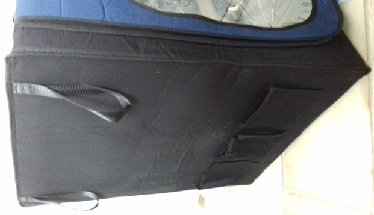 | 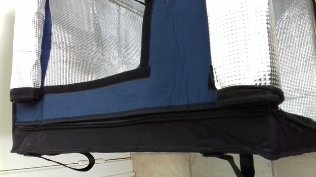 |  |

Due to the better quality, I personally used this tent for one of my Kobra Neos which only prints other types of filament than PLA in the first place.  
But because the quality is just so much better than the quality of the generic one mentioned above, I ended up getting more of these enclosure from SainSmart and only use these ones now. Compared to the generic one, it's really impressive how much quieter the printer is and how much better the fumes are being kept iniside.  

**Final thoughts on tent style enclosures**  
My bottom line here about these two types of tent style enclosures would be: if you plan to use the enclosure for *printing* more demanding types of filament like ABS for example and not just like using it as a better dust protection cover, then I highly recommend getting the one from SainSmart.  
The difference in quality compared to the "generic" one from Sunlu shown above is like day and night and it's really impressive how much quieter the printer is and how much better the fumes are being kept inside with the enclosure from SainSmart compared to the generic one.    
The enclosure from SainSmart usually is a bit more expensive that the cheapest generic ones you could get, but the much better quality is worth every buck.  
Sure, the generic one also works, and I used it for printing PETG as well (where using an enclosure isn't necessary, but it helps avoiding any cold airstream hitting the bed) as it was the first tent I got myself. When I then got the one from SainSmart and the difference in quality became obvious, I kind of did regret spending the money on the generic one though as it was only 20€ less than the one from SainSmart.  

However, due to the fact that the stock spool holder is mounted to the left side and the whole printer setup therefore gets wider, it most likely won't fit in these tent style enclosures anymore without using a different solution for the spool holder (I didn't check that yet as I'm not using the stock spool holder).  
It *might* be that the generic tents could be used when the lid on the left side is opened and the spool sticks out of the enclosure. As the one from SainSmart has the opening on the right side, this wouldn't be possible with that one then. Doing so might be counterproductive though, as the enclosure won't be closed anymore and a cold airstream might hit the bed. This wouldn't be a problem if you're only PLA anyway, but it would become a problem when printing more demanding types of filament which are sensitive to this.  
There are bigger tents available on the market es well, but of course that would come with the need of decent space to put them.  
So I personally would suggest to use a solution where the spool is held by a different type of spool holder, like using one of those abovementioned 4l cereal containers where you added a mechanism to feed the filament from. This also has the advantage that the humidity inside of the container can be held down (by adding a bag of silica gel) which serves those types of filament which tend to take up moisture faster than PLA (like PETG and TPU).  
  

<!--

---

## Mods
In the following I'll list mods or STL files I found which could be interesting in general. Keep in mind that they mostly should fit for both printers in general due to the identical design and contruction itself, so (right now) I don't separate them into **Go** and **Neo** like usually.    

- [Gregg Bennett](https://www.printables.com/de/social/221278-greg-bennett) created [risers](https://www.printables.com/de/model/394918-anycubic-kobra-neo-risers) which slip on the feet of the printer to rise up the whole construction allowing a better airflow for the fans of the mainboard and the power supply unit.  
- [Lohtex](https://www.printables.com/de/social/546846-lohtex) created [bed spacers](https://www.printables.com/de/model/376710-anycubic-kobra-go-bed-spacers) which could be used to replace the stock ones if they're completely different in their size.  
  However, keep in mind though that also the bottomside of the bed will get warm and therefore the spacers might become deformed if using PLA, so make sure you're printing them with e.g. ABS. Also keep in mind that prints aren't 100% correct in their dimensions, so that printing spacers won't be the final solution to get your bed perfectly trammed.   
- [Stellar5](https://www.printables.com/de/social/407998-stellar5) created a [purge/drip tray](https://www.printables.com/de/model/351007-anycubic-kobra-go-purgedrip-tray) which can be mounted to the frame and prevents filament from falling underneath the printer while heating up in home position.
- [ZAch Goldberg](https://www.printables.com/de/social/457330-zach-goldberg) created a [sidemount](https://www.printables.com/de/model/334261-anycubic-kobra-go-side-mount) which can be mounted underneath the holder of the control unit and offers some mounting options for e.g. a Raspberry Pi.   

-->

---

  
