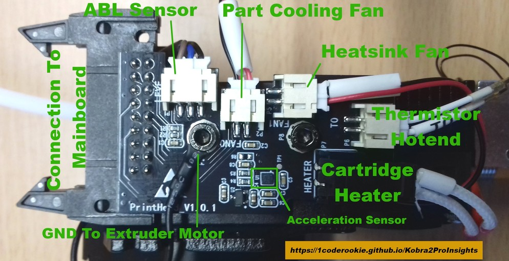

<link rel=”manifest” href=”docs/manifest.webmanifest”>

# Printhead

| Specifications |
|:---------------|
| **Feeder system**: Direct drive, dual gear, 4:1 ratio |
| **Thermistor**: 24V, 100k NTC "EPCOS 100K B57560G104F" type, capsuled, dimensions 3x5.5mm, two pinned JST PH 2.0 (?) connector |
| **Heater Cartridge**: 24V, 60W, ~10.5 Ohm, dimensions 6x18.5mm, two pinned Molex Micro-Fit 3.0 (item-no. 43645-0200) connector |
| **Nozzle**: proprietary Volcano-like nozzle (*not* compatible with Volcano!), 0.4mm |
| **Heater Block**: Volcano-like type |
| **Heatbreak**: M6 thread (to fit in the heater block), overall length 25/26(?)mm, 6mm OD / 4mm ID, PTFE tube inliner |  
| **PTFE tube**:   **Hotend**: ~41mm inliner for the heatbreak, ~4mm OD / ~2mm ID bore   **Reverse bowden tube** (between filament runout sensor and printhead): ~???mm   *Both PTFE tubes can/should be replaced with a "Capricorn XS" tube (for 1.75mm filament).* |  
| **Silicone Sock**: Volcano-style type |
| **Part Cooling Fan**: 24V, 0.14A, 50x50x20mm, model "Coolcox BF5020H24D"  |
| **Heatsink Cooling Fan**: 24V, 0.08A, 30x30x10mm, model "HSC BCY3010D24H"  |
| **ABL sensor**: PNP-NO type (imho!), connection: brown = VCC 24VDC; blue = GND; black = LEVEL/signal (seems to be the same as the one being used at the 'old' regular Kobra) |  

---

The printhead of the **Kobra 2 Pro** includes the direct drive feeder gear system, the distribution board for connecting the electronic components, the hotend, the heatsink and part cooling fans, the ABL sensor and the motion sensor for measuring the vibrances.   

The following pictures show the printhead with the blue plastic cover from various angles.  

| Front side | Back side | Top side | Bottom side |
|:----------:|:---------:|:--------:|:-----------:|
|  |  |  |  |  

It is the same as the one being used at the *Kobra 2 Plus* and *Kobra 2 Max* - it is *not* the same as the one being used in the regular *Kobra 2* and the *Kobra 2 Neo* though.  

--- 

### Mounting

The printhead itself is mounted to a metal plate which is running along the [x-axis gantry](axes.md#x-axis-gantry).  

| Mounting plate front side | Mounting plate back side |  
|:------------------------:|:-----------------------:|
|  |  |  

The following picture shows the four screws which are being used to mount the printhead onto the plate.  

  

---

### Disassembling
  
Disassembling the printhead isn't really complicated. Just make sure you're careful and put the screws in a place and order that makes it easy for you to reassemble everything later. The following steps are just a rough guide through so that you know what you'll be confrontated with. I'd recommend to take a picture of each step, so that you can look at them later when reassembling - just in case you don't know how to proceed at a certain point or if you're not sure where certain screws belong.    
  
!!! warning  

    - If you need to disassemble the printhead for e.g. changing the hotend, *unload the filament first!* 
    - For changing the nozzle or disassembling the heatbreak from the heater block, you have to *heat up the parts first!*   The main reason for that is to melt the filament which most likely entered little gaps there. Usually it's said that it should be around 200°C but that's probably not sufficient because (in my opinion) it depends on the material of the filament. So my suggestion is to heat up the extruder about 5-10°C more than the temperature you're printing with, then you should be on the safe side.   So either do that using the pre-heat function of the printer or by using a sufficient heat gut. However - don't burn yourself by touching the hot metal parts!
    - Before starting to tinker *turn off the printer* and *unplug it from the power outlet!*
    - *Use the sufficient tools!*   So please don't try to loosen the nozzle with a pair of pliers for example, use e.g. a wrench for that.   I also strongly recommend to *not* use a pair of pliers for the heater block, also for that you should use a wrench (if you don't have one of that size, use an adjustable one). A wrench has a smooth surface and therefore won't scratch the surface or even put dents into the block.  
    - Make sure you *don't lose a screw* and make sure you'll *know where the screws belong* later when you want to reassemble everything again.   You might will be able to remember the belonging screws and positions if your tinkering lasts only an hour, but if anything crosses your plan and therefore you have to pause tinkering, you maybe won't remember one week later. So maybe start sorting the screws and take notes where they belong and/or take pictures right away from the start.
    - *Be patient and careful.* Generally speaking, if you unscrew something and it doesn't come off easy, don't start pulling too hard as you might have overseen a screw or clip, so better watch twice. 
    - *Don't harm or rip off any wires* as it may cause severe damage to your mainboard or might be complicated to fix later on.   
    
Whatever you want to do, like if you want to change the hotend, the heater block, the heatbreak, a fan or even want to disassemble the whole feeder system, you have to remove the plastic cover of the printhead first.  
It's secured by two hexagon socket screws at the top of the metal back plate and a plastic clip at each side at the lower bottom as you can see at the following picture (well, you don't really see the plastic clip though but you can see the belonging notch of one of them). Be gentle and careful to not break one of the clips - the best way to get them out of their fittings is to gently push together the whole plastic cover at the bottom sides.  
  
  
  
Inside of the plastic housing, you can see the part cooling fan with the fan duct.  
*Mind the thin wire of the fan - you don't want to rip it off!* 

  

After the plastic cover is gone, you're looking at the plastic backplate of the feeder gear. Underneath it, you can see the the black heatsink with the hotend in the middle and the proximity sensor at the right side of the hotend.  
  
  

<!--  
Now we look at the left side where you can see the motor of the feeder gear. You can spot three hexagon socket screws there - two at the top and one at the bottom close to the motor housing, which are holding the entire feeder system onto the metal backplate.    
  

  
From the right side view you see the fan for cooling the heatsink and the ABL sensor with the orange tip at the very right side of the construction.    
  
 

  
Looking at the head from the bottom right side, you can see the fan outlet on the left, the hotend with the stock silicone sock and the orange tip of the ABL sensor.    
  
   
The following picture shows the whole metal plate where the feeder construction (the marked tips of the three screws on the right side) and the bracket of the ABL sensor (the two marked screws on the left side) is mounted onto - I took these pictures when the head wasn't mounted to the carrier of the x-axis so you can have a better look at the deatails.   
  

-->

*You'll find further disassembling instructions for the ABL sensor, the feeder gear system and the hotend in the specific sections.*  

---

## Breakout Board  

There's a PCB located at the printhead where the electronic components (e.g. thermistor, cartridge heater, ABL sensor etc.) are connected to which I call (for the sake of simplicity) "breakout board".    
The more 'formal' name for this is "Hot End Nozzle Adapter Board Breakout Module" - so I'll stick with "breakout board".. ;)

  

The following picture shows this breakout board from a slightly different angles, so that you can see the labels at the wires and the plugs and connectors a bit better.  

  

The connection between the mainboard and this breakout board is then accomplished by a ribbon cable. The following picture shows the connector at the head and a part of that ribbon cable.  

  

??? example "Assembling The Cap"

    When you try to assemble that cap (which is attached to the ribbon cable) onto the plug once you put it into the connector, you might have a hard time doing so - at least I had in the beginning.  
    So there's a little trick to get everything together - it's kinda difficult for me to explain it properly, but I'll try:  
    After you plugged the plug into the connector, *bend that ribbon cable* where that textile tape (or whatever that is) is located *a bit downwards*.  
    Pay attention that those levers at the sides of the connector are clipped into the plug's side.  
    Then carefully push down that cap while paying attention that it really goes across the plug in the back as well.  
    Once everything looks fine so far, push down the cap until it finally goes over the plug and clips onto it. Don't try to force it too much - you do need a bit of force, but you have to make sure that everything is in place.  

---

## ABL Sensor
The printer comes with an inductive proximity sensor for automatic bed leveling (ABL) which detects the metal of the spring steel PEI plate.  
The ABL sensor is the part with that round orange tip whic is located at the right hand side when looking at the printhead from the front.  

The sensor itself seems to be the same as the one being used at the regular Kobra, so if you need a replacement and can't find it for this specific model, look out for the one of the Kobra as well.  
In a German 3d forum someone measured the sensor of the regular Kobra and it gives +24VDC on the black signal wire when the LED lights up, so imho that's a PNP-NO type then (as the level is HIGH then).  
The connections are:  

- brown = VCC 24VDC
- blue = GND
- black = LEVEL/signal 

The position of the sensor (the height) should be adjusted in relation to the nozzle.  
Therefore you can either use the ABL height gauge which sometimes comes with the printer or you can use the bigger one of the two-sided open ended wrench that comes in the toolset.  
The following picture shows the height gauge that sometimes comes with the printer - if you don't have it and don't want to use the mentioned wrench, you can download [the gcode file](https://cdn.shopify.com/s/files/1/0245/5519/2380/files/Height_gauge.rar?v=1667814312) from Anycubic's support page and print it.  

The procedure about how to adjust the position will be described in the following section. 

The following picture shows the location of the ABL sensor at the printhead, looking at it from a bottom view angle - the ABL sensor is the part at the right side with the round orange tip.   
  

    
The ABL sensor itself is mounted in a plastic bracket which is then mounted to the metal backplate.  
  

---  
      
#### Leveling The ABL Sensor

The tip of the ABL sensor should be ~2mm higher than the tip of the nozzle.  
If it's too high, the sensor won't be able to detect the spring steel PEI plate and your nozzle will be driven into the build plate.    
So check if you need to level your ABL sensor in relation to the nozzle - this should be done after every maintenance at the hotend as well as when you got the printer brandnew from the manufacturer.  

!!! warning "Attention"  

    After adjusting the height of the ABL sensor, execute a new calibration procedure for having your new z-offset and bedmesh generated!  
    Keep an eye on your first layer and adjust the z-offset on the fly if necessary.  

The following picture shows a sensor of a different printermodel that should/has to be leveled (don't mind the tiny rest of filament at the tip of the nozzle which touches the paper instead of the nozzle itself though, I chipped it away before leveling everything).      

As I didn't get the plastic height gauge from Anycubic with my printer, I used the bigger one of those two-sided open ended wrenches. Check the parts that came with your printer, maybe you got the gauge shown in the following picture.  

If you didn't get this tool, you can also print yourself one: [ABL height gauge](https://cdn.shopify.com/s/files/1/0245/5519/2380/files/Height_gauge.rar?v=1667814312).  

See the expandable textbox below for further instructions.  

??? example "Leveling Procedure"  

    - Take the [height gauge](https://cdn.shopify.com/s/files/1/0245/5519/2380/files/Height_gauge.rar?v=1667814312) from Anycubic.  
      If you don't have the height gauge, take a sheet of paper and the bigger two-sided open-end wrench that came with your printer.  
      If you also don't have that, take something with a flat surface that is ~2mm thick.
    - Put on the spring steel plate on the heated bed and place the printhead about the center of the bed.
    - If you're using the height gauge, put it under the printhead and lower the head by turning the z axis rod manually. The nozzle should then touch the lower/thinner part of the gauge while the proximity sensor should touch the higher/thicker part of it as the following picture of a different printer model illustrates.  
         
    - If you don't have/use the height gauge, place a sheet of paper under the printhead now. Then lower the head to make the nozzle touch the sheet of paper. You should still be able to move the paper but you should feel a minimum amount of resistance as a sign that the nozzle is touching it.   Now place the wrench flat under the ABL sensor. The sensor should touch the wrench.  
    - If the sensor is too high or too low, you need to adjust the position of the sensor. Therefore you need to loosen the screw which clamps down that plastic bracket which holds the ABL sensor:    
        
    - Once you loosened the screw enough, pull that plastic bracket slightly apart and adjust the position of the sensor by moving it up or down. When you found the correct position, tighten up the screw of that bracket again.   
    - After completing the beforementioned steps, take all parts off the bed and start a calibration process for having the z-offset and the new bedmesh generated. Keep an eye on your first layer and adjust the z-offset on the fly if necessary.  

---

#### Dismounting The ABL Sensor
If you want to change the ABL sensor, take off the blue plastic housing of the printhead.  
Make sure to not rip off the wires of the part cooling fan.  
Then you'll already see the hexagon socket screw which holds the bracket of the sensor in place.  

See the expandable textbox below for further instructions.  

??? example "Dismounting Procedure"

    - First disconnect the belonging connector at the distribution box. Be careful to not rip off the wire nor the connector itself!  
    - Now measure the distance between the tip of the sensor and the lower side of the bracket, so that you can install the replacement part at the exact same height later.  
    - Now unscrew the belonging screw and take out the sensor.  
    - Voilà - you're already done! 
    
??? example "Remounting Procedure"

    For remounting, just follow the steps of dismounting in reverse:  
    
    - Place the sensor in the bracket and mind the correct position which you measured before taking the old one out.  
    - Make sure you're using the right screw and don't overtighten it though - as my father (R.I.P.) used to say: "After tight comes loose!" (roughly translated ;) ).  
    - Reconnect the wiring.  
    
    
!!! warning "Attention"

    If you dis- and remounted the ABL sensor, make sure to level the ABL sensor again and control your Z offset!  

---  
  
## Extruder / Feeder Gear System
This machine is using a direct drive, double gear extruder/feeder system (4:1 ratio).  

When you take off the blue plastic cover of the printehad, you can see the ..

At the right side of the printhead's plastic cover you can see a hole. In there is a screw which you have to use for adjusting the feeder gear tension.  
  

??? tip "Can't Load New Filament?!"

    For loading new filament, you need to have the hotend heated up to the belonging temperature first - you can't load filament in a cold hotend, as it won't melt in there.  
    
    If you can't load new filament, first of all check if you pushed the lever on the feeder gear all the way to the right.  
    
    If you did so and were able to insert the filament but it seems that it's getting stuck lower down in the hotend, then you might hit the end of the nozzle with an edge of your filament. It helps when you cut the filament in a 45° angle and bend the part you're manually feeding into the hotend so that it's pretty straight.  
    If you still can't get your filament loaded, it's most likely that the PTFE tube inside of the hotend is clogged or deformed or that you have a clog in or above the nozzle somewhere. To clean, inspect and maintain it, you need to disassemble the hotend. Check the section ["Disassembling The Hotend"](#disassembling-the-hotend) further down below for more information.   
  
<!--
The following picture shows the extruder/feeder of the **Neo** with the mounted plastic cover of the printhead.  
  

  
At the top in front of the little hole where the filament is inserted you find a little lever for manual release of the tension while loading/unloading the filament. The screw in the front adjusts the pressure of the feeder gear which is brought onto the filament. The following picture shows the mechanism without the plastic cover.  
  

  
You can access the inside of the feeder system by dismounting the heatsink, which is located at the right side underneath the heatsink fan. The following picture shows the inside of the system.  

  
-->
  
!!! warning "Retraction Settings"

    Make sure that you set the retraction distance and speed to the correct values for a direct drive in conjuction with a Volcano nozzle!  
    In general, it's supposed to be something around 1mm retraction *distance* for direct drive systems, when using a Volcano nozzle you should be fine going up to 2mm. A bit more might work well also, but you don't want to risk pulling the hot and melted filament up in the cold zone of the heatbreak, so don't exxagerate increasing the retraction distance.  
    Play around with the retraction *speed* as well, as the speed which is being used to actually retract the filament plays an important role as well.  
    You can find some more information about this topic in the section ["Retraction Settings"](../calibration.md#retraction-settings).
  
??? tip "Feeder Gear Pressure"

    When adjusting the pressure of the feeder gear, make sure you don't tighten it up too much as it could squeeze and deform the filament. On the other hand it shouldn't be too loose though as it should transport the filament reliably.  
    The following picture shows you the location of the screw for adjusting the feeder gear tension.  
      
    
    When pulling out the filament of the extruder system, you should notice little dents on the surface of the filament from the teeth of the feeder gear, the filament itself shouldn't be squeezed and deformed though, it should still be "round" so to say. You don't want the feeder gear to "bite" too much into the filament as well though, as this may lead to inconsistentites of the filament flow. I personally like to extrude a bit so that the gear actually has to pull it in. Then I do a cold pull and check the marks of the gear on the filament itself. If you can see and feel little marks of the teeth of the gear on the surface of the filament, then it should be ok. If you don't feel and see any marks, then it's too loose. PLA is pretty hard, so the pressure can/should be a bit higher as well, but if the marks are pretty deep, then it already might be too much. If the filament is already a bit squeezed and kinda flat, then it's definitely way too much pressure (you'll most likely experience some weird artefacts, inconcisties and patterns at your prints as well then).   
    The filament should be fed reliably, which especially comes into account while retracting. So keep an eye on the shaft of the motor by looking at the back of the motor - if you notice that it's slipping while retracting, you definitely need to increase the tension.  
    As a rule of thumb you can keep in mind that the pressure should be higher when using hard filament like PLA and lower when using soft filament like TPU.  
  

---

#### Disassembling The Feeder Gear

(..needs to be added..)   

<!--
??? example "Disassembling Procedure"  

    - There is a metal part with cooling fins underneath the 'big' fan at the right side, this is the heatsink.     
    - This heatsink is secured by three screws as you can see at the following picture.     
    - If you unscrew those three hexagon socket screws and take the heatsink off, you can get a closer look at the gears of the feeder system.     
    - The following picture shows the feeder gear properly assembled.     
    - The following picture shows the feeder gear being completely disassembled with the parts arranged at their (approximately) position where they belong.     
    - The following picture shows the disassembled feeder gear, the heatsink fan and the ABL sensor next to each other with the belonging screws placed at the (roughly) belonging position of the components.      So from right to left this is how it'll look when you disassemble the belonging parts. The two little screws below the heatsink are the ones which hold the heatbreak in place. Mind the three long screws for that heatsink - the two longer ones are used at the left side, the slightly shorter one is used in the bottom right corner.

    ??? info "Dimensions Of The Spring"

        As the question arised about the dimensions of the spring being used which applies the tension to the feeder gear (in case you lost it and need to find a suitable replacement), here are the dimensions of it:  
    
        - overall length: ~12-12.5mm
        - length completely compressed: hard to tell as it's pretty stiff, I'd say around 6-7mm
        - spring steel thickness: 1mm
        - windings (except the 'closed' loops at both ends): 4
        - outer diameter: ~7.1mm
        - inner diameter: ~5.1mm
  
??? example "Reassembling Procedure"

    For reassembling, just put everything back together by proceeding the steps of disassembling in reverse. Make sure you're using the right screws and don't forget any of them.  
    Don't overtighten the screws though - as my father (R.I.P.) used to say: "After tight comes loose!" (roughly translated ;) ).  
-->

---

## Heatsink  
The heatsink is located underneath the housing of the extruder/feeder gearbox. It's screwed against it with two hex screws.  
The heatsink takes in the heatbreak of the hotend and cools it down.  
Two grub screws located in the middle at the front are holding the heatbreak in place, at the backside of the heatsink you can find the heat sink cooling fan.  
The following picture shows the heatsink with it's fins from the frontview after you took off the plastic housing of the printhead.  

  
  
??? example "Dismounting The Heatsink"  

    If you need to dismount the heatsink, you need to take out the two screws which are holding it to the gearbox.  
    After doing so, you can just take it out - make sure to also get out the PTFE tube which is stuck into the heatbreak!  
      

---

### Heatsink Cooling Fan  
The heatsink/coldend cooling fan being used is a 24V, 0.08A, 30x30x10mm, model "HSC BCY3010D24H".  

??? example "Dismounting The Heatsink Cooling Fan"  

    If you need to dismount the heatsink cooling fan, you can't do so right away as one of the screws is blocked by the metal plate where the extruder motor is mounted to.  
    
      
    
    So for being able to unscrew the screw in the upper left corner, you need to unscrew the two screws in the front which hold the heatsink in place (you don't have to dismount the hotend though).  
    
      
    
    Then you can pull out the whole heatsink-hotend-setup out of the feeder gearbox and reach the necessary screws.  
    
      
    
    Now you can unscrew the fan from the heatsink and take it off.  
    
      

??? example "Remounting The Heatsink Cooling Fan"     

    For reassembling the heatsink cooling fan, just proceed with the steps of dismounting it in reverse.   

    
---  
  
## Hotend 

The assembled hotend is shown in the following picture.  
  
  

!!! warning "Stock Setup NOT Comaptible With Regular Volcano Nozzles!"  

    I added warnings and notes about this in the belonging sections (heatbreak & nozzle), but I already wanna give you a clear warning here: if you want to get yourself true Volcano-style nozzles, you *have* to change the heatbreak as well! The stock heatbreak is NOT compatible with true Volcano-style nozzles!
  
!!! warning "General Advices"

    - Too high temperatures may harm the PTFE tube - it may become deformed!   
    - If you dismounted the hotend and you put it back into the printhead, make sure you check and adjust the position of the ABL sensor in relation to the nozzle and that you check and set your new z-offset afterwards!  
    - If you replaced your old hotend or parts of it with (a) new one(s) (regardless of whether you also replaced the thermistor and/or cartridge heater with a new one or keep using the existing ones), execute a PID tuning afterwards!  

??? danger "Check The Screws From Time To Time"

    Check the screws of the heater block and the position of the cartridge heater and the thermistor from time to time!  
    Due to expansion and contraction of the aluminum heater block and the vibrations that occur, those screws can come loose - which then can result in a part being slipped out!  
    *This is a serious potential of a fire hazard!*    
    See the following picture of a user where the cartridge heater slipped out of the heater block (different type of hotend though, but the same can happen to this hotend as well).  
      

??? info "Spare Part Hotend"

    - At the time of writing there are already 3rd party hotends available. Look out for "Anycubic Kobra 2 Hotend" or similar. You can find a complete hotend including the thermistor and cartrdige heater for around 15 bucks.      
    - If the old thermistor and/or cartridge heater are still good and the wires aren't harmed, you don't have to look around for getting new ones! Just take the existing ones out of the old heater block and install them into the new one.    
    - However, scroll down and check out the "Disassembling" section below to see how to dis- and reassemble it. *Maybe you don't need new parts, so try to clean up everything first and reassemble it before ordering new parts right away.*    
  
??? tip "Can't Load New Filament?!"

    For loading new filament, you need to have the hotend heated up to the belonging temperature first - you can't load filament in a cold hotend, as it won't melt in there.  
    
    If you can't load new filament, first of all check if you pushed the lever on the feeder gear to the right hand side.
    If you did so and were able to insert the filament but it seems that it's getting stuck lower down in the hotend, then you might hit the end of the nozzle with an edge of your filament. It helps when you cut the filament in a 45° angle and bend the part you're manually feeding into the hotend so that it's pretty straight.  
    If you still can't get your filament loaded, it's most likely that the PTFE tube inside of the hotend is clogged or deformed or that you have a clog in or above the nozzle somewhere. To clean, inspect and maintain it, you need to disassemble the hotend. Check the section ["Disassembling The Hotend"](#disassembling-the-hotend) further down below for more information.     
       
??? example "Large Clump Of Melted Filament Built Up"

    Sometimes it may happen that melted filament builds up on top of the heater block to a large clump. The reason for that is that the heatbreak and the end of the nozzle don't touch tight enough, so that the melted filament can squeeze out. It also may be caused by bad and cheap parts where the threads aren't just as good as they should be.      So if you encouter this problem, here is what I recommend to do (based on my own experience with this dilemma).  
    
    - Take off the plastic cover first to get better access to the whole area.  
    - Heat up everthing.
    - Once the filament starts to melt and became soft, I'd suppose to turn off the printer, just to make you don't cause any shortcuts in case you harm the wires.  
    - Then grab a wooden stick and take away as much as possible carefully. *Don't* use a screwdriver or something like that to do so as you might harm the wires and/or cause a shortcut at e.g. the contacts of the cartridge heater.  
    *Be really careful when taking away the clumps to not harm or rip off any of the wires!* You can also use a cloth to wipe off the melted filament from the heater block and so on, just make sure you don't burn yourself!  
    - For the next steps you need to be a bit quick in proceeding them, so if this is the first time you're diassembling the hotend, take a look at the sections here at the page and read them first so you'll know where the screws are located and which steps you need to take. Then proceed with the following steps.
    - So, once everything is as clean as possible, heat everything up again. The turn off the printer and loosen the two grub screws inside the heater block to take out the thermistor and the cartridge heater. Give it a quick wipe with the cloth if they're covered by a lot of filament, too (but don't waste too much time here as the filament is becoming hard again now pretty quick!). 
    - Then disassemble the hotend (see description below), so take out the nozzle from the heater block and unscrew the heater block from the heatbreal. Pay attention if you can feel that the heatbreak was loose in the heater block to check if that was the reason for the filament being able to squeeze out and build up. 
    - If you were using a cheap nozzle and have a spare one, just throw away the old one. If it's a good or your only nozzle, try to get it back to work again by giving it a proper cleaning and doing some cold pulls when it's installed again. 
    - Now put all the metal parts (heatbreak, heater block and probably the nozzle) in a glass with acetone. close the lid and let it sit there for about 24hrs. The acetone won't dissolve PLA filament or so automagically like it does with ABS, but it'll make it soft and easier to clean. 
    - In the meantime you can take care of the thermistor and the cartridge heater. Scratch off the hardened filament from the metal parts by using a cutter for example, but be *really* careful to not slip off and harm any wires! I personally didn't take care of the little clump at the part where ther wires are coming out of the metal part because I didn't wanted to risk harming the wires, so I just let it sit there.  
    - When you're about to clean the meatal parts which soaked in the acetone, I'd recommend wearing disposable gloves as acteone isn't really healthy for your skin. So put on those gloves and start cleaning the parts by carefully scratching off the rest of the filament. Use a cutter, a brass brush etc., but always be careful to not really harm anything. Pay special attention to all the threads and the holes of the heater block where the thermistor and the cartridge heater will take place. If you don't get everything cleaned up at the first time, just put it back in the acetone, wait again and then repeat the cleaning steps. 
    - Once everything looks nice and clean, rinse off the acetone with clear water and let it dry. This is especially important for the inner side of the nozzle - you don't want to have acetone in there.  
    - Then reassemble the hotend (see description below) and put it back in place. Read the notes in the specific sections here about how to reassemble the specific parts and what to pay attention to.  
    - At the end when everything is reassembled and you heated up the hotend to finally mount the nozzle and load the filament, extrude filament to see if everything is ok. 
    - If so (I hope it will be!), don't start printing right away - execute a PID tuning for the hotend first.  
    - Also check if you need to re-level the ABL sensor in relation to the nozzle due to a probably different position of the hotend now.  
    - Execute an ABL and take care of your Z-offset, most likely the position of your nozzle will be different due to a different position of the whole hotend.  
  
  
---

#### Disassembling The Hotend
If you need to dismount the hotend from the printhead to change it or if you need to disassemble it, check out the expandable textbox below for further instructions. 

!!! warning  

    - When pulling out the hotend, *make sure the PTFE tube placed in the heatbreak comes out, too!*  
    - Inspect the PTFE tube if it's burned, deformed  or clogged - if so, get a new one as a replacement (I'd recommend using a Capricorn XS bowden tube). Make sure the filament runs through the tube nice and easy and without any friction.   
    - When pulling out the hotend, *be careful to not break any wires or rip them off from the sensor and heater catridge* - so better unscrew the tiny hex screws a bit and take out the thermistor and the heating cartridge first as mentioned above. 
    - Check the wires and contacts if they aren't harmed and if everything is ok. 
    - ***Never try to unscrew the heatbreak and/or the nozzle from the heater block while the parts are cold!***  
      Melted filament or some kind of screw lock glue might make it hard or even impossible to unscrew these parts and you risk to shear them off!  

!!! danger  

    *If you can see bare wire shining through the isolation of the wires of either the thermistor or the cartridge heater, I'd strongly recommend to replace the component to not risk a shortcut and therefore a broken mainboard!*   

??? example "Disassembling Procedure"  

    When I need to disassemble the hotend, I first take off the blue plastic cover (including the part cooling fan which you have to disconnect from the breakout board) of the printhead, so I'd suggest to do the same. Then proceed as follows.   

    **Attention: you'll handle HOT parts now, so be really careful to not harm yourself by accidentally touching any parts or your surrounding by dropping any parts!**  
    *Also make sure to be quite quick as you need to disassemble the parts while they're still hot. So make sure to read through the following steps and have the belonging tools on hand already.*  
    
    - Before you start to disassemble the hotend, heat it up to about 240°C first. Once it reached the temperature, turn off the printer.  
    - Unplug the connectors at the breakout board of the heater cartridge and the thermistor.  
    - Now I personally take out the whole hotend from the heatsink, so I'd suggest to do the same. For doing so, just loosen those two grub screws in the center of the heatsink while holding the heater block with an adjustable wrench to prevent the hotend falling down.  
        
    - Once you have the whole hotend in front of you, pull out the PTFE tube which is located in the heatbreak, it should come out easily. If it's somehow *not* there, you'll have to check in the extruder system later if it somehow got stuck in there.  
    - Now loosen the nozzle by holding the heater block in place with an adjustable spanner or wrench and carefully loosen the nozzle by turning it counter-clockwise with a 7mm wrench.  
    - Once you unscrewed the nozzle a bit, carefully grab the heatbreak then instead of the nozzle by using an adjustable wrench and turn it counter-clockwise.  
    - Then take out both parts completely from the heater block while everything is still hot - pay attention to not burn yourself and to not drop any hot parts on a temperature sensitive surface.  
      

??? example "Reassembling Procedure" 
  
    - Screw the heatbreak into the heater block to the corresponding depth and screw in the nozzle from the other side until they touch. Don't tighten up the nozzle yet!  
    - Put back the new PTFE tube in the heatbreak.  
    - If you took them out, put the thermistor and the heater cartridge back in place and secure them by carefully tighten the belonging screws. Don't overtighten the grub screw of the cartridge heater and don't pich the thin wiring of the thermistor.    
    - Then push the heatbreak back into the specific hole of the heatsink - make sure you push it deep enough (I personally push it as far into it as it goes).  
    - Turn the hotend so that the wires which are coming from the heater block are hanging freely and aren't bent too much.  
    - Then tighten up the two grub screws at the heatsink which hold the heatbreak in place, so that the hotend doesn't turn or wiggle anymore (but don't overtighten the screws though).  
    - Plug in the cartidge heater and thermistor back into their corresponding connectors.  
    - Turn on the printer and heat up the nozzle to ~230-240°C. Once the temperature is reached, tighten up the nozzle with about 1.5NM force.  
      **Make sure to hold the heater block in place with an adjustable wrench or spanner and strictly avoid any movement of it - make sure to not pinch or harm any wires while doing so!**  
    - Once everything is done, reconnect the part cooling fan to the breakout board and mount the plastic cover.   
 

<!--
---
    
#### MOD: Different Hotend 
Besides the stock hotend you can also just get or build yourself your own hotend by using a V5 compatible heatbreak and heater block which fits just fine. When doing so, pay attention to the dimensions though, as e.g. a lower position of the nozzle due to a longer heatbreak requires adaptation of the position of the part cooling fan duct!  

Genereally speaking, it's also possible to upgrade to a completely different system, like a V6, a Volcano or a MK8 - if you're willing and capable of tinkering. In that case I assume you already know what you should pay attention to, so I won't go deeper into this.  

The following pictures show two hotends I built myself from third party manufacturer parts. In both cases I used an original E3D V6 nozzle, a plated copper V5 heater block and a Capricorn XS PTFE tube for 1.75mm filament. Then I used a heatbreak for V5 compatible heater blocks where the PTFE tube goes all the way down to the nozzle (like the stock one) for printing PLA, and a bi-metal heatbreak where the PTFE tube only sticks into the top of the heatbreak for ~4mm for printing PETG and other material that needs higher temperatures.  

  

The following pictures show each hotend being disassembled. You can clearly see the shorter PTFE tube of the hotend with the bi-metal heatbreak.  

  

!!! warning "Adjust The Position Of The Part Cooling Fan"  

    If you're going to use a heatbreak which is longer than the stock one, pay attention to the part cooling fan duct / fan duct outlet. As the whole hotend setup will be slightly longer and the nozzle will be positioned a bit lower, you need to adjust the position of the fan duct (outlet), so that it doesn't point the airstream onto the nozzle, but onto the printed part.  
    As the fan duct models being available at Thingiverse, Printables etc are made for the stock setup, you'll have to modify the design, so that the outlet will come lower.  
    I did this for two models, but as I want to finetune that a bit and don't have an account there yet, I didn't put those modified version online yet. Once I did that, I'll link to them, so that you can just print them without the need of extra modification.  

!!! warning "Lower Your Retraction Distance When Using A Bi-Metal/All-Metal Heatbreak"

    When using a bi-metal/all-metal heatbreak, keep an eye on your retraction distance setting. Generally speaking, you should decrease/lower that value.
     
-->

---  

## Heatbreak

The heatbreak is plugged into the heatsink, being secured by two grub screws.   
To fit the Volcano style heater block, it has an M6 thread.  
The inner diameter is about 4.2mm to take the PTFE tube.  
The length measured from the top until the 'stop ring' before the thread is about 18mm and the length in total is about 26mm.  

  

As this isn't a bi-metal/full metal heatbreak, there is a little PTFE tube (aka "inliner") inside of it which goes all the way down to the nozzle, which is about 41mm long and 4mm thick with a 2mm hole inside of it to guide the 1.75mm filament.  
The following picture shows the heatbreak (together with the PTFE inliner) being screwed into the heater block.  

  

What's special about this stock heatbreak is the specific shape of the throat's end as you can see in the followng picture.  

  

As you can see, there's a cylindrical recess to take the corresponding part of the stock nozzle.  

  

When screwed together inside of the heater block, both parts fit perfectly.  

!!! warning "Incompatible With True Volcano Nozzles"  

    If you want to use true Volcano-style nozzles instead of the proprietary stock Volcano-like nozzle, you also have to change the heatbreak! The stock heatbreak is NOT comaptible with regular Volcano-like nozzles as the following pictures show!  

      
    

    
??? info "Spare Part Heatbreak"

    If you need a new heatbreak, you should be able to use whichever heatbreak you'd like to use, you just have to *pay attention to the dimensions*.  
    It should be of the same length as the stock one, so don't buy anything significantly shorter or longer.  
    Same goes for the outer dimensions of the throat - that has to be 6mm in diameter. Make sure to pay attention to the surface of that throat - that should be even and smooth, so don't get yourself the ones with the thread on the outside which you would have to screw into an according heater block.  
    Of course the threaded part that goes into the heater block has to be M6 as well.     
    You can look out for heatbreaks which are being advertised to fit the Anycubic Vyper - those ones fit perfectly. The following picture shows a bimetal heatbreak being advertised to fit the Vyper and the stock heatbreak.    

    
    
    However, you'll most likely only find bi-metal or full-metal heatbreaks. If you're *only* printing PLA, this might cause some issues. Anyway, when using a bi-metal/all-metal hotend, you usually should lower the retraction *distance* setting! 

??? example "Dismounting The Heatbreak"  

    - Before dismounting the heatbreak from the heater block, I personally use to heat up the hotend to ~240°C with the plastic cover (including the part cooling fan - don't rip off it's wires!) of the printhead already being taken off.  
      Once it reached the final temperature, turn off the machine and disconnect the connectors of *both* the thermistor and the heater cartridge at the [breakout board](#breakout-board), labeled as "T0" (thermistor) and "H" (cartridge heater).  
    - Then you need to take out the hotend from the heatsink by loosening those two grub screws in the center of the front of the heatsink which hold the heatbreak in place for being able to actually reach the screw which holds the thermistor in place.  
        
      **Attention:**  
      *Be very careful when doing so, as the heatbreak will slip out of the heatsink and the whole hotend will fall down immediately! As these parts are heated up, you can severly harm yourself and the surrounding! So better use a decent pair of adjustable pliers and/or some thick leather gloves to hold the hotend in place and avoid that it's falling down!*  
    - You will now have the whole hotend in front of you.  
        
    - If you now have to dismount the heatbreak from the heater block, hold the heater block in place using an adjustable wrench or an adjustable pair of pliers and grab the heatbreak with another pair of (adjustable) pliers. It might be a good idea to put a piece of cloth between the jaws of the pliers and the metal parts to avoid scratching them as much as possible.   
      *Be careful to not harm any wires by accident!*  
    - Now unscrew the heatbreak from the heater block by turning it counter-clockwise.  
         
     
    
---

### MOD: Different Heatbreak
You can swap out the stock heatbreak and use a bi-metal/full-metal one instead. Just get yourself one with the specific dimensions (M6 thread, 6mm OD throat, overall length 26mm).  
You can search for a bi-metal heatbreak which is compatible for the *Vyper*, as that one has the same dimensions as the folloing picture shows.  

  
  

!!! warning "Only Compatible With 'True' Volcano-type Nozzle!"  

    ***Mind that you'd have to change the stock nozzle to true Volcano-type nozzles as well, as the end of the heatbreak's throat is shaped different than the one of the stock heatbreak as you can clearly see at the following pictures!***  

    
    

    The following pictures show how these 'regular Volcano-type' heatbreak and nozzle touch each other perfectly when being installed in the heater block.  
    
    

??? warning "Lower Your Retraction Distance When Using A Bi-Metal/All-Metal Heatbreak"

    When using a bi-metal/all-metal heatbreak, keep an eye on your retraction distance setting. Generally speaking, you should decrease/lower that value.
     

??? warning "Bi-Metal/All-Metal Heatbreak And PLA"

    When using a bi-metal or all-metal heatbreak, it may cause and increase clogging problems when printing PLA. So up to me always go with a heatbreak that uses a PTFE inliner all the way down to the nozzle in case you're only or mostly printing PLA.  
    If you've changed the PTFE tube to a Capricorn one, then you still can print PETG, as those Capricorn tubes can take slightly higher temperatures than the cheap ones. 

---

## PTFE Tube  
There are two PTFE tubes located at this machine:  

- A longer PTFE bowden tube which is located between the printehad and the filament runout sensor, called "reverse bowden".
- A short PTFE tube inside of the heatbreak/hotend, called "PTFE inliner".  

Both PTFE tubes have the outer diameter of ~4mm and the inner diameter of ~2mm as they're meant to be used for 1.75mm filament.  

*Imho it's recommendable to change the stock tubes and use original Capricorn XS tubes instead.*  

!!! warning "Pay Attention When Installing A New PTFE Tube" 

    When installing a new PTFE tube inliner in the heatbreak/hotend, make sure it runs down through the heatbreak to the end of the nozzle and touches it.  
    *Pay special attention to make a clean and perpendicular cut at a 90° angle to avoid any small gaps between the nozzle and the end of the tube!*  
    You can use a special cutter that comes in certain sets with a Capricorn XS tube, print one of the many available cutting guides or just cut along the end of the heatbreak, using it as a guide for the cutting blade.  
      

??? info "Spare Part PTFE Bowden Tube"

    If you need a new PTFE bowden tube, I'd recommend to get the 4mm "Capricorn XS" tube for 1.75mm filament at the length of 1m. Then just cut the belonging length and replace the old bowden tube. You can also get it in a set with a cutter.  
        

---

### Reverse Bowden  
The reverse bowden tube, which is the PTFE tube between the printhead and the filament runout sensor, is about ??mm long.  
It acts as a guidance and protection for the fed filament and is clipped onto the wiring of the printhead.    

(add pic)  

??? example "How To Get The Reverse Bowden Out"

    If you need to get the reverse bowden tube out of the PC-4 couplers, you need to push down the black plastic part towards the metal part of the coupler.  
    At the printhead's coupler there's an additional blue plastic clip in between the metal and the black plastic part - make sure to remove that one first and don't lose it. Once you're done with dis- and reassembling of the tube, put that clip back in place.   

??? info "Thoughts About The Reverse Bowden"

    You might change the position of the filament spool and ask yourself if you then should also change the position of the reverse bowden accordingly or just get rid of it.  
    
    I personally don't like reverse bowden tubes that much, as I find it easier to e.g. load and unload filament and also perform cold pulls without a reverse bowden tube in place.  
    Besides that, I personally think that friction might be added when using a reverse bowden.  
    I also think that it might happen that there's different tension on the filament when the extruder moves around and when e.g. it's pushing back filament in certain positions, which imho might lead to differencies of the filament volume per extruder steps. This especially might come into place and cause issues when printing softer material like TPU.    
    *I might be completely wrong with my assumptions though, so don't take my thoughts on this as being correct!* Either just use the reverse bowden when changing the position of your spool or do some research about this topic on your own. I didn't really dive into this topic any further yet, but I most likely will do so anywhere in the future.   
    
    Reverse bowden tubes do have some advantages though, as they constrain the distance between their mounting point at the frame and the extruder. When the extruder is pushing back filament, the risk of tangling filament which then might be caught by the moving printhead therefore is reduced.  
    
    However, I personally would recommend to change the stock reverse bowden tube to a better Capricorn XS tube, as they have a lower overall friction due to their special coating/recipe.  
    
    If you're interested in this topic, maybe read this article written by Thomas Sanladerer (and/or watch his video about it): [Should you use a Reverse Bowden](https://toms3d.org/2022/09/06/should-you-use-a-reverse-bowden/). 

---

### PTFE Inliner
The short PTFE tube which is located in the hotend/heatbreak is about 41mm long.  
Here the PTFE tube only is an inliner for the heatbreak.   

The following picture shows the PTFE inliner assembled in the hotend's heatbreak.  

  

The following picture shows one of the spare PTFE inliner tubes which come with the machine.  

  

!!! warning "Check The PTFE Inliner"

    If you start to have issues whith filament being fed or extruded incorrectly, take out the assembled hotend from the heatsink to access the PTFE inliner.  
    You can simply pull this little tube out, you shouldn't have to use much force to do so - if you can't get the tube out easily, then it's already a clear sign that there's an issue.  
    If you can't get it out *at all*, then you need to heat up the hotend to the degree that you can pull it out. In this case it's advisable to take apart the whole hotend (unscrew the nozzle and the heatbreak) and do a proper cleaning of all components first. 
    
    Once you took the tube out, inspect the lower part of the tube and see if you can spot any deformations or clogs there, also if the tube got brown it's a sign of being burnt and deformed already. Look closely as it might be hard to see. If so, replace the tube.  
    
??? example "How To Access And Replace The PTFE Inliner"

    For accessing the PTFE tube in order to inspect and/or replace it, you need to take out the whole hotend from the heatsink. It's not a complicated task, you literally only need to loosen two screws (well, and you have to take off the plastic cover from the printhead in the first place).  
    
    - Take off the plastic cover of the printhead first of all. Pay attention to not rip off the wires of the part cooling fan, and unplug the connector from the breakout board.      
    - Disconnect the connectors of *both* the thermistor and the heater cartridge at the [breakout board](#breakout-board), labeled as "T0" (thermistor) and "H" (cartridge heater). You might be able to take out the hotend with those wires still being attached, but you don't want to risk ripping any wires off, so better disconnect them completely.    
    - Then you need to take out the hotend from the heatsink by loosening those two grub screws in the center of the front of the heatsink which hold the heatbreak in place for being able to actually reach the screw which holds the thermistor in place.  
        
      **Attention:**  
      *Be very careful when doing so, as the heatbreak will slip out of the heatsink and the whole hotend will fall down immediately!*  
    - You will now have the whole hotend in front of you.  
        
    - Now you can pull out the PTFE inliner from the heatbreak. Usually it comes out without any problems. *If* it doesn't come out, it might already be deformed, melted or somehow 'glued' due to molten filament - in this case you need to connect the thermistor and the cartridge heater again and heat up the hotend. Be careful to not harm yourself!  
    - Once you pulled the inliner out, inspect it and replace it with a new one. It's advisable to use Capricorn XS tubing here.  
    - If you had trouble getting out the inliner, you might have to clean the heatbreak in the inside as well. Therefore you'd have to unscrew the heatbreak from the heater block. To do so, you have to heat up the hotend to minimum 220°C - pay attention to not harm yourself!  
      Refer to the section about the [heatbreak](#heatbreak) and read the tips and the violet expandable textbox there as well for further instructions.  
       
    
??? tip "Length Of PTFE Inliner"  

    When you need to cut a new inliner and you're not sure about the correct length, the best would be to actually disassemble the hotend, so that you can install the heatbreak only. Push it into the heatsink as far as you can. Then push the replacement tube into the heatbreak from the bottom, until you can't stick it in any further. Then either cut along the end of the heatbreak or mark that spot and cut it perpendicular afterwards. Then the length should fit - at least it should fit better than the stock inliner.  
    

---
  
## Heater Block
The machine uses a Volcano-style heater block.  
Both the thermistor and the cartidge heater have to be plugged into the specific holes and fixated with the according screws.  
  
| Heater block top/side | Heater block side | Heater block top |
|:---------------:|:---------:|:-----------:|
|  |  |  |    

??? danger "Check The Screws From Time To Time"

    Check the screws of the heater block and the position of the cartridge heater and the thermistor from time to time!  
    Due to expansion and contraction of the aluminum heater block and the vibrations that occur, those screws can come loose - which then can result in a part being slipped out!  
    *This is a serious potential of a fire hazard!*    
    See the following picture of a user where the cartridge heater slipped out of the heater block (different type of hotend though, but the same can happen to this hotend as well).  
      

<!--
### MOD: Different Heater Block

!!! warning "Execute A PID Tuning"

    Whenever you change something at your hotend setup, remember to execute a PID tuning.  

You can pick any V5 type of heater block you want if you have to exchange or want to mod/upgrade your existing hotend.  
However, it might be smart to not get the cheapest one available as they sometimes lack of precision and therefore may cause problems with leaking filament.  

Usually the heater blocks are made of aluminum, but you can also get them made of plated copper (which I personally use and highly recommend) as shown in the following picture.  

    
There are also ceramic heater blocks on the market which come with M6 threads - those ones can be used as well. The following picture shows one of these already being mounted.  

However, as they come with an inbuilt heating element and an inbuilt thermistor, make sure to get yourself the correct type regarding the specs.  
Also pay attention to the length of the wires of these units and the connectors they're coming with - it might be necessary to do a bit of a tinkering to get these ones installed.  
Last but not least check the height of these units and compare it to the V5 heater block setup - most likely it will be necessary to adjust the position of your fan duct and the settings as well.   
--> 
    
---   
  
## Silicone Sock
The silicone sock that comes with the hotend insulates the heater block. Therefore it should stay in place and shouldn't come off, as it *might* cause the "thermal runaway" error.  
  
The following pictures show the stock silicone sock from different angles.     

| Sock front/side | Sock side | Sock bottom | Sock inside |
|:---------------:|:---------:|:-----------:|:-----------:|
|  |  |  |  |   
  
  
??? info "Spare Part Silicone Sock"  

    You should be able to use any Volcano-style silicone sock from the aftermarket as a spare part.     
  
---  
  
## Thermistor 
The thermistor which is used is a capsuled 100k NTC "EPCOS 100K B57560G104F" type.    
The diameter is 3mm, the length is about 5.5mm. It comes with a short wiring and the specific connector (JST PH 2.0 (?)) attached.  

The following picture shows the stock thermistor being used.  

  

  

The thermistor is plugged into the belonging hole of the heater block and is then secured by a screw as you can see in the following picture.  

  

The following picture shows the connector being used, it's a two pin JST PH-2.0 (?) type.  

??? danger "Check The Screws From Time To Time"

    Check the screws and the position of the thermistor and cartridge heater from time to time!  
    Due to expansion and contraction of the aluminum heater block and the vibrations that occur, those screws can come loose - which then can result in a part being slipped out!  
    *This is a serious potential of a fire hazard!*    
    See the following picture of a user where the cartridge heater slipped out of the heater block (different type of hotend though, but the same can happen to this hotend as well).  
      

??? info "Spare Part Thermistor"  

    It might be difficult to find this specific thermistor as an individual spare part (especially from a 3rd party manufacturer) at this point of time. You might be successful when you search for "Kobra 2 thermistor" instead though.  
    However, there are already complete hotends available from 3rd party manufacturers which aren't that expensive, so if you have to get a replacement thermistor, maybe just get yourself a whole new hotend as you'll have a spare cartridge heater (and other parts) then as well. Search for "Kobra 2 hotend" as those are the same being used.   
 

??? info "What Is A 100k NTC Thermistor?"

    A thermistor is an electronical part which changes resistances depending on the given temperature, the resistance will then be interpreted as a temperature reading. The thermistor being used is a 100k Ohm NTC type. That means, that it has a resistance of about *100k Ohm at 25°C* temperature.  
    When the temperature drops, the resistance will become higher/bigger.  
    When the temperature rises, the resistance will become lower/smaller.  
    As an example: at 20°C the resistance is about 125k Ohm; at 30°C the resistance is about 81k Ohm.  
    Therefore you can measure the functionality of the thermistor by measuring the given resistance with a multimeter.  
    See the violet expandable textbox "Measuring / Checking The Thermistor" in the section ["Checking And Replacing The Thermistor"](#checking-and-replacing-the-thermistor) below for further information.  
    

---

### Checking And Replacing The Thermistor 

If problems occur with the electric circuit or the thermistor, you can check each of them for localizing the cause of the error.  
You'll need a [multimeter](../tools.md#multimeter) for doing so.  
Basic knowledge of how to use a multimeter is sufficient - if you don't know how to use a multimeter, please do a web research. If you don't know how to measure resistance, you can start by reading [this article](https://www.fluke.com/en-us/learn/blog/digital-multimeters/how-to-measure-resistance) for example which describes the process.    

!!! warning "Turn Off The Printer And Unplug The AC Connection"

    Before attempting any measurements, *turn off the printer and unplug the AC connector first!*  

!!! danger "Electrical Shock And Severe Damage Possible"

    It's possible to experience an electrical shock and cause severe damage to your printer if you do measurements with the unit being powered on!  
    
    Unless you *have to have the printer powered* on because you need to check certain functions (e.g. if the power supply is working and delivering the belonging 24V for driving the components), *always* turn off the printer and unplug the AC connector first!  
    
    *Doing measurements with the unit being powered on should only be done if you ***really*** know what you're doing!*  

---

#### How To Check The Thermistor

The following expandable textboxes will give you some basic instructions what you can do to check the electric circuits of the thermistor.  
  
??? example "Measuring / Checking The Wiring"  

    Before attempting any measurements, do a visual check if the insulation of the thermistor's wires is still intact. 
    
    *If you can see bare wire shing through due to a melted and/or displaced insulation, change the part immediately!*  
    
    Don't try to cover it up with some kind of insulation, even though Kapton tape should stand the heat. You'll risk a shortcut which then will harm your motherboard and might even cause more severe damage!  
    
    Generally speaking, you can check the wiring of the thermistor by measuring the electrical continuity of the wires. If your multimeter doesn't have this function, you can measure the resistance instead.  
    However, *it's advisable to measure the resistance, even though your multimeter offers the function of probing for continuity,* because it might be the case that a wire still passes the check for continuity, but that individual strands of the wire are broken. This causes problems if those strands lose contact permanently or during movement of the head, as it leads to a higher resistance and therefore a wrong temperature being reported.  
    
    The difficulty here though is to actually measure one wire by itself, because you can only access one end of the wire (at the connector), the other end is inside of the thermistor's capsule. So if you measure the resistance probing at both contacts of the two wires, you already measure the thermistor itself as well.   
    However, by doing so you could still be able to tell if the wiring is faulty when you move the wires around while probing and see if the resistance value will spontaneously change. It actually wouldn't really help you in the end though to know if it's either the wiring or the thermistor itself, as you can't just change the wiring. Due to the construction of the thermistor and it's wiring, you'd have to replace the whole unit anyway though.  
     

??? example "Measuring / Checking The Thermistor"  

    You can check if a thermistor is working or if it's somehow broken by measuring the resistance of it using a multimeter.  
    As mentioned above, at a temperature of 25°C the resistance should be ~100k Ohm (nominal restistance: R25°C = 100 kΩ ± 1%).  
    If the temperature is lower, the resistance value will be higher; if the temperature is higher, the resistance value will be lower.  
    The following table gives you some typical resistance values of a 100K thermistor type 3950 (generic) for temperatures around room temperature. The values might slightly vary from the one you'll get, but they should be pretty close.  
    
    | Temperature in °C | Resistance in kΩ (kilo Ohm) |  
    |:-----------------:|:-----------------------------:|
    | 15° | ~157 kΩ |
    | 20° | ~125 kΩ |
    |**25°**| **~100 kΩ** |
    | 30° |  ~81 kΩ |
    | 35° |  ~65 kΩ |

    *Set your multimeter to resistance testing for a higher Ohm range - in most cases the multimeters have different settings, usually 200/2000/20K/200K/20M -> use the setting "200K" here.*  
    
    You can measure by probing the belonging wires at the plug of the [breakout board](#breakout-board) (unplug it!), that would be the connector labeled as "T0".  
    Keep in mind though that by doing so you also measure the wiring itself. Means, if there are e.g. broken wires, the thermistor won't work even if the thermistor itself is still fine. Due to the construction of the thermistor and it's wiring, you'd have to replace the whole unit anyway though.     
    
  

---

#### How To Replace The Thermistor

If you need to replace the thermistor of the hotend, see the expandable textbox below for further instructions.  

*Of course always turn off the printer and unplug it from the power outlet first and then unplug the belonging connector at the mainboard before attempting replacing either component.*  

!!! danger "Don't Pinch The Wires"  

    When replacing the thermistor, *make sure you don't pinch and harm the thin wires with the head of the screw which is holding the thermistor in place!*  
 

??? example "Replacing The Thermistor"

    - If you need to change the thermistor, take off the blue plastic housing of the head first (including the part cooling fan - don't rip off it's wires!).  
    - It's advisable to already disconnect the connectors of *both* the thermistor and the heater cartridge at the [breakout board](#breakout-board), labeled as "T0" (thermistor) and "H" (cartridge heater).  
    - Then you need to take out the hotend from the heatsink by loosening those two grub screws in the center of the front of the heatsink which hold the heatbreak in place for being able to actually reach the screw which holds the thermistor in place.  
        
    - So loosen those two screws and take out the whole hotend - be careful when pulling it out to not rip off any wires if you didn't disconnect them already.  
    - Once you took the hotend out, you can already spot the black head of the hex screw which taps the thermistor and holds it in place.  
          
    - Take out that black hex screw completely and you can pull out the thermistor.  
        
      *Attention: be careful when trying to loosen that screw, it might be that it won't come loose unless you heated up the hotend first!*  
    - Now take your new thermistor and repeat the steps in reverse for reassemble everything.  
      Make sure to not pinch the thin wires of the thermistor with the head of the black hex screw and to connect the wires back to the breakout board once you installed the hotend back into the heabreak.  

---

## Cartridge Heater

The cartidge heater which is used is a **24V 60W** element.  
The diameter is 6mm, the length of the original part is about 18mm. The stock part comes with a short wiring and the specific two pinned [Molex Micro-Fit 3.0 (item-no. 43645-0200)](https://www.molex.com/en-us/products/part-detail/436450200) connector attached.    

The following picture shows the stock cartridge heater being used.  

  

The cartridge heater is plugged into the specific hole of the block and is hold in place with a 1.5mm hex grub/set screw.  

The following picture shows the two pinned [Molex Micro-Fit 3.0 (item-no. 43645-0200)](https://www.molex.com/en-us/products/part-detail/436450200) connector which is necessary to fit into the socket at the mainboard.  

 

??? danger "Check The Grub Screws From Time To Time"

    Check the grub/set screw of the heater block and the position of the cartridge heater from time to time!  
    Due to expansion and contraction of the aluminum heater block and the vibrations that occur, those screws can come loose - which then can result in a part being slipped out!  
    *This is a serious potential of a fire hazard!*    
    See the following picture of a user where the cartridge heater slipped out of the heater block (at a different printer though).  
      
  

??? info "Spare Part Cartridge Heater" 

    It might be difficult to find this specific cartridge heater as an individual spare part (especially from a 3rd party manufacturer) at this point of time. You might be successful when you search for "Kobra 2 cartridge heater" instead though.  
    However, there are already complete hotends available from 3rd party manufacturers which aren't that expensive, so if you have to get a replacement thermistor, maybe just get yourself a whole new hotend as you'll have a spare thermistor (and other parts) then as well. Search for "Kobra 2 hotend" as those are the same being used.  
 

!!! warning "Replacing The Cartridge Heater / Thermistor" 

    See the section ["Checking The Cartridge Heater And The Thermistor"](#checking-the-cartridge-heater-and-the-thermistor) at the end of this chapter for further instructions about how to check and replace those components. 
   

<!--
??? info "Ceramic Heater Block With Inbuilt Heating Element"

    There are ceramic heater blocks on the market which come with M6 threads and an inbuilt heating element (24V, 55W) and a thermistor (100k, most likely it's a "Generous 3950" type). The wires usually aren't long enough for these printers and lack the belonging plugs as well, so further tinkering is necessary to get these ones installed.  
 

??? tip "Execute PID Tuning"      
    
    After successful installation of the new thermistor and/or cartridge heater, execute a [PID tuning](calibration.md#pid-tuning) using e.g. Octoprint!  
-->  

---

### Checking And Replacing The Cartridge Heater 

If problems occur with the electric circuit or the cartride heater, you can check each of them for localizing the cause of the error.  
You'll need a [multimeter](../tools.md#multimeter) for doing so.  
Basic knowledge of how to use a multimeter is sufficient - if you don't know how to use a multimeter, please do a web research. If you don't know how to measure resistance, you can start by reading [this article](https://www.fluke.com/en-us/learn/blog/digital-multimeters/how-to-measure-resistance) for example which describes the process.    

!!! warning "Turn Off The Printer And Unplug The AC Connection"

    Before attempting any measurements, *turn off the printer and unplug the AC connector first!*  

!!! danger "Electrical Shock And Severe Damage Possible"

    It's possible to experience an electrical shock and cause severe damage to your printer if you do measurements with the unit being powered on!  
    
    Unless you *have to have the printer powered* on because you need to check certain functions (e.g. if the power supply is working and delivering the belonging 24V for driving the components), *always* turn off the printer and unplug the AC connector first!  
    
    *Doing measurements with the unit being powered on should only be done if you ***really*** know what you're doing!*  

---

#### How To Check The Cartridge Heater

The following expandable textbox will give you some basic instructions what you can do to check the electric circuits of the 24V cartridge heater.  
  
??? example "Measuring / Checking The Wiring"  

    Before attempting any measurements, do a visual check if the insulation of the cartridge heater is still intact. 
    
    *If you can see bare wire shing through due to a melted and/or displaced insulation, change the part immediately!*  
    
    Don't try to cover it up with some kind of insulation, even though Kapton tape should stand the heat. You'll risk a shortcut which then will harm your motherboard and might even cause more severe damage!  
    
    Generally speaking, you can check the wiring of the 24V line by measuring the electrical continuity of the wires. If your multimeter doesn't have this function, you can measure the resistance instead.      
    However, *it's advisable to measure the resistance, even though your multimeter offers the function of probing for continuity,* because it might be the case that a wire still passes the check for continuity, but that individual strands of the wire are broken. This causes problems if those strands lose contact permanently or during movement of the head, as it leads to a higher resistance.  
    At the 24V wires this can lead to the circumstance that the wire will get hot at that spot, that the insulation will melt, that a shortcut might occur and it might even occur that it causes a fire.   

    The difficulty here though is to actually measure one wire by itself, because you can only access one end of the wire (at the connector), the other end is inside of the hetaer cartridge's capsule. So if you measure the resistance probing at both contacts of the two wires, you already measure the cartridge heater itself as well.  
    However, by doing so you could still be able to tell if the wiring is faulty when you move the wires around while probing and see if the resistance value will spontaneously change. It actually wouldn't really help you in the end though to know if it's either the wiring or the cartridge heater itself, as you can't just change the wiring. Due to the construction of the cartridge heater and it's wiring, you'd have to replace the whole unit anyway though. 
        

??? example "Checking The 24V Heating Circuit Of The Cartridge Heater"  

    You can check the 24V heating circuit of the cartridge heater itself. Besides inspecting it closely if any visible damages like scratches or abraded spots are visible, you can measure the continuity and resistance of the circuit as well.  
    
    If the circuit and the cartridge heater is ok, continuity will be given and a resistance of about 10.5 Ohm should be reported.  

---

#### How To Replace The Cartridge Heater

If you need to replace the cartridge heater of the hotend, see the expandable textboxes below for further instructions.  

*Of course always turn off the printer and unplug it from the power outlet first and then unplug the belonging connector at the mainboard before attempting replacing either component.*  

When replacing the cartridge heater, *make sure you don't overtighten the tiny grub screws / set screws which holds it in place as it could harm the heater cartridge!*  

??? example "Replacing The Cartridge Heater"  

    - If you need to change the thermistor, take off the blue plastic housing of the head first (including the part cooling fan - don't rip off it's wires!).  
    - It's advisable to already disconnect the connectors of *both* the thermistor and the heater cartridge at the [breakout board](#breakout-board), labeled as "T0" (thermistor) and "H" (cartridge heater).  
    - Then you need to take out the hotend from the heatsink by loosening those two grub screws in the center of the front of the heatsink which hold the heatbreak in place for being able to actually reach the screw which holds the thermistor in place.  
        
    - So loosen those two screws and take out the whole hotend - be careful when pulling it out to not rip off any wires if you didn't disconnect them already.  
    - Once you took the hotend out, loosen the 1.5mm hex grub/set screw at the heater block which holds the cartride heater in place.  
          
      *Attention: be careful when trying to loosen that screw, it might be that it won't come loose unless you heated up the hotend first!*  
    - Now you can take out the cartridge heater.  
        
    - Now take your new cartridge heater and repeat the steps in reverse for reassemble everything.  
      Make sure to screw the grub screw in tight but not too tight (as you don't want to harm the unit) and to connect the wires back to the breakout board once you installed the hotend back into the heabreak.  
  
---  
  
## Nozzle
Anycubic ships the printheads with a *proprietary* Volcano-like brass nozzle (0.4mm for 1.75mm filament).  

  

!!! warning "Incompatible With True Volcano Nozzles"  

    The stock nozzle and heatbreak Anycubic is using is NOT comaptible with true Volcano-style nozzles. So if you want to use regular Volcano nozzles, you also HAVE to swap out the stock heatbreak and get yourself a different one!   
    
    
??? info "About Nozzles In General" 

    - *Do yourself a favour and don't buy those cheap brass nozzles where you'll get a dozen of them for a few bucks.* It's just not worth it.  
    Remember that the nozzle is pretty much the most crucial part when it comes down to printing and achieving good results, as it's the last link in the chain of the print process and puts out the filament - so go for an established manufacturer who is known for producing quality nozzles.  
      Means, avoid those cheap sets of nozzles where you get a dozen nozzles for a few bucks. Those often lack quality: the bore might be off-center and/or might have a burr (which leads to heavy stringing), the thread might not be precise (which leads to leaking) and so on.  
      I personally only use [**original E3D Volcano nozzles**](https://e3d-online.com/products/volcano-nozzles). Yes, they are a bit more expensive than the super cheap ones, but it's still a good price and it's really worth it - they last longer, they're precisely made and you'll get much better results. As long as you don't want to print special abrasive filaments, you're always good with the standard E3D V6 brass nozzles.  
  
    - If you want to print filaments that are more abrasive, you probably want to go with nozzles made from plated copper, stainless or hardened steel, ruby sapphire nozzles and so on. Check out the web for further and more specific information about what to choose.  
      Be aware of the fact though, that the manufacturers *clearly advise against doing cold pulls with any kind of coated nozzles*! This also involves hardened steel nozzles! Referring to them, the coating might be harmed when doing so.  
    
    - When it comes down to choose the right nozzle size, it all depends on what you want to print and how detailed it should be. The standard size of 0.4mm the printers come with is a good starting point.  
      However, you may find yourself in the situation that you want to print more detailed objects or objects which should be more sturdy or where it doesn't matter if the surface doesn't look as clean and flat as possible, so you probably should adjust the size and switch to a smaller oder bigger diameter like 0.2mm for high detailed objects and 0.6mm for the 'rougher' prints.   
      Keep in mind though that the printing time usually increases by choosing a smaller diameter and it decreases when you're using a bigger diameter.  
      The printing time as well as the quality also depends on the [layer height](../calibration.md#layer-height) you're using, so by choosing a smaller layer height you can also get detailed and great looking prints with a 0.6mm nozzle.  
      Last but not least a smaller nozzle bore is more likely to clog and some filaments even have a sticker on the spool saying that e.g. it should be printed with minimum a 0.4mm nozzle. So choose wisely if you really want to use a nozzle with a 0.2mm bore for example.  
      Search the web for more specific information about finding and choosing the right nozzle size for your project. You may want to start with this article from [All3DP: The Best 3D Printer Nozzle Types, Sizes & Materials](https://www.all3dp.com/2/3d-printer-nozzle-size-material-what-to-know-which-to-buy). 
  
    
  
---

### Spare Nozzles

If you need to replace the nozzle, you either have to buy spare part nozzles directly from Anycubic or find a 3rd party seller who sells these specific nozzles. These ones can often be found much cheaper than the ones from Anycubic while the quality might be comparable. If you search for these kind of specific stock nozzles, you can search for e.g. "Anycubic Kobra 2 nozzle", as the same type of proprietary nozzle is being used in the regular Kobra 2 and the other models of the Kobra 2 line (like the Kobra 2 Neo, Plus and Max).  

Anycubic only sells 0.4mm nozzles and also in the `printer.cfg` the nozzle size is set to 0.4mm.  
However, there are 3rd party manufacturers though who already offer this specific nozzle design in different sizes.  
*If you're going to use a different size than 0.4mm, make sure to set the according nozzle size in your slicer then!*

---

### MOD: Volcano Nozzle  

At the time of writing this, the specific type of the stock nozzles are only available in the size of 0.4mm and as a regular brass nozzle.  
I didn't come across e.g. different nozzle sizes like 0.6mm, hardened steel nozzles or even CHT high flow nozzles with this particular throat design.  
So you might want to change your setup for being able to use regular Volcano type nozzles.  

!!! warning "Incompatible With True Volcano Nozzles"  

    **Both the stock nozzle and heatbreak Anycubic is using are NOT comaptible with true Volcano-type nozzles! So if you want to use regular Volcano nozzles, you also HAVE to swap out the stock heatbreak and get yourself a different one!**    
    Please see the section ["MOD: Different Heatbreak"](#mod-different-heatbreak) for further information.  

The following picture shows the stock nozzle with the specific design of the throat's end at the left side and a regular E3D Volcano nozzle at the right side.  

  

The following picture shows a closeup view of the different shape of the nozzle's throat.  

  

The following pictur shows you the specific setups: Volcano-type bi-metal heatbreak and nozzle at the top versus the stock parts at the botttom.  

If you now want to use Volcano type nozzles, I highly recommend to only use high quality nozzles, like the [**original E3D Volcano nozzles**](https://e3d-online.com/products/volcano-nozzles)!  

---

### MOD: Special Kind Of Nozzles

In the following I'll mention some special kind of nozzles.  

*As I don't own these types of nozzles in a Volcano type yet, I'll show pictures of an E3D ***V6*** type. Please mind that these specific ones shown in the following won't fit, so don't get irritated by the different length! The principle (material, ruby, CHT insert) is the same though, so they can still serve for illustration purposes.*   

---

#### Hardened Steel / Tungsten Carbide 
If you're about to print *highly abrasive* types of filament, like "wood" or "glow in the dark" PLA for example, get yourself a hardened steel nozzle,  a tungsten carbide nozzle, as regular brass nozzles will be worn out in no time.  
The following picture shows an "E3D Nozzle X" hardened steel nozzle (*Attention: I'm showing a V6 type here instead of a Volcano though as I currently don't have a Volcano "NozzleX" nozzle!*).  

  

!!! warning "Don't Do Cold Pulls"

    When using this kind of nozzle, it's said by the manufacturers that one shouldn't do cold pulls for cleaning the nozzle as that might harm the coating in the inside of the nozzle!  

---

#### Ruby Tip Nozzles 
If you're about to print *highly abrasive* types of filament, like "wood" or "glow in the dark" PLA for example, you can also get yourself a ruby tipped nozzle as shown in the following pictures, as regular brass nozzles will be worn out in no time. They're still made from brass, but they have a tiny ruby at the tip which is harder and therefore doesn't wear out.  

| Normal brass vs ruby tip nozzle | Normal brass vs ruby tip nozzle |
|:-------------------------------:|:-------------------------------:|
|  |  |  

!!! warning "Ruby Tip Nozzle Might Be Slightly Longer"  

    Mind that the ruby tip nozzle (at least the one which has been used here) is or might be slightly longer than a regular brass nozzle, so **adjust your z-offset accordingly before starting a print** to not have your nozzle being driven into the build plate!  

---

#### CHT High Flow Nozzles
If you're planning on printing on much higher speeds and need a higher flowrate than a regular nozzle can offer in this stock hotend setup, you can get yourself a "CHT high flow" nozzle. These ones have a special designed copper inlet in the shaft of the nozzle, which splits up the filament in three parts which then results in a much higher flowrate.  
The following picture shows this kind of design at a cheap CHT nozzle clone (*Attention: I'm showing a V6 type here instead of a Volcano though as I currently don't have a Volcano "CHT" nozzle!*).  

  

 
 
  
---  
  
### Cleaning The Nozzle
If you need to clean the nozzle during the printing procedure to take off excessive amount of melted filament or if the nozzle is clogged, mind the warnings from above and check out the following steps in the expandable block below.  
  
However, keep in mind that nozzles are consumables though, they won't last forever. So get yourself some good quality nozzles right away so that you can easily replace a nozzle which is too clogged or where the tip may already be harmed.  
A harmed tip or worn out nozzle may also cause artefacts like stringing for example, so also keep that in mind if you suddenly see yourself confronted with weird and unexplainable printing behavior (in terms of quality).  

!!! warning  

    *Don't do cold pulls for cleaning a nozzle when using any kind of coated nozzles!* This also involves hardened steel nozzles! Referring to the manufacturers, the coating might be harmed when doing so.  
    
  
??? example "Cleaning The Nozzle"

    - For cleaning the nozzle and getting rid of excessive filament during the printing process or right before printing starts as the extruder is heating up, you can use a long and thin wooden stick like a skewer. A wooden toothpick also works fine - just make sure you don't burn yourself as it may be a bit short. I personally use these long pipe cleaners which have this kinda cotton stuff all around them. It doesn't melt when touching the hot nozzle and filament sticks great to it.  
    - Before and after each print I recommend to wipe away the melted filament at the nozzle with a 'cotton' pipe cleaner, a paper towel or a cloth - but *don't burn yourself!* This procedure keeps the nozzle clean and the rest of the filament won't burn black onto the brass which makes it hard to remove later.   
    - If the nozzle is already too smeared and has too much filament burnt onto the surface to be cleaned with a paper towel, you can use a small brass brush. Be careful though to not harm the tip of the nozzle by scrubbing too hard across it! Be careful to *not* touch any wires or contacts during brushing at it may cause a shortcut and blow off your mainboard! So I'd suggest you heat up the nozzle and then turn off the printer before starting to brush.  
    - If the nozzle is clogged, using a needle with the correct diameter to stick it into the hot nozzle for cleaning it sometimes works. Just stick in in the heatened up nozzle and poke around. Be careful to not harm the tip of the nozzle though!  
    - You can also use certain filament which is made for cleaning. You load it and let it run through. 
    - If the nozzle is clogged and therefore the cleaning filament can't run through, you could also try to do a *"cold pull"*. To do so you heat up the nozzle to about 220°C, load the cleaning filament and manually push it through a bit. Then let the nozzle cool down to about 90-100°C and rip out the filament. You may have to repeat this procedure a few times until the cleaning filament can run through again. However, be careful not to rip off the filament by doing the cold pull as you then definitely have to disassemble the hotend.  
      *Attention: don't do cold pulls when using any kind of coated nozzles! This also involves hardened steel nozzles! The manufacturers say that it might harm the coating of the inside of the nozzle!* 
    - If you still encounter problems with the flow of the filament though or if you even can't load new filament, most likely the little PTFE tube inside of the heatbreak is clogged. Scroll down to the "Disassembling" section where you'll find a little guide about how to get it out and clean it.  
    - If you took out the nozzle from the heater block and can't get it clean, heat it up with a hot air gun. Then you can poke out the soft filament. You can also try to put it in acetone and let it sit there - the longer the better (I'd say minimum 24hrs). This method works especially great with ABS as that just dissolves, but it also works at least a bit with other types of filament like PLA (although not as good as with ABS at all) and makes it a bit softer. Then you can try to poke the filament out. This also works with the heater block and the heatbreak if you want to clean them also. Make sure to rinse them with water before installing though.  
  
---  
       
### Changing The Nozzle
If you need to change the nozzle, mind the warnings from above and check out the following steps in the expandable block below.
     
!!! warning  "Heat Up The Hotend First!"
        
    - ***Never try to unscrew the nozzle from the heater block while the parts are cold!***  
      Melted filament or some kind of screw lock glue will make it hard or even impossible to unscrew it and you risk to shear off the nozzle! So always heat up the hotend to ~240°C before attempting to unscrew the nozzle from the block!     
    - Make sure you're holding the heater block tight and in place to avoid *any* movement and don't overtighten the nozzle when installing it!        
     
??? example "Changing The Nozzle"  

    - If you just want to change the nozzle, take off the silicone sock of the heater block, then *heat up the extruder first* about 5-10°C above your regular printing temperature and pull back the filament a bit once it's warm enough. 
    - Once the extruder heated up, let it sit at that temperature for about a minute or two to make sure that even the last amount of filament which might stick somewhere in the gaps or the thread is melted. 
    - Then *turn off the printer* and ideally unplug it from the power outlet. Don't fiddle around while it's turned on - in case you slip with the wrench and harm the wires you could create a shortcut which most likely will blow something up of your mainboard.  
    - Then grab the heater block with a wrench to hold it in place and screw out the nozzle carefully. Use a sufficient tool like a wrench or a socket wrench for the nozzle - don't use a pair of pliers as it may/will round off the screw nut. 
    - Make sure you don't turn the heater block at all to not loosen it from the heat break! Just hold it in place.
    - If the nozzle won't come loose, heat up the extruder again, raise the temperature a bit and let it sit longer to melt the filament in the gaps which seems to block. Before trying to unscrew the nozzle, switch off the printer again.   If that still doesn't work, you could take a piece of damp cloth and hold it against the nozzle (*not* the heater block, *only the nozzle*!) for a moment to cool it down. Due to the sudden decrease of temperature the metal of the nozzle will contract a tiny bit which may result in being able to unscrew it.  
    - For installing the new nozzle, screw it in and turn it back about one rotation once you feel it hits the heatbreak. I personally do this after everything cooled down until it's safe to touch because then I can screw in the nozzle by hand and therefore I can feel right at the start if it doesn't sit correctly.
    - Check if you didn't harm any wires! 
    - If everything is fine, power up the printer and heat up the extruder again. Most nozzle manufacturers say that you should heat it up to about 250°C, but that might already harm the PTFE tube. So go with 230-240°.  
    - Then carefully tighten up the nozzle, but don't overtighten it though. However, you need to make sure that it's tight enough (about 1.5NM) and that it really touches the heatbreak! There shouldn't be any gap between the heatbreak and the nozzle inside of the heater block!  
    - Don't get irritated by the fact that there's a little gap between the head of the nozzle and the heater block oncce you installed everything correctly - that's totally fine and it's supposed to be like that as the following picture shows.        
             
---

## Part Cooling Fan  

The part cooling fan is a 24V, 0.14A, 50x50x20mm blower, model "Coolcox BF5020H24D".  

According to the [specifications of the manufacturer](https://www.coolcox.com/products/pdf/BF5020_a.pdf), the bearing type of this fan is a 2-ball bearing. The current is listed as 0.08A, even though the label at the fan itself states 0.14A. The fanspeed is listed with 5000rpm, Anycubic states at the product page 7000rpm though. The air flow is listed with 6.0 CFM and the noise level is listed with 34.0 dBA.  

  

---

### Fan Duct

The fan duct for the 5020 part cooling blower fan has two outlets at the sides as the following picture shows.  

  

Mind the additional opening at the left handed side in the picture - it seems to be there for cooling the ABL sensor. I don't know yet if this additional opening results in a lack of part cooling at that specific side.   

---

   
  

    

