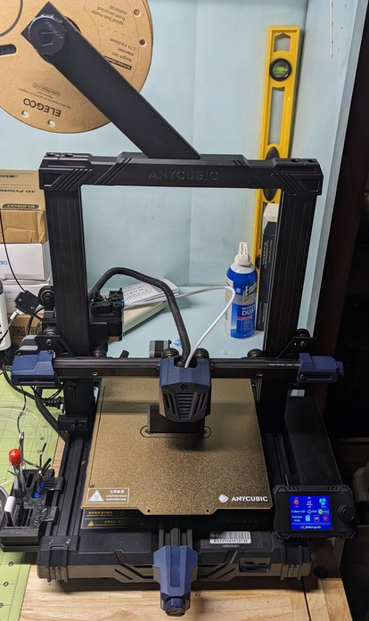
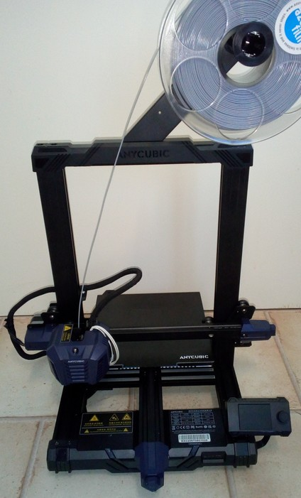

<link rel=”manifest” href=”docs/manifest.webmanifest”>

# Printers
The Anycubic [**Kobra 2 Pro**](https://www.anycubic.com/products/kobra-2-pro) is a FDM bedslinger style printer.  
It comes pre-assembled, you only have to mount a few parts like the 'upstanding' frame onto the base frame.  
  
See [Anycubic's support page](https://www.anycubic.com/pages/firmware-software) of the Kobra 2 series to find manuals, firmware, video tutorials and more of **Kobra 2 Pro**.    
  
The following list gives an overview of the most important specifications:    

<!--  
- Printing dimension: 250 x 220 x 220 mm (HxWxD) 
- Printing platform: 8.7 x 8.7inches / 220 x 220mm (*Attention: the physical dimensions of the bed and the PEI plate are 230x230mm!*) 
- Machine dimensions: 490 x 445 x 443 mm (plus filament holder mounted to the upper frame = approx. 630 mm height) 
- Machine weight: approx. 7.5 kg  
- Aluminum frame  
- X-axis and Y-axis: belt driven, belt tension can be adjusted by knobs  
- Z-axis: single threaded rod  
- Printing speed: ≤100 mm/s (Max speed)  
- Control panel: 2.4" LCD screen with a control knob  
- Mainboard: TriGorilla V_3.0.6, 32bit, 24V, TMC2208 silent stepper drivers (soldered), microSD card reader, USB-C connector 
- Extruder / feeder system:  
    - Bowden separated at Kobra **Go**  
    - Direct drive at Kobra **Neo**  
- Heated aluminum bed with a magnetic foil glued onto it, comes with a removable PEI-coated spring steel plate (one-sided coated at **Go**, double-sided coated at **Neo**); *physical dimensions: 230x230mm*  
- Hot bed temperature: ≤ 230 °F / 110 °C  
- Bed leveling: "Anycubic LeviQ", which is a 25-point bed level measuring process 
- Power supply: 400W, 24V DC output, suitable for 110V/230V AC input (set the correct voltage with a switch before using it!)
- Printing material: PLA / ABS / PETG & TPU (optional housing recommended for certain material)  
- Single nozzle in a E3D **V5** type hotend, filament diameter 1.75 mm  
- Comes with a E3D V6 compatible 0.4 mm brass nozzle which is replaceable  
- Nozzle temperature: ≤ 500 °F / 260 °C  
- Optional filament run-out detection sensor  

  
| Kobra **Go** | Kobra **Neo** |
|--------------|---------------|
|  |  | 

-->

---

  
 
