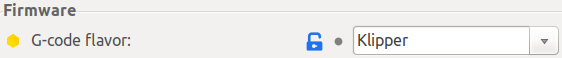

<link rel=”manifest” href=”docs/manifest.webmanifest”>

# Printer Profiles & Slicers

In the following you'll find some short notes on the most common slicers Cura, PrusaSlicer, SuperSlicer and OrcaSlicer and some notes on printer profiles for these slicers.  

---

## Printer Profiles

The USB drive shipped with your printer should contain Cura and PrusaSlicer profiles. If you don't have them, you can download them at [Anycubic's support page](https://www.anycubic.com/pages/firmware-software) but I'll list and link to them further below also.  

However, these profiles most likely need individual tweaking. The settings like print speed, retraction settings, extruder and bed temperature etc. also depend on the type of material you want to use (e.g. PLA/ABS/PETG/TPU). But also for the same type of filament material like PLA the settings often need to be adjusted again if you're using filament of a different manufacturer or even just another spool or colour of the same brand.  
There are countless guides about this topic in general, so I'd recommend to dig into it deeper using your preferred sites or specific videos.   

<!--  
There are users who offer their profiles for the Go and Neo, so that beginners have a better starting point if the stock ones don't seem to work for them. In the following I'll list them as far as I'm aware of them. Be aware though that you still have to check the settings and finetune them for your device.   
-->  

You can always set up your own custom profile in your slicer. Just pay attention to the general machine settings, like the bed size and so on.  
  
??? tip "Set Up Filament Specific Profiles"

    When you're using more than one filament, it's a good idea to set up a profile for each spool of filament you have. So not only for the type of filament (like PLA, PETG etc.), but also for the different manufacturer, the colour and so on. It happens that you have to use slightly different settings even with the same type of filament from the same brand but just when using a different colour of it.   
  
---

### Official Profiles

The following list links to the specific profiles from [Anycubic's firmware page](https://www.anycubic.com/pages/firmware-software): 
 
 - [Profile for PrusaSlicer](https://drive.google.com/file/d/1ADX_Y6oFosKwoohzcw0gUPFc67n_XUub/view)  
 - [Profile for Cura](https://drive.google.com/file/d/1yfL37414oz0F4p-yFsYAbx0iMnToSfJM/view?usp=share_link)  

    
---

### Custom Profiles  

Here you'll find links to profiles made by users - if I'm getting aware of them.  

- [Mircea M](https://www.printables.com/de/@mrfenyx) set up a profile for **OrcaSlicer**, you can find it [here](https://www.printables.com/de/model/646205-anycubic-kobra-2-pro-orcaslicer-profiles).

---

## Slicers  
In the following you'll find some short notes on the most common Slicers, which (imho) are PrusaSlicer, SuperSlicer, OrcaSlicer and Cura.   
I won't go over [Ancubic's slicer](https://www.anycubic.com/pages/anycubic-slicer) at this point though as it's based on PrusaSlicer.  

A slicer is a program you open your STL file with and which needs to be set up with a profile which contain the specific settings for your printer.  
When you open the STL file of the model you want to print, you then adjust some settings for how the printer should print the model (like speed, temperature etc.) and then you "slice" the model for getting the `.gcode` file generated, which then will be taken and processed by the printer.   
In the following I'll just go over the abovementioned slicers really quick as it would be too much to discuss the slicers in detail. You'll find many resources online though where you'll find more information about them.  
If I find the time, I'll add some screenshots as well, but I suggest to read around the web a bit for further information for the specific slicer you want to use or you're interested in. There are many comprehensive YouTube videos out there about this topic as well.  

---
 
### PrusaSlicer, SuperSlicer, OrcaSlicer 
PrusaSlicer (initially based on "Slic3r") and it derivates like SuperSlicer and OrcaSlicer are my personal favourites after using Cura for some time.  

If you need it, you can find [Anycubic's PrusaSlicer Usage Instructions V1.1 here](https://cdn.shopify.com/s/files/1/0245/5519/2380/files/PrusaSlicer_Usage_Instructions_V1.1_EN.pdf?v=1685695259).

You can set the G-code flavor depending on the firmware of the printer (menu "Printer Settings"), so set it to "Klipper" as shown in the screenshot of SuperSlicer below, so it's already everything set up correctly within the G-code of the sliced files.  
  

  
Of course all slicers have many functionalities to finetune and control the output - you can even choose between different patterns for the top layer finish. They're all pretty identical overall, yet they differ in certain functions. One of them being worth mentioned is a *handy set of calibration tools that comes with SuperSlicer and OrcaSlicer*. This function actually guides you step by step through the calibration process and allows you to generate calibration models like temperature or retraction towers with individual settings by just a few clicks.  

Make sure to enable the optional "Arachne Engine" (Print Settings -> Perimeters) as it improves the quality of the printed parts. 

---

### Cura  
Cura is probably the most commonly known slicer. If you check support page of Anycubic or if you have a look at the content of the microSD card that was shipped with the printer, you'll find an *outdated* version of Cura and some printer profiles for it. My suggestion would be: *don't* use that outdated Cura version and *don't* use the profiles Anycubic offers, at least not without inspecting them (especially Neo users!). You can find more notes on the profiles further down below.  

Even though Cura and Klipper work perfectly together, there are a few things to be aware of.  
Certain classic G-code commands aren't directly supported by Klipper as it uses extended G-code and scripts for certain things. As an example the G-code command `M0` (unconditional stop) isn't recognized by Klipper, you'd have to use the extended G-code command `PAUSE` for that.  

Also there are a few functions of Cura which should improve the print quality which interfere with Klipper's own approaches for that (like Pressure Advance or Input Shaping).  

You'll find a good overview of what to be aware of in the tutorial from [All3DP: Cura & Klipper: How to Make Them Work Together](https://www.all3dp.com/2/cura-klipper-tutorial).  
 
The latest version of Cura also offers the option to now set the G-code flavor to Klipper.   
However, there's also a ["Klipper Settings Plugin"](https://github.com/jjgraphix/KlipperSettingsPlugin) available which adds a category to Cura called "Klipper Settings" and offers Klipper specific settings and features.  

---

  

